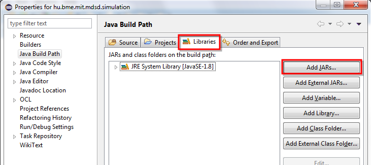
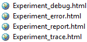

# Simulation

,,Simulation is the imitation of the operation of a real-world process or system over time. [...] A model represents the system itself, whereas the simulation represents the operation of the system over time.'' [1]
,,A computer simulation is a simulation, running on a single computer, or a network of computers, to reproduce the behavior of a system. The simulation uses an abstract model (a computer model, a computational model, or a simulation model) to simulate the system.'' [2]

There are many practical use cases of simulations, to name a few:
weather forecasting,
approximating system performance,
flight simulators,
logistics,
social simulation,
etc.
or deep see simulation to name a not computer simulation.

Usually the main purpose of simulation is 
1) avoid costly, unethical and/or dangerous experiments
2) to observe certain parameters and statistics of the system for a deeper understanding of the inner correlations, possibly through visualization,
3) evaluate alternative design candidates.

Typical types of simulation techniques:
* Continuous simulation: ,,Continuous Simulation refers to a computer model of a physical system that continuously tracks system response according to a set of _equations_ typically involving differential equations.'' [3]
* Discrete-event simulation: ,,In the field of simulation, a discrete-event simulation (DES), models the operation of a system as a discrete sequence of events in time. Each event occurs at a particular instant in time and marks a change of state in the system. Between consecutive events, no change in the system is assumed to occur; thus the simulation can directly jump in time from one event to the next.''[4]
* Agent-based simulation: ,,In agent-based simulation, the individual entities (such as molecules, cells, trees or consumers) in the model are represented directly (rather than by their density or concentration) and possess an internal state and set of behaviors or rules that determine how the agent's state is updated from one time-step to the next.'' [2]

From wikipedia:
* [1] http://en.wikipedia.org/wiki/Simulation
* [2] http://en.wikipedia.org/wiki/Computer_simulation
* [3] http://en.wikipedia.org/wiki/Continuous_simulation
* [4] http://en.wikipedia.org/wiki/Discrete_event_simulation

# The DESMO-J framework

DESMO-J is an open-source framework distributed under the Apache Licence, developed at University of Hamburg and designed for **D**iscrete-**E**vent **S**imulation and **Mo**delling in **J**ava. DESMO-J is also capable of agent-based modeling and simulation but we will focus on the event based approach.

Home page: http://desmoj.sourceforge.net/

Current release version: 2.4.2

## Installation

DESMO-J can be downloaded from here: http://desmoj.sourceforge.net/download.html
We will be using only the core so you can download either version of it, but **download both binaries and sources**.

Create a **new Java project** and create a **libs folder** in it. **Copy** the downloaded files into that libs folder.


Right click the project, select Build Path and select Configure Build Path... Then switch to the Libraries tab and click Add Jars. Add the *.jar file from the libs folder.



If you would like to browse the source code from Eclipse attach the source (.zip) from the libs folder by editing the source attachment node on the previously added jar dependency as shown on the next figure:


 
## Modeling

For a discrete-event simulation problem one should model the entities and events of the system. Entities will represent the state of the model, while events will represent the dynamics of the system. The model usually also contains waiting queues and random number generators of certain distribution (if the simulation has stochastic elements).

Our example will be a pastry shop, where customers comes in groups, they buy some sweets and sit to a free table ->

Entities with attributes:
* CustomerGroupEntity
*  size
* WaitressEntity
* TableEntity

Events:
* ArrivalEvent - a new customer group has arrived.
* BuyEndedEvent - a customer group has finished buying their cakes.
* DepartureEvent - a customer group leaves the shop.

Queues:
* IdleWaitressQueue
* BuyersQueue
* IdleTableQueue
* EatersQueue - for those who cant sit down to a table.

Distributions:
* Normal distribution for customer arrival interval
* Poisson distribution for customer group size
* Uniform distribution for buying time
* Uniform distribution for eating time

During modelling, usually we take several assumption, for example every group can sit down to any table (tables have no size attribute).
It is also important to clarify the parameters of the simulation model. In this example we will have the number of waitresses and the number of tables as parameters.


### Code

1. Firstly, create the entities, starting with the CustomerGroupEntity class and extend it from the (desmoj.core.simulator.)Entity class. Generate its constructor with quick fix and add a private integer field named __size__ with a getter method.

    ```java
    package hu.bme.mit.mdsd.simulation.entities;
    
    import desmoj.core.simulator.Entity;
    import desmoj.core.simulator.Model;
    
    public class CustomerGroupEntity extends Entity {
    
        private final int size;
    
        public CustomerGroupEntity(int size, Model owner, String name, boolean showInTrace) {
            super(owner, name, showInTrace);
            this.size = size;
        }
    
        public int getSize() {`
            return ;
        }
    
    }
    ```

Do the same with the TableEntity and WaitressEntity class (without the size field).

2. Create the boilerplate code of the events. Events can be either external or have 1,2 or 3 entity as a parameter. (There cannot be 4 or more entity, its a limitation of the framework, but probably three is more than enough. If 4 or more is required try to model the event with a sequence of different events.)

All four events will be extended from a specific class as listed below. Also generate its constructor and unimplemented methods with quick fix.

* ArrivalEvent extends ExternalEvent
* BuyEndedEvent extends EventOf2Entities<CustomerGroupEntity,WaitressEntity>
* DepartureEvent extends EventOf2Entities<CustomerGroupEntity,TableEntity>

```java
package hu.bme.mit.mdsd.simulation.events;

import desmoj.core.simulator.ExternalEvent;
import desmoj.core.simulator.Model;

public class ArrivalEvent extends ExternalEvent{

	public ArrivalEvent(Model owner, String name, boolean showInTrace) {
		super(owner, name, showInTrace);
	}

	@Override
	public void eventRoutine() {
		// TODO
	}

}
```

```java
package hu.bme.mit.mdsd.simulation.events;

import hu.bme.mit.mdsd.simulation.entities.CustomerGroupEntity;
import hu.bme.mit.mdsd.simulation.entities.WaitressEntity;
import desmoj.core.simulator.EventOf2Entities;
import desmoj.core.simulator.Model;

public class BuyEvent extends EventOf2Entities<CustomerGroupEntity,WaitressEntity> {

	public BuyEvent(Model owner, String name, boolean showInTrace) {
		super(owner, name, showInTrace);
	}

	@Override
	public void eventRoutine(CustomerGroupEntity who1, WaitressEntity who2) {
		// TODO
	}

}
```

The eventRoutine methods will be implemented later.

3. The DESMO-J framework requires a simulation model which will contain the queues, random number generators and the initialization code.

Create a class named PastryShopSimulationModel and extend it from the (desmoj.core.simulator.)Model class. Add some description to it.

```java
package hu.bme.mit.mdsd.simulation;

import desmoj.core.simulator.Model;

public class PastryShopSimulationModel extends Model {

	public PastryShopSimulationModel(Model owner, String name,
			boolean showInReport, boolean showInTrace) {
		super(owner, name, showInReport, showInTrace);
	}

	@Override
	public String description() {
		return "Pastry shop simulator";
	}

	@Override
	public void doInitialSchedules() {
		
	}

	@Override
	public void init() {
		
	}

}
```

4. Add the following fields to the Model:

```java
    private static final int WAITRESSES = 1;
    private static final int TABLES = 3;

	public Queue<CustomerGroupEntity> buyersQueue;
	public Queue<CustomerGroupEntity> eatersQueue;
	public Queue<WaitressEntity> idleWaitressQueue;
	public Queue<TableEntity> idleTableQueue;

	// Here we only specify that it is a discrete or continuous distribution
	private DiscreteDist<?> customerGroupSize;
	private ContDist customerArrivalTime;
	private ContDist buyTime;
	private ContDist eatTime;
```

In this tutorial the simulation parameters are final private fields but in a real case they should be settable from outside.

5. The init() method will be used to initialize the above fields. Don't use inline initialization! Add the following code to the init() method:

```java
        @Override
	public void init() {
	
		// Init queues
		buyersQueue = new Queue<CustomerGroupEntity>(this, "Buyers Queue", true, false);
		eatersQueue = new Queue<CustomerGroupEntity>(this, "Eaters Queue", true, false);
		idleWaitressQueue = new Queue<WaitressEntity>(this, "Idle Waitresses Queue", true, false);
		idleTableQueue = new Queue<TableEntity>(this, "Idle Tables Queue", true, false);
	
		// Init random number generators
		customerGroupSize = new DiscreteDistPoisson(this, "Customer group size", 2, true, false);
		customerArrivalTime = new ContDistNormal(this, "Customer arrival time", 4*60, 1*60, true, false);
		buyTime = new ContDistUniform(this, "Buying time", 1*60, 3*60, true, false);
		eatTime = new ContDistUniform(this, "Eating time", 5*60, 20*60, true, false);
		
		for (int i = 0; i < WAITRESSES; i++){
			idleWaitressQueue.insert(new WaitressEntity(this, "Waitress", false));
		}
		
		for (int i = 0; i < TABLES; i++){
			idleTableQueue.insert(new TableEntity(this, "Table", false));
		}
	}
```

6. The doInitialSchedules() is for scheduling the first events. Now, it will be only an ArrivalEvent:

```java
    @Override
    public void doInitialSchedules() {
	ArrivalEvent arrivalEvent = new ArrivalEvent(this, "Arrival event", true);
	arrivalEvent.schedule(new TimeInstant(0));
    }
```

Note, that TimeInstant represents an absolute point in the time line, while TimeSpan is relative to the current time.
	
7. Before moving on to the events, create a few helper methods for the random number generators:

```java
	public int getCustomerGroupSize(){
		int value = customerGroupSize.sample().intValue();
		return value == 0 ? 1 : value;
	}
	
	public int getCustomerArrivalTime(){
		int value = customerArrivalTime.sample().intValue();
		return value <= 0 ? 0 : value;
	}
	
	public int getBuyTime(){
		return buyTime.sample().intValue();
	}
	
	public int getEatTime(){
		return eatTime.sample().intValue();
	}
```

8. Now that we created the simulation model, we can access it from the event classes. Do the following for all the three events:

```java
	private PastryShopSimulationModel model;
	
	public ArrivalEvent(Model owner, String name, boolean showInTrace) {
		super(owner, name, showInTrace);
		model = (PastryShopSimulationModel) owner;
	}
```

You can also get the model with getModel() method.

9. Write the following eventRoutine() methods:

```java
	//ArrivalEvent
	@Override
	public void eventRoutine() {
		int size = model.getCustomerGroupSize();

		CustomerGroupEntity customerGroup = new CustomerGroupEntity(size, getModel(), "Customer group", true);
		
		if (model.getIdleWaitressQueue().isEmpty()) {
			model.getBuyersQueue().insert(customerGroup);
		} else {
			WaitressEntity waitress = model.getIdleWaitressQueue().removeFirst();
			BuyEndedEvent event = new BuyEndedEvent(getModel(), "Buy event", true);
			event.schedule(customerGroup, waitress, new TimeSpan(model.getBuyingTime(size), TimeUnit.SECONDS));
		}
		
		schedule(new TimeSpan(model.getCustomerArrivalTime(), TimeUnit.SECONDS));
		
	}
```

```java
	// BuyEndedEvent
	@Override
	public void eventRoutine(CustomerGroupEntity who1, WaitressEntity who2) {
		
		if (model.buyersQueue.isEmpty()) {
			model.idleWaitressQueue.insert(who2);
		}
		else {
			CustomerGroupEntity customerGroup = model.buyersQueue.removeFirst();
			BuyEndedEvent event = new BuyEndedEvent(model, "Buy ended event", true);
			event.schedule(customerGroup, who2, new TimeSpan(model.getBuyTime()));
		}
		
		if (model.idleTableQueue.isEmpty()) {
			model.eatersQueue.insert(who1);
		}
		else {
			TableEntity table = model.idleTableQueue.removeFirst();
			DepartureEvent event = new DepartureEvent(model, "Departure event", true);
			event.schedule(who1, table, new TimeSpan(model.getEatTime()));
		}
		
	}
```


```java
	//DepartureEvent
	@Override
	public void eventRoutine(CustomerGroupEntity who1, TableEntity who2) {
		if (model.eatersQueue.isEmpty()) {
			model.idleTableQueue.insert(who2);
		}
		else {
			CustomerGroupEntity customerGroup = model.eatersQueue.removeFirst();
			DepartureEvent event = new DepartureEvent(model, "Departure event", true);
			event.schedule(customerGroup, who2, new TimeSpan(model.getEatTime()));
		}
	}
```


## Starting a simulation, trace and statistics

To start the simulation, create a new class with a main method, instantiate the simulation model and an Experiment object, than configure the experiment:

```
	public class SimulationRunner {

		public static void main(String[] args) {
			
			PastryShopSimulationModel model = new PastryShopSimulationModel(null, "PastryShopSimulationModel", true, false);
			
			Experiment experiment = new Experiment("Experiment", TimeUnit.SECONDS, TimeUnit.SECONDS, null);
			
			model.connectToExperiment(experiment);
			
			// Turn on the simulation trace from the start to the end
			experiment.traceOn(new TimeInstant(0));
			
			// Set when to stop the simulation
			experiment.stop(new TimeInstant(8, TimeUnit.HOURS));
			
			experiment.start();
			
			// Create the report files
			experiment.report();
			
			experiment.finish();
			
		}
	}
```


Run it as a Java application.

Refresh the project, so you will find four new .html files in it:



The error and debug files should be empty for now.

If you have turned on tracing and set the showInTrace parameter of the events to true, you will see the following in the trace file:


Note: you can insert custom trace rows from the events by calling the sendTrace(String) method.

The report file contains aggregated information about the simulation. For example, the average number of entities in a queue.


## Add custom reports

To report additional statistics about the simulation to the report file, you can use a Tally, an Accumulate or a Histogram class. All of them should be updated with single numbers during the simulation, but will report differently: 1) a Tally will show the size, min, max, mean and standard deviation of the reported numbers, 2) an Accumulate will do the same but will weight the numbers with elapsed time between updates and 3) the Histogram will draw a histogram given intervals.

### Tally

Let's create a Tally which reports average time spent by the customers in the pastry shop.

Add the following field to the PastryShopSimulationModel:
```java
public Tally timeSpentByCustomer;
```
And initialize it in the init() method:
```java
timeSpentByCustomer = new Tally(this, "Time spent by customer", true, false);
```
Save the arrival time of the CustomerGroupEntity:
```java
public class CustomerGroupEntity extends Entity{

	int size;
	private TimeInstant arrivalTime;
	
	public CustomerGroupEntity(int size, Model owner, String name, boolean showInTrace) {
		super(owner, name, showInTrace);
		this.size = size;
		arrivalTime = presentTime();
	}

	public TimeInstant getArrivalTime() {
		return arrivalTime;
	}

}
```
Update the tally in the DepartureEvent:
```java
model.timeSpentByCustomer.update(presentTime().getTimeAsDouble() - who1.getArrivalTime().getTimeAsDouble());
```
Run the simulation and see the results:


### Histogram

Let's create a Histogram which visualize the distribution of the customer group sizes.

Add the following field to the PastryShopSimulationModel:
```java
public Histogram customerGroupSizeHistogram;
```
And initialize it in the init() method:
```java
customerGroupSizeHistogram = new Histogram(this, "Histogram", 1, 10, 9, true, false);
```
Update the histogram in the ArrivalEvent:
```java
model.customerGroupSizeHistogram.update(size);
```
Run the simulation and see the results:


## Other references

Official tutorial (it also includes the agent-based approach): http://desmoj.sourceforge.net/tutorial/overview/0.html