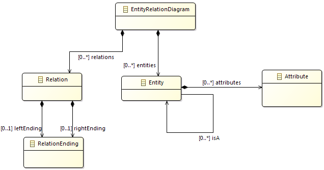
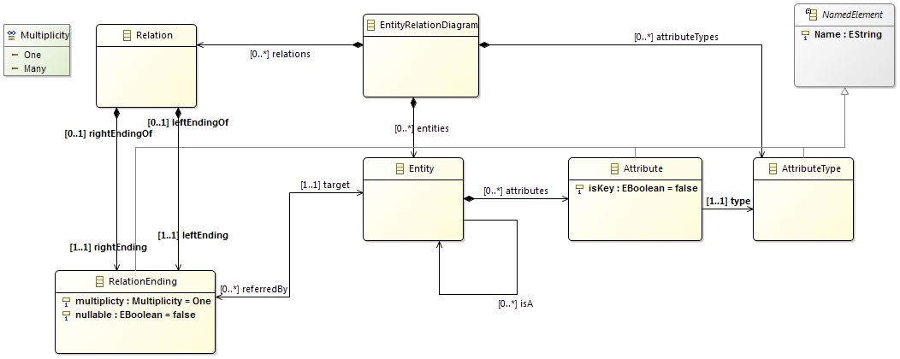

Introduction to the Eclipse Modeling Framework
==============================================

Author: Oszkár Semeráth, András Szabolcs Nagy

About the EMF
--------------

From Wikipedia (<http://en.wikipedia.org/wiki/Eclipse_Modeling_Framework>) ,,Eclipse Modeling Framework (EMF) is an Eclipse-based modeling framework and code generation facility for building tools and other applications based on a structured data model.'' EMF's data model is lightweight as it only defines a few but well-defined modeling elements. However, it has an extensive tooling support and community. For example, you can define the textual or graphical syntax of a language and generate the appropriate editors.

EMF can generate Java code from the model with only a click of a button. The generated code is capable of serialisation to XMI and deserialisation from XMI files.

EMF home page: <http://www.eclipse.org/modeling/emf/>

Since Eclipse Luna (25.06.2014), the EMF Ecore visual editor (Ecore Tools) has changed and now based on Sirius changing the extension name of the diagrams to .aird. Legacy diagrams (.ecorediag) cannot be opened with Eclipse Luna Modeling Tools edition. You can find the home page of the Ecore Tools project along with tutorials here: <https://www.eclipse.org/ecoretools/overview.html>

Description of the task
-----------------------
The goal of this exercise is to create the metamodel of customized
Entity-Relationship Diagrams (ERD). Those diagrams can aid the development of
software components that working with complex data structures. A later exercise
will show you how complete database schemes, full classes and the automated
mapping between those can be derived from those documents.

The following image presents an example of Entity Relation diagram.


Prerequisites
-------------

The Eclipse Modeling Tools edition contains every required plug-in.

Ecore model: step-by-step
-------------------------

1. Create a new **Empty EMF Project** by **File | New | Other... | Eclipse
Modeling Framework | Empty EMF Project**. Name it to ``hu.bme.mit.mdsd.erdiagram``.
This project is a Java plugin project (has an src folder and a MAINFEST.MF file) with the required ecore dependencies.

1. There is a folder in the project named **model**. Create a new
**ECore Model** in it by right click to the folder | New | Other... |
ECore Model. Name it to ``ERDiagram.ecore``.

1. A new editor opens  that shows that the model resource has a yet unnamed empty package. Fill the missing properties in the property view:
    * Name: ``ERDiagram``
    * Ns Prefix: ``hu.bme.mit.mdsd.erdiagram``
    * Ns URI: ``hu.bme.mit.mdsd.erdiagram``
    
    To show unavailable view go to **Window | Show View | Other... | General**.

1. Let's use this tree editor to create the first root model element (right click on the package | New Child | ECLass) and name it EntityRelationDiagram in the Properties View. Don't forget to save the model. Also try out the other context menu items.

1. While it is possible to create the model in this tree editor, there is a more
convenient editor for this purpose.  Right click to the ecore file and choose
the **Initialize ECore diagram...** option. Name it to **erdiagram.aird**. Click Finish. After that choose the Desing/Entities representation, then the package ``ERDiagram``. Name the representation to Entity Relation class diagram.

1. Add the first element from the palette with Existing Elements | Add command, then choose the EClass we already created. Note that the visual representation is independent from the ecore model itself, deleting from model and the diagram are different things.

1. Let's make the following part by dropping metamodel elements from the palette to the diagram:

    

1. If you click on a model element you can edit its properties in the **Property view**.
    * Specify the names of the ``EClass``es, the ``EReference``s and the ``EAttribute``s.
    * The ``EClass``es can be set to **Abstract** or **Interface** in this view.
    * The type of an ``EAttribute`` can be set in this view.
    * The multiplicity of the relation is set to ``0..*``
	* The ``EOpposite`` feature should be presented.
    * The objects of the instance models of the metamodel have to be in a tree hierarchy with respect of the containment references. Set the ``entities`` relation to **Is Containment**.
	* **Appearance:** you can edit the view of the diagram. For example the behaviour of an edge.
    * **Advanced Options:** Direct editing for the properties of the elements of the model.
    The features should be presented:

1. The effect of the diagram editing on the ``.ecore`` file can be observed if it is opened. It synchronizes when the diagram is saved.

1. The editor can validate the model with the check symbol visible in the context menu (see the following figure). All of the generated markers are also listed in the Problems View.

     
    
1. Create the metamodel of the Entity Relation Diagram on your own like it was a class diagram. A possible result is visible on Figure 1.4.
    
     

1. Add the ``EEnum`` named ``Multiplicity`` to the metamodel, and add two literals to it: ``One`` and ``Many``.

1. Add an abstract ``NamedElement`` class to the metamodel and add inheritance relations to the  Fill the 
The difference between the ``EAttribute`` and ``EReference`` is that the EAttribute is referring to an ``EDataTypes`` opposed to ``EReferences`` that endings to ``EClasses``.

1. Add EAttributes to the classes and also create an AttributeType Class. The final model should be similiar to the following figure:

    

1. The metamodel lacks of ``EOperations``, because it is basically a data model.


Editor: step-by-step
--------------------
This example shows how to generate classes and an editor from Ecore models.

1. The ecore files are the blueprints of the domain specific languages. To use the tooling support available in Eclipse some kind of Java class  representation of those "boxes" are needed. Fortunately those classes can be automatically generated.

    Right click _on the ecore file_ and **New | Other | Eclipse Modeling Framework | EMF Generator Model**. The default ``ERDiagram.genmodel`` is fine. At the next step choose that the generator generate from an Ecore model. In the third step the URI of the Ecore model have to be added. Click on load and next. Choose the only avaliable package to generate and hit finish.

1. Another tree editor opens similar to the ecore editor. Browse some of the setting in the property editor. Right click to the root, and choose the **Generate Model** command. Three package has been generated in the source folder. The first one contains the Classes we created in the form of Java interfaces. There are two special interfaces: *Factory.java and *Package.java, we will com back to this. Browse for example the ``hu.bme.mit.mdsd.erdiagram/src/ERDiagram/EntityRelationDiagram.java`` file, and you can see that nothing strange has been generated. The second package (ERDiagram.impl) contains the implementation classes. The implementation class has some unusual field, but the implementations of the functions of the interface are quite simple. The ERDiagram.util package contains two helper classes which can be useful in advanced scenarios.

1. Let's change two thing on the .genmodel file. 1) Click the rott object on the .genmodel editor and find Model | Model Directory. Let's change the src folder to src-gen (this will change the generation destination folder). 2) Click on the Package element and find All | Base Package. Change it to ``hu.bme.mit.mdsd``. This will correct the generated package names according to the project name. Regenerate the Model code, delete the previously generated code and correct the MAINFEST file as it tries to export the deleted packages.

1. Note that if you change the ecore model, you may have to reload the genmodel by Right click | Reload... Changes to the genmodel file will be preserved.

1. Generate an **editor**. Right click to the root of the genmodel file, and generate edit and editor in this order.

1. Right click to the project, and choose **Run as | Eclipse** application.

1. Create an empty project by **File | New | Other... | General | Project** and name it to **Diagrams**.

1. Create a new Entity Relation Diagram into the new project by right clicking on it and picking **New | Other | Example EMF Model Creation Wizard | ERDiagram Model**. The name can be the default ``My.erdiagram``, and the model object (what we want to edit) should be **Entity Relation Diagram**.

1. Create the instance model. The editor is quite self-explanatory to use and very similar to the ecore tree editor.

   

Model manipulation: step-by-step
--------------------------------
The following example shows how to edit the model from code.

1. Create a new **Plug-in Project** by right click | New | Plug-in Project. Name it to ``hu.bme.mit.mdsd.erdiagram.example``.

1. Add the following dependencies:

    -------------------------------- ----------------------------------------------------
    ``hu.bme.mit.mdsd.erdiagram``    The edited domain.
    ``org.eclipse.emf.ecore.xmi``    The instance model is serialised as an XMI document.
    -------------------------------- ----------------------------------------------------
    
1. Create a class to the source folder:

    ```java
    package ``hu.bme.mit.mdsd.erdiagram.example``
    name    ``ERDiagramModels``
    ```

1. Create an initialisation method for model loading.

    ```java
    public void init() {
       // For the initialisation of the model.
       // Without this the following error happens:
       //  "Package with uri 'hu.bme.mit.mdsd.erdiagram' not found."
       ERDiagramPackage.eINSTANCE.eClass();
          
       // Defining that the files with the .erdiagram extension should be parsed as an xmi.
       Resource.Factory.Registry reg = Resource.Factory.Registry.INSTANCE;
       reg.getExtensionToFactoryMap().put("erdiagram", new XMIResourceFactoryImpl());
    }
    ```

1. The model is in an xmi file that can be generally handled as a resource. A resource can be referenced by an URI. Write a method that creates and one that loads a resource:

    ```java
    public Resource createResource(URI uri) {
	ResourceSet resSet = new ResourceSetImpl();
	Resource resource = resSet.createResource(uri);
	return resource;
    }
    ```

    ```java
    public Resource loadResource(URI uri) {
        ResourceSet resSet = new ResourceSetImpl();
        Resource resource = resSet.getResource(uri, true);
        return resource;
    }
    ```

1. The resource simply can be saved:

    ```java
    public void saveResource(Resource resource) {
       try {
         resource.save(Collections.EMPTY_MAP);
       } catch (IOException e) {
          System.out.println("The following error occured during saving the resource: "
            + e.getMessage());
       }
    }
    ```

1. The content of the resource should be the ED diagram object.

    ```java
    public EntityRelationDiagram getModelFromResource(Resource resource) {
       // check the content!
       EntityRelationDiagram root = (EntityRelationDiagram) resource.getContents().get(0);
       return root;
    }
    ```

1. The ER diagram object should be edited through the interface and instantinated by the generated factory methods. This method creates a custom table data object for every entity that doesn't already have one:

    ```java
    public EntityRelationDiagram createModel() {

        ERDiagramFactory factory = ERDiagramFactory.eINSTANCE;
        EntityRelationDiagram diagram = factory.createEntityRelationDiagram();

        Entity person = factory.createEntity();
        Attribute name = factory.createAttribute();
        AttributeType attributeType = factory.createAttributeType();

        attributeType.setName("String");
        name.setName("Name");
        name.setType(attributeType);
        person.setName("Person");
        person.getAttributes().add(name);

        diagram.getAttributetypes().add(attributeType);
        diagram.getEntities().add(person);

	return diagram;
    }
    ```

    The result can be printed to the output by this method:

    ```java
    public void printERDiagram(EntityRelationDiagram erdiagram)
    {
        for (Entity entity : erdiagram.getEntities()) {
            System.out.println(entity.getName());
        }
    }
    ```

1. You can get the URI by right click | **Properties** and copy the file to a string. For example my URI is:

    ```java
    URI uri = URI.createFileURI("C:/workspace/Diagrams/My.erdiagram");
    ```

    The main method looks like:

    ```java
    public static void main(String[] args) {
        // init
        ERDiagramModels erdiagramModels = new ERDiagramModels();
        erdiagramModels.init();
        // create
        EntityRelationDiagram model = erdiagramModels.createModel();
        // save
        URI uri = URI.createFileURI("C:/workspace/hu.bme.mit.mdsd.erdiagram.example/samplemodel.erdiagram");
        Resource resource = erdiagramModels.createResource(uri);
        resource.getContents().add(model);
        erdiagramModels.saveResource(resource);
        // load
        Resource resource2 = erdiagramModels.loadResource(uri);
        EntityRelationDiagram model2 = erdiagramModels.getModelFromResource(resource2);
        // print
        erdiagramModels.printERDiagram(model2);
    }
    ```

    Right click to the class and choose **Run as | Java Application**. This will run our code as a simple Java application that creates, saves, loads and prints a model.

General tips
------------

* If anything goes wrong with the regeneration and there is problem with your code you have two options:
  * If the document was not edited by hand or it isn't valuable delete it. Generate the code again, and it should be fine. It works on the `Manifest.MF` and the `plugin.xml` too.
  * In other case don't be afraid of rewriting. For example if you delete an item from the metamodel the XMI that contains the instance model might have remaining tags with undefined type. That makes the XMI invalid, but it isn't necessary to start over the instance model; simply delete the unwanted part from the code by hand.
  
References
----------

* Tutorial: <http://eclipsesource.com/blogs/tutorials/emf-tutorial/>