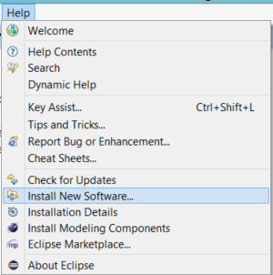
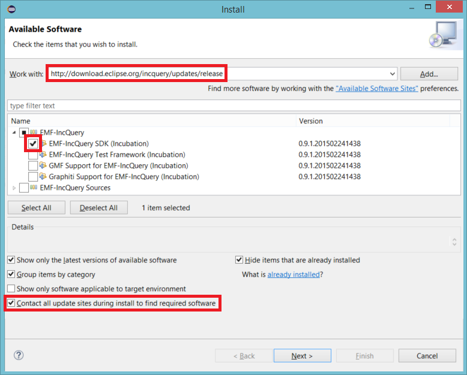
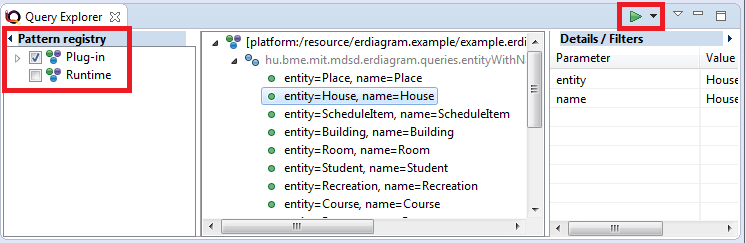

EMF-IncQuery (Pattern Language)
===============================


homesite: https://www.eclipse.org/incquery/

Install EMF-IncQuery
--------------------

Navigate to the homesite of IncQuery and search for update sites at the download page:
https://www.eclipse.org/incquery/download.php

Copy the URL of _Release builds_ update site:
http://download.eclipse.org/incquery/updates/release

Switch back to your Eclipse instance and select the _Help/Install New Software..._



Paste the copied URL to the _Work with_ field, than press _Enter_. When the view is updated, select the _EMF-IncQuery SDK_. Tick the _Contact all update sites during install..._ field. Press _Next_, then _Next_ and finally _Finish_.
After the install process, you should restart Eclipse.



For a faster installation, advanced users can untick out the _Contact all update sites during install..._ field, but they have to install _Xtend_ and _Xtext_ technologies manually.

Setup the Laboratory
--------------------

1. Import the projects from [here](projects/incquery-metamodel.zip).
1. Run as **Eclipse Application**.
1. Import the project from [here](projects/incquery-example.zip) to the runtime Eclipse and check the instance model.
1. Create a new IncQuery project in the host Eclipse and name it to ```hu.bme.mit.mdsd.erdiagram.queries```.
1. Create a new query definition in a package named ```hu.bme.mit.mdsd.erdiagram``` and a file named ```queries.eiq```. In the wizard create an empty query. Fill the first query:
    
	```java
	package hu.bme.mit.mdsd.erdiagram
	
	import "hu.bme.mit.mdsd.erdiagram"

	pattern entityWithName(entity, name) {
		Entity.Name(entity,name);
	}
	```

1. Load the query and the instance model to the **Query Explorer**.

Query Explorer
--------------

**Query Explorer** is the primary debug tool for debugging IncQuery patterns runtime. To open the view: _Window/Show View/Others/EMF-IncQuery/Query Explorer_ or you can simply press the _CTRL + 3_ shortcut and start to type the name of the view. On the left side of the view, there will be patterns inherited from the host eclipse. The middle part will show you the matches of the patterns. To achive this, we have to load a model into the view:
1.  Open our example instance model (_example.erdiagram_)
1.  then press the green arrow button on the view.



