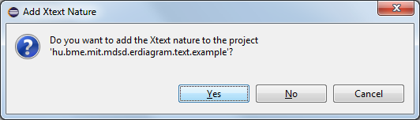

# Xtext

## Creating a textual language


homesite: https://eclipse.org/Xtext/

Install Xtext
-------------

Install from eclipse market place: search for Xtext -> Click _Install_ -> etc.


_Note: This will also install the Xtend packages._

Create an Xtext language without existing AST metamodel
-------------------------------------------------------

1. Create a new Xtext project with the following name: ```hu.bme.mit.mdsd.erdiagram.text```. Name of the language will be ```hu.bme.mit.mdsd.erdiagram.text.ERDiagramDSL```. It should conform to a fully qualified class name. Extension will be ```er```.


This will produce a simple ```Hello``` language with greetings messages. It is worth to check this language.

1. Declare our language

```java
grammar hu.bme.mit.mdsd.erdiagram.text.ERDiagramDSL with org.eclipse.xtext.common.Terminals

generate eRDiagramDSL "http://www.bme.hu/mit/mdsd/erdiagram/text/ERDiagramDSL"
```

The ```grammar``` keyword declares the name of our language. The ```with``` keyword defines an inheritance from an other language. In this case, we are inherited from the _Terminals_ language which enables us to use the ```ID``` rule.
```generate``` keyword is responsible for generating AST metamodel from the language definition. Package name will be _eRDiagramDSL_ and _ns uri_ will be _http://www.bme.hu/mit/mdsd/erdiagram/text/ERDiagramDSL_. Name of the EClasses will be the same as the name of the rules.


1. Entry rule

Each Xtext language is built up from rules. The entry (or main) rule is the first defined rule which will be the ```ERDiagram``` in our case:

```java
ERDiagram:
	attributeTypes+=AttributeType*
	entities+=Entity+
	relations+=Relation*
;
```

Syntax: _rule name_ ':' ... ';'

This rule states that our language consists of zero or more ```AttributyType``` object, one or more ```Entity``` object and zero or more ```Relation``` object. The output of a rule can be stored in AST. To do this, we can define references for AST which will be: _attributeTypes_, _entities_, _relations_.

'*' -> zero, one or more
'+' -> one or more
'?' -> zero or one

_reference_ ' =' _eclass_ -> zero or one reference
_reference_ += _eclass_ -> zero, one or more reference
_reference_ ?= _keyword_ -> boolean reference


_Note: in this case, 'eclass' equals with a rule name, because the generated AST uses rule names as type names._

1. 'ID' terminal.

Definition of _AttributeType_ rule:

```java
AttributeType:
	'type' name=ID ';'?	
;
```

Between apostrophe characters, we can define terminals (or keywords) for our language. The 'ID' terminal comes from the _Terminals_ language, and defines a unique identifier rule. An ```AttributeType``` rule starts with the ```type``` keyword, than an identifies that is stored in a _name_ attribute, and finally an optional ';' character comes.

1. Reference an instance of a rule

Definition of _Entity_ and _Attribute_ rules:

```java
Entity:
	'entity' name=ID ('isA' isA=[Entity])?
	'{'
	((attributes+=Attribute) 
	(',' attributes+=Attribute)*)?
	'}'
;

Attribute:
	name=ID ':' type=[AttributeType] (isKey?='key')?
;
```

With the previous rules, we could declare variables, but these rules reference already declared variables. To achieve this, use the following syntax:
'[' _eclass_ ']'

_Note: in this case, 'eclass' equals with a rule name, because the generated AST uses rule names as type names._

1. Enumeration, grouping expressions, unordered expressions, boolean expression

```java
Relation:
	'relation'
	leftEnding=RelationEnding
	rightEnding=RelationEnding
;

RelationEnding:
	target=[Entity] '(' (multiplicity=Multiplicity & (nullable?='nullable')? ) ')'
;

enum Multiplicity:
	One = "one" | Many = "many"
;
```

We can define enumerable rules which is mapped to an EMF enumeration in the generated AST. It starts with ```enum``` keyword. The key-value pairs are separated by '|' character.
We can group expressions with brackets to add cardinality character to the complex grouped expression. The '&' character defines an unordered list of the rules.
In this case, the following solutions are applicable:

 * one nullable
 * nullable one
 * many nullable
 * nullable many
 * one
 * many
 
The last two example is valid because of the (...)? expression around the 'nullable' case. 
 
1. The full Xtext code

```java
grammar hu.bme.mit.mdsd.erdiagram.text.ERDiagramDSL with org.eclipse.xtext.common.Terminals
generate eRDiagramDSL "http://www.bme.hu/mit/mdsd/erdiagram/text/ERDiagramDSL"

//Entry rule
ERDiagram:
	attributeTypes+=AttributeType*
	entities+=Entity+
	relations+=Relation*
;

// Attribute type rule
AttributeType:
	'type' name=ID ';'?	
;

//Entity rules
Entity:
	'entity' name=ID ('isA' isA=[Entity])?
	'{'
	((attributes+=Attribute) 
	(',' attributes+=Attribute)*)?
	'}'
;

Attribute:
	name=ID ':' type=[AttributeType] (isKey?='key')?
;

//Relation rules
Relation:
	'relation'
	leftEnding=RelationEnding
	rightEnding=RelationEnding
;

RelationEnding:
	target=[Entity] '(' (multiplicity=Multiplicity & (nullable?='nullable')? ) ')'
;

enum Multiplicity:
	One = "one" | Many = "many"
;
```

Building infrastructure
-----------------------

When you modifies your _xtext_ files, you have to build the infrastructure for your language. The following figure shows where click to generate.


The generation may fail due to a missing plug-in. To solve this problem, add the _org.eclipse.equinox.common_ plug-in to the _MANIFEST.MF_ file.


Try our new language
--------------------

1. Create a general project

_New->Project...->General->Project_ Name: hu.bme.mit.mdsd.erdiagram.text.example


1. Create a file with 'er' extension

_New->File_ Name: example.er 


Add xtex nature in the pop-up window.



1. (Optional, if you missed the pop-up window) Add Xtext nature

Right click on project -> Configuration -> Add Xtext nature

1. Now, you have a working language.

Check out the generated AST
---------------------------

1. Create an example file with 'er' extension and fill it with the following content:

```java
type String
type Int

entity person isA car {
	name : String,
	id : String key
}

entity car {
	numberPlate : String key
}

relation car (one) person (many nullable)
```

1. Open with Simple Ecore Model Editor

Right click on the file -> Open -> Open with... -> Simple Ecore Model Editor


This will show you the AST built from the text.


Create an Xtext language with existing AST metamodel
----------------------------------------------------

