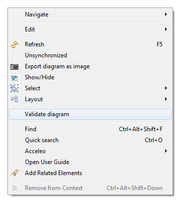
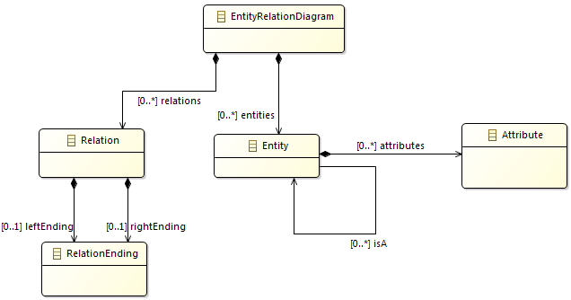
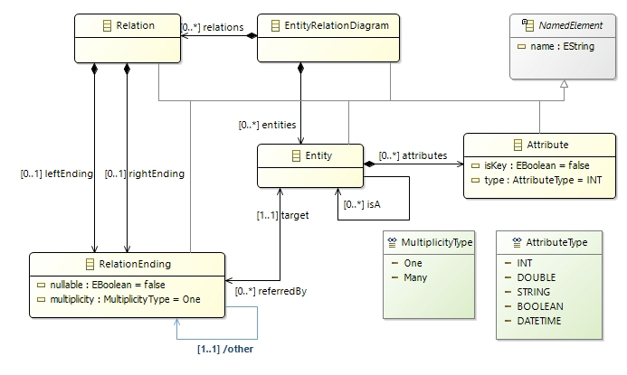
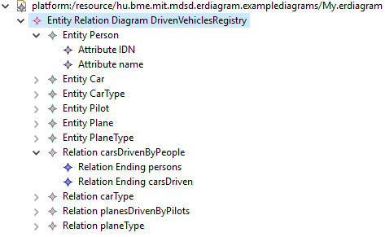

Introduction to the Eclipse Modeling Framework
==============================================

Author: Oszkár Semeráth, András Szabolcs Nagy. Gábor Bergmann

About the EMF
--------------

From Wikipedia (<http://en.wikipedia.org/wiki/Eclipse_Modeling_Framework>) ,,Eclipse Modeling Framework (EMF) is an Eclipse-based modeling framework and code generation facility for building tools and other applications based on a structured data model.'' EMF's data model is lightweight as it only defines a few but well-defined modeling elements. However, it has an extensive tooling support and community. For example, you can define the textual or graphical syntax of a language and generate the appropriate editors.

EMF can generate Java code from the metamodel with only a click of a button. The generated code provides a Java object API aligned with the metamodel. Out of the box, EMF is capable of serialisation to XMI and deserialisation from XMI files.

EMF home page: <http://www.eclipse.org/modeling/emf/>

Since Eclipse Luna (25. 06. 2014.), the EMF Ecore visual editor (Ecore Tools) has changed and now based on Sirius changing the extension name of the diagrams to `.aird`. Legacy diagrams (`.ecorediag`) cannot be opened with Eclipse Luna Modeling Tools edition. You can find the home page of the Ecore Tools project along with tutorials here: <https://www.eclipse.org/ecoretools/overview.html>

Description of the task
-----------------------
The goal of this exercise is to create the metamodel of customized
Entity-Relationship Diagrams (ERD). Those diagrams can aid the development of
software components that working with complex data structures. A later exercise
will show you how complete database schemes, full classes and the automated
mapping between those can be derived from those documents.

The following figure presents an example of an Entity Relation diagram.


Prerequisites
-------------

The Eclipse Modeling Tools edition contains every required plug-in.

Ecore model: step-by-step
-------------------------

1. Create a new **Empty EMF Project** by **File | New | Other... | Eclipse
Modeling Framework | Empty EMF Project**. Name it to ``hu.bme.mit.mdsd.erdiagram``.
This project is a Java plugin project (has an src folder and a MAINFEST.MF file) with the required ecore dependencies.

1. There is a folder in the project named **model**. Create a new
**Ecore Model** in it by right click to the folder | New | Other... | Eclipse Modeling Framework | Ecore Model. Name it to ``erdiagram.ecore``.

1. A new editor opens  that shows that the model resource has a yet unnamed empty package. Fill the missing properties in the property view, use only small case letters:
    * Name: ``erdiagram``
    * Ns Prefix: ``erdiagram`` (name space prefix in xml)
    * Ns URI: ``hu.bme.mit.mdsd.erdiagram`` (works as global ID. Other conventions is to use ``http://example.com/erdiagram``)
    
    If Properties View is not shown, right click the package element in the editor, and select **Show Properties View**. In general, to show any unavailable views go to **Window | Show View** or use the Quick Access box.

1. Let's use this tree editor to create the first EClass that will represent the ERD root model element (right click on the package | New Child | EClass) and name it EntityRelationDiagram in the Properties View. Don't forget to save the model. Also try out the other context menu items.

1. While it is possible to create the model in this tree editor, there is a more
convenient editor for this purpose.  Right click to the ecore file and choose
the **Initialize ECore diagram...** option. Name it to **erdiagram.aird**. Click Finish. After that choose the Design/Entities representation, then the package ``Erdiagram``. Name the representation to Entity Relation class diagram.

1. Add the first element from the palette with Existing Elements | Add command, then choose the EClass we already created. Alternatively, double click the canves when the diagram is first initialized. Note that the visual representation is independent from the ecore model itself, deleting from model and the diagram are different things.

1. Let's make the following part by dropping metamodel elements from the palette to the diagram:

    

1. If you click on a model element you can edit its properties in the **Property view**.
    * Specify the names of the ``EClass``es, the ``EReference``s and the ``EAttribute``s.
    * The ``EClass``es can be set to **Abstract** or **Interface** in this view.
    * The type of an ``EAttribute`` can be set in this view.
    * The multiplicity of the relation is set to ``0..*``
	* The ``EOpposite`` feature should be presented.
    * The objects of the instance models of the metamodel have to be in a tree hierarchy with respect of the containment references. Set the ``entities`` relation to **Is Containment**.
	* **Appearance:** you can edit the view of the diagram. For example the behaviour of an edge.
    * **Advanced Options:** Direct editing for the properties of the elements of the model.
    The features should be presented:

1. The effect of the diagram editing on the ``.ecore`` file can be observed if it is opened. It synchronizes when the diagram is saved.

1. The editor can validate the model with the check symbol visible in the context menu (see the following figure). All of the generated markers are also listed in the Problems View.

     
    
1. Create the metamodel of the Entity Relation Diagram on your own like it was a class diagram. A possible result is visible on Figure 1.4.
    
     

1. Add the ``EEnum`` named ``Multiplicity`` to the metamodel, and add two literals to it: ``One`` and ``Many``.

1. Add an abstract ``NamedElement`` class to the metamodel and add inheritance relations to all the EClasses. Note: the difference between the ``EAttribute`` and ``EReference`` is that the EAttribute is referring to an ``EDataTypes`` opposed to ``EReferences`` that endings to ``EClasses``.

1. Add EAttributes to the classes and also create an AttributeType enumeration. The final model should be similar to the following figure:

    

1. The metamodel lacks of ``EOperations``, because it is basically a data model. Also the creator of EMF doesn't recommends the usage of ``EOperations``.


Editor: step-by-step
--------------------
This example shows how to generate classes and an editor from Ecore models.

1. The ecore files are the blueprints of the domain specific languages. To use the tooling support available in Eclipse some kind of Java class  representation of those "boxes" are needed. Fortunately those classes can be automatically generated.

    Right click _on the ecore file_ and **New | Other | Eclipse Modeling Framework | EMF Generator Model**. The default ``erdiagram.genmodel`` is fine. At the next step choose that the generator generate from an Ecore model. In the third step the URI of the Ecore model have to be added. Click on load and next. Choose the only avaliable package to generate and hit finish.

1. Another tree editor opens similar to the ecore editor. Browse some of the setting in the property editor. Right click to the root, and choose the **Generate Model** command. Three package has been generated in the source folder. The first one contains the Classes we created in the form of Java interfaces. There are two special interfaces: *Factory.java and *Package.java, we will come back to this. Browse for example the ``hu.bme.mit.mdsd.erdiagram/src/erdiagram/EntityRelationDiagram.java`` file, and you can see that nothing strange has been generated, it is an interface with basic methods. The second package (erdiagram.impl) contains the implementation classes. The implementation class has some unusual field, but the implementations of the functions of the interface are quite simple. The erdiagram.util package contains two helper classes, which can be useful in advanced scenarios.

1. The main function of the generator model is to control the generated code. For example, we notice that the generated package names don't match the project name, which is a sad thing. To correct this, click on the Package element and find All | Base Package. Change it to ``hu.bme.mit.mdsd``. This will correct the generated package names according to the project name. Regenerate the Model code, delete the previously generated code and correct the MANIFEST file as it tries to export the deleted packages. Also, you could change the name of the src folder (for example to emf-gen). For that, click on the root object on the .genmodel editor and find Model | Model Directory and then change the src folder to emf-gen. However, this will break the generated tree editor in the runtime Eclipse, so don't do this :( Further options in the generator model include e.g. selecting a label feature for each class (e.g. "name").

1. Note that if you change the ecore model, you may have to reload the genmodel by Right click | Reload... Changes to the genmodel file will be preserved.

1. Generate an **editor**. Right click to the root of the genmodel file, and generate edit and editor in this order.

1. Right click to the project, and choose **Run as | Eclipse** application. Alternatively, select from the toolbar **Run | Run configurations...| Eclipse application**, then hit the *New launch configuration* button, optionally fill out parameters (such as launch configuration name), and press "Run". Both options will, by default, run an "Eclipse Application" launch configuration, consisting of all plug-ins defined in workspace source projects (i. e. the plug-ins we have just generated) as well as the target platform (the latter is, by default, the set of plug-in of the Eclipse instance used for developing the plug-ins). 

1. Create an empty project by **File | New | Other... | General | Project** and name it to **hu.bme.mit.mdsd.erdiagram.examplediagrams**.

1. Create a new Entity Relation Diagram into the new project by right clicking on it and picking **New | Other | Example EMF Model Creation Wizard | Erdiagram Model**. The name can be the default ``My.erdiagram``, and the model object (what we want to edit) should be **Entity Relation Diagram**.

1. Create the instance model. The editor is quite self-explanatory to use and very similar to the ecore tree editor.

   


Model manipulation: step-by-step
--------------------------------

The following example shows how to edit the model from code.

1. Create a new **Plug-in Project** by right click | New | Plug-in Project. Name it to ``hu.bme.mit.mdsd.erdiagram.example``, then add the following dependencies:

    ```
    hu.bme.mit.mdsd.erdiagram    The plug-in project's name that holds the ecore model.
    org.eclipse.emf.ecore.xmi    The instance model is serialised as an XMI document, will need it.
    ```
    
1. Create a class to the source folder:

    ```
    package hu.bme.mit.mdsd.erdiagram.example
    name    ErdiagramModels
    ```

1. Let's create a model using the generated Java code. The objects of the instance model should be instantiated by the generated *Factory singleton and edited through their interface without using the *Impl classes. The following method creates a single entity named Person with an attribute Nickname:

    ```java
    public EntityRelationDiagram createModel() {

        ErdiagramFactory factory = ErdiagramFactory.eINSTANCE;
        EntityRelationDiagram diagram = factory.createEntityRelationDiagram();

        Entity person = factory.createEntity();
        person.setName("Person");

        Attribute name = factory.createAttribute();
        name.setName("Nickname");
        name.setType(AttributeType.STRING);

        person.getAttributes().add(name);
        diagram.getEntities().add(person);

        return diagram;
    }
    ```

1. Create a method, which traverses the model and prints out the name of the entities.

    The result can be printed to the output by this method:

    ```java
    public void printErdiagram(EntityRelationDiagram erdiagram)
    {
        for (Entity entity : erdiagram.getEntities()) {
            System.out.println(entity.getName());
        }
    }
    ```

1. Create a main method which runs the previous code. Try it out by right clicking to the class and choosing **Run as | Java Application**.

    ```java
    public static void main(String[] args) {
        ErdiagramModels erdiagramModels = new ErdiagramModels();
        EntityRelationDiagram model = erdiagramModels.createModel();
        erdiagramModels.printErdiagram(model);
    }
    ```

1. Probably it won't run. Ecore models needs initialization, which can be done with the following code. Note that this is not needed if you run the code as an Eclipse application or as a JUnit Plug-in test.

    ```java
    public void init() {
       // For the initialisation of the model.
       // Without this the following error happens:
       //   "Package with uri 'hu.bme.mit.mdsd.erdiagram' not found."
       ErdiagramPackage.eINSTANCE.eClass();
    }
    ```

1. The model can be serialized into and loaded from an xmi file, which is handled as a ``Resource``. A resource can be referenced by an ``URI`` (note that are a lot of classes named as ``URI``; the one we need is in the ``org.eclipse.emf.common.util`` package). A ``ResourceSet`` manages a set of ``Resource``s. Write a method that creates and one that loads a resource with a specified ``URI``:

    ```java
    public Resource createResource(URI uri) {
        ResourceSet resSet = new ResourceSetImpl();
        Resource resource = resSet.createResource(uri);
        return resource;
    }
    ```

    ```java
    public Resource loadResource(URI uri) {
        ResourceSet resSet = new ResourceSetImpl();
        Resource resource = resSet.getResource(uri, true);
        return resource;
    }
    ```

1. The resource can be serialized by the ``save()`` method:

    ```java
    public void saveResource(Resource resource) {
       try {
         resource.save(Collections.EMPTY_MAP);
       } catch (IOException e) {
          System.out.println("The following error occurred during saving the resource: "
            + e.getMessage());
       }
    }
    ```

1. The model can be retrieved from a ``Resource`` by the ``getContents()`` method:

    ```java
    public EntityRelationDiagram getModelFromResource(Resource resource) {
       // check the content in production code!
       EntityRelationDiagram root = (EntityRelationDiagram) resource.getContents().get(0);
       return root;
    }
    ```


1. Let's put it together. Note that you can get the URI by right click | **Properties**.

    ```java
    public static void main(String[] args) {
        // init
        ErdiagramModels erdiagramModels = new ErdiagramModels();
        erdiagramModels.init();
        // create
        EntityRelationDiagram model = erdiagramModels.createModel();
        // save
        URI uri = URI.createFileURI("C:/Users/meres/Desktop/samplemodel.erdiagram");
        Resource resource = erdiagramModels.createResource(uri);
        resource.getContents().add(model);
        erdiagramModels.saveResource(resource);
        // load to a different resource
        Resource resource2 = erdiagramModels.loadResource(uri);
        EntityRelationDiagram model2 = erdiagramModels.getModelFromResource(resource2);
        // print
        erdiagramModels.printErdiagram(model2);
    }
    ```

    Right click to the class and choose **Run as | Java Application**. This will run our code as a simple Java application that creates, saves, loads and prints a model.

1. We still missing some initialization code, which registers an xmi serializer to the given file extension.

    ```java
    public void init() {
       // ...
          
       // Defining that the files with the .erdiagram extension should be parsed as an xmi.
       Resource.Factory.Registry reg = Resource.Factory.Registry.INSTANCE;
       reg.getExtensionToFactoryMap().put("erdiagram", new XMIResourceFactoryImpl());
    }
    ```

1. After running again, you can find the newly created .erdiagram file in the path you specified (desktop or if you sepcified the project folder, you may have to refresh it by F5 or by the refresh button). It cannot be opened with the generated tree editor as it is not installed in this Eclipse. To open it you may either use the Sample Reflective Ecore Editor, start a runtime Eclipse or install the plugins to the host by exporting it.


UI integration: quick example
-----------------------------

Above, we have created a plain Java console application that loaded, manipulated and saved EMF models. The most common scenario for handling EMF objects, however, is within the Eclipse Workbench, interacting with EMF models loaded in Eclipse editors. Although Eclipse plug-in development would deserve a course of its own, here we do a quick and rough walkthrough of contributing a context menu action to existing EMF editors that would access and modify the model under edit. 

The example plug-in will register a context menu action that can be activated on any selected Entity model element, and when executed, will add an attribute named "FooBar" to the selected entity.

1. We are going to create an Eclipse plug-in project. Select **File | New | Project... | Plug-in project**, use a project name such as ``hu.bme.mit.mdsd.erdiagram.action``, and on the final page of the wizard, unclick "Create a plug-in using one of the templates". Open the file ``META-INF/MANIFEST.MF`` within the resulting project, and add as plug-in dependencies both the model project ``hu.bme.mit.mdsd.erdiagram`` (containing the metamodel and the generated Java classes) as well as ``org.eclipse.ui`` (to which we will make contributions). Such dependencies can be added easily on the "Dependencies" tab (specifically the "Required Plug-ins" panel) of the manifest editor, or manually using the textual syntax on the MANIFEST.MF tab.

1. Understand that there are three kinds of extensions that we must contribute to the Eclipse UI. First, we will define the "Add FooBar" _Eclipse command_. Second, such a command can appear on the UI in several places; it be bound to keyboard shortcuts, shown in the main menu, on toolbars, etc.; we will specifically make a popup menu contribution so that it will (conditionally) appear in context menus. Finally, there can be multiple pieces of code called _handlers_ that actually perform the duties of the command, one of which is always selected depending on the context;  here we will register a single handler, a single way to execute the command regardless of circumstances. 

1. There are all achieved by contributing to three extension points provided by the plug-in ``org.eclipse.ui``, namely ``org.eclipse.ui.menus``, ``org.eclipse.ui.commands`` and ``org.eclipse.ui.handlers``. The manifest editor has an "Extensions" tab where you can add these extensions; add an extension now to, say, ``org.eclipse.ui.handlers`` (without filling out the details or creating child elements), and save the editor. 

1. A ``plugin.xml`` file will appear, which encodes the extensions contributed by our plugin. As an alternative to the "Extensions" tab, it can be directly edited in XML syntax through the "plugin.xml" tab of the same manifest editor. Let's do just that, and paste the following contents. Note that the Java class ``hu.bme.mit.mdsd.erdiagram.Entity`` is referenced by its fully qualified name (as a plain string); please make sure that the name matches the one used in your workspace.

```xml
<?xml version="1.0" encoding="UTF-8"?>
<?eclipse version="3.4"?>
<plugin>
    <extension
         point="org.eclipse.ui.commands">
      <command
            description="Add an attribute called 'FooBar' to selected Entity"
            id="hu.bme.mit.mdsd.erdiagram.action"
            name="Add FooBar Attribute">
      </command>
    </extension>
    <extension
        point="org.eclipse.ui.handlers">
        <handler
              class="hu.bme.mit.mdsd.erdiagram.action.AddFooBarHandler"
              commandId="hu.bme.mit.mdsd.erdiagram.action.AddFooBar">
        </handler>
    </extension>
    <extension point="org.eclipse.ui.menus">
         <menuContribution locationURI="popup:org.eclipse.ui.popup.any?after=additions">
            <command commandId="hu.bme.mit.mdsd.erdiagram.action.AddFooBar" 
                style="push" tooltip="Add FooBar Attribute">
                 <visibleWhen checkEnabled="false">
	               <with
	                     variable="activeMenuSelection">
	                  <iterate>
	                     <adapt
	                           type="hu.bme.mit.mdsd.erdiagram.Entity">
	                     </adapt>
	                  </iterate>
	               </with>
                </visibleWhen>
            </command>
         </menuContribution>
    </extension>
</plugin>
```
1. As seen above, the extension contribution has a visibility condition that makes sure that the menu item will only appear in the context menu of entities. More precisely, this will work in any view or editor (such as the default generated EMF tree editor, or the Outline view) where the selection is recognized to correspond to an Entity object. Beware that in certain concrete syntax frameworks, the selection might contain a notation element distinct from the underlying domain model EObject; in those cases, an extra wrapping/unwrapping step is needed that is specific to the given concrete syntax editor technology. 

1. One could further personalize the contributions (e.g. make sure that the command is also deisabled if another element is selected; make sure that the menu item will show up in the proper place within the context menu, etc.) , but instead we will move over. After saving the plugin.xml, note that an warning marked is found towards the top, on the ``class=`` line of the handler contribution. Here we reference the class implementing the handler logic, but we have not created that class yet. By moving the cursor to that line and hitting Ctrl+1, a selection of _quick fixes_ are shown, among which we will need "Create...". Choosing that fix will pop up a "New Java Class" wizard. The interface name ``IHandler`` is pre-filled, but we will have an easier time if we add the base class ``org.eclipse.core.commands.AbstractHandler`` (in the "Superclass" field) as well. That way, only a single method will have to be implemented. Hit Finish. 

1. Note that in an Eclipse environment, the extension-point mechanism is also used to register Ecore packages in a global registry, associate file extensions with EMF resource types, etc. Thus there is no need in this case for the previously described steps of initializing Ecore packages and registering XMIResourceImpl for the file extension; we can directly use EMF types. First, however, we have to unpack EMF object from the data structures of the _selection_ mechanism provided by the Eclipse UI. Insert therefore the following implementation of the ``AddFooBarHandler.execute`` method:

```java
	@Override
	public Object execute(ExecutionEvent event) throws ExecutionException {
		// unpack selected object
		IStructuredSelection selection = (IStructuredSelection) HandlerUtil.getCurrentSelection(event);
		Object firstElement = selection.getFirstElement();
		
		// cast to Entity, which it must be in this case
		Entity entity = (Entity) firstElement;

		// perform business logic
		Attribute newAttribute = ErdiagramFactory.eINSTANCE.createAttribute ();
		newAttribute.setName("FooBar");
		entity.getAttributes().add(newEntity);
	
		return null;
	}
```
1.  Once again, run an "Eclipse Application" launch configuration, consisting of all plug-ins defined in workspace source projects as well as the target platform; you can simply reuse the previous "Eclipse Application" launch config from the dropdown of the **Run** toolbar button. In the workspace of the runtime Eclipse, either create a new ER Diagram instance model using the wizard, or open an existing instance model file created above. Observe how "Add FooBar Attribute" will appear in the context menu of any Entity selected in either the tree editor or the outline view, and that invoking this action will indeed add a new Attribute to the model. 

General tips
------------

* If anything goes wrong with the regeneration and there is problem with your code you have two options:
  * If the document was not edited by hand or it isn't valuable delete it. Generate the code again, and it should be fine. It works on the `Manifest.MF` and the `plugin.xml` too.
  * In other case don't be afraid of rewriting. For example if you delete an item from the metamodel the XMI that contains the instance model might have remaining tags with undefined type. That makes the XMI invalid, but it isn't necessary to start over the instance model; simply delete the unwanted part from the code by hand.
  
You can find the final state of the projects in [this repository](https://github.com/FTSRG/mdsd-examples) by checking out the ``EMF`` branch.

References
----------

* Tutorial at EclipseSource: <http://eclipsesource.com/blogs/tutorials/emf-tutorial/>
* Tutorial at Vogella: <http://www.vogella.com/tutorials/EclipseEMF/article.html> and <http://www.vogella.com/tutorials/EclipseEMFPersistence/article.html>