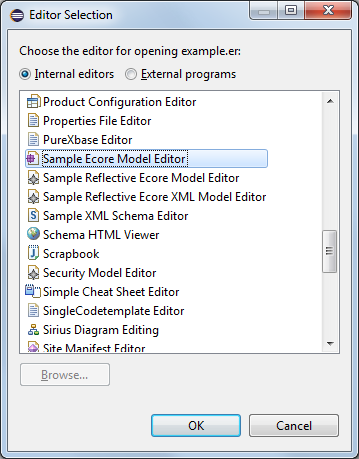

# Xtext


homepage: https://eclipse.org/Xtext/

Install Xtext
-------------

Install Xtext 2.9 using the releases update site: http://download.eclipse.org/modeling/tmf/xtext/updates/composite/releases/

(You can find the link here: https://eclipse.org/Xtext/download.html)

Click Help > Install New Software and complete with next, next finish.


As you can see, we will need Xtend as well.

Create an Xtext language without existing AST metamodel
-------------------------------------------------------

1. Create a new Xtext project with the following name: ```hu.bme.mit.mdsd.erdiagram.text```. Name of the language will be ```hu.bme.mit.mdsd.erdiagram.text.ERDiagramDsl```. It should conform to a fully qualified class name. File extension will be ```er```.


You can hit finish, or on the next page you can disable the "Testing support" as we won't need that. This will produce a simple ```Hello``` language with greetings messages. It is worth to check this language.

1. Declare our language

	```
	grammar hu.bme.mit.mdsd.erdiagram.text.ERDiagramDsl with org.eclipse.xtext.common.Terminals
	
	generate eRDiagramDSL "http://www.bme.hu/mit/mdsd/erdiagram/text/ERDiagramDsl"
	```
	
	The ```grammar``` keyword declares the name of our language. The ```with``` keyword defines an inheritance from another language. In this case, we inherit from the _Terminals_ language which enables us to use the ```ID``` rule (see later).
	The ```generate``` keyword is responsible for generating the AST metamodel (more precisely, DOM metamodel) from the language definition. The metamodel will be expressed in Ecore, where the EPackage name will be _eRDiagramDsl_ and the package _namespace uri_ will be _http://www.bme.hu/mit/mdsd/erdiagram/text/ERDiagramDsl_. By default, the generated EClasses within the package will be named after name of the grammar rule that generated them.


1. Entry rule

	Each Xtext language is built up from context-free grammar rules. The entry (or main) rule, responsible for describing the structure of the entire text file, is the first defined rule. In our case, the ```ERDiagram``` rule will serve as the main rule:
	
	```
	ERDiagram:
		entities+=Entity+
		relations+=Relation*
	;
	```
	
	Syntax: _rule name_ ':' ... ';'
	
	This rule states that each file in our syntax consists of one or more ```Entity``` objects and zero or more ```Relation``` objects (rules). The entire model described by such a file will be stored in an EObject of type ```ERDiagram```, and the individual entities and relations will be stored in two containment EReferences of this root object, named _entities_ and _relations_ in this case.
	
	Some examples with containment references (attributes and cross-references work analogously, as we'll see):
	* _referenceName_  ```=``` _ruleName_  -> single-valued EReference to hold one contained object described by called rule
	* _referenceName_ ```+=``` _ruleName_  -> one contained object (described by called rule) put into a many-valued EReference (can hold a list of zero, one or more contained objects)
	* _referenceName_ ```+=``` _ruleName_```*``` -> zero, one or more contained objects (each described by called rule) put into a many-valued EReference
	
	
	The usage of ```*``` in the last example indicated the multiplicity:
	* ``` ``` -> exactly one
	* ```*``` -> zero, one or more
	* ```+``` -> one or more
	* ```?``` -> zero or one
	
	
	_Note: by default, 'ruleName' will also be the type of the objects held by the containment reference, because the generated DOM uses rule names as type names (EClass names). This is possible to override, if we want the parsed model to conform to an existing Ecore metamodel._

1. Defining an enumeration type for representing ER attribute types:

	```
	enum AttributeType:
		INT = 'int' | DOUBLE = 'double' | STRING = 'string' | BOOLEAN = 'boolean' | DATETIME = 'datetime'
	;
	```

	We can define enumerable rules which is mapped to an EMF enumeration in the generated AST. It starts with ```enum``` keyword. The key-value pairs are separated by '|' character; each pair consists of an enum literal to be generated, and a keyword to define its concrete syntax.

1. 'ID' terminal rule.

	First version of _Entity_ rule:
	
	```
	Entity:
		'entity' name=ID ';'?	
	;
	```
	
	Between apostrophe characters, we can define terminals (or keywords) for our language. The 'ID' terminal rule comes from the _Terminals_ language, and defines a unique identifier. An ```Entity``` rule starts with the ```entity``` keyword, then a string conforming to the 'ID' terminal follows, which is stored in a _name_ attribute, and finally an optional ';' terminal character (keyword) concludes the rule. Note the multiplicity indicator '?'.

	Note that attribute assignment with a rule uses the same syntax as reference assignment. Some examples with attributes:
	* _attributeName_  ```=``` _ruleName_  -> single-valued EAttribute to hold one data value described by called rule
	* _attributeName_ ```+=``` _ruleName_  -> one data value (described by called rule) put into a many-valued EAttribute
	

1. Grouped multiplicities, Booleans 

	Next version of _Entity_ rule, now with contained attributes:
	
	```	
	Entity:
		'entity' name=ID
		('{'
		(attributes+=Attribute) 
		(',' attributes+=Attribute)*
		'}')?
	;

	Attribute:
		name=ID ':' type=AttributeType (isKey?='key')?
	;
	```	

	We can group expressions with parentheses  (```(```, ```)```) to add a joint cardinality indicator character (see ```*```, ```?``` demonstrated above) to the complex grouped expression. If an entity doesn't have any attributes, then the entire pair of curly braces can be omitted. Otherwise, there is one mandatory application of the ```Attribute``` rule with the resulting object put into the ```attributes``` containment reference. The first attribute is optionally followed by a number of additional attributes, each separated by a comma terminal character. 


	A special case of the EAttribute assignment syntax for Boole-valued attributes is demonstrated in the ```'Attribute``` rule. If the 'key' keyword is found, the grouped expression (with optionality indicator ```?```) will match, setting the boolean field ```isKey``` to true.
	* _attributeName_ ```?=``` _keyword_ -> boolean attribute set to true (but only in case this expression, including the keyword, is applied to match the text)

1. Cross-reference an _instance_ of a rule applied elsewhere with square brackets `[...]`.
	
	Further refined definition of the _Entity_ rule:
	
	```
	Entity:
		'entity' name=ID ('isA' isA+=[Entity])*
		('{'
		(attributes+=Attribute) 
		(',' attributes+=Attribute)*
		'}')?
	;
	```
	
	If we omit the square brackets (`isA+=Entity` instead of `isA+=[Entity]`), then we would have to apply the rule again starting with `entity` keyword, defining a new entity each time. With the square brackets we declare that only a cross-reference is needed to a rule instance applied elsewhere: ```[``` _eClass_ `]`.
	
	_Note: in this case, 'eclass' equals with a rule name, because the generated AST uses rule names as type names._

1. Unordered expressions.

	```
	Relation:
		leftEnding=RelationEnding
		'is related with'		
		rightEnding=RelationEnding
	;
	
	RelationEnding:
		(multiplicity=Multiplicity & (nullable?='nullable')?) target=[Entity]
	;
	
	enum Multiplicity:
		One = "one" | Many = "many"
	;
	```
	
	The '&' character defines an unordered list of the rules.
	In this case, the following combinations are all accepted before the entity reference:
	
	 * one nullable
	 * nullable one
	 * many nullable
	 * nullable many
	 * one
	 * many
 
1. The full Xtext code

	```
	grammar hu.bme.mit.mdsd.erdiagram.text.ERDiagramDsl with org.eclipse.xtext.common.Terminals

	generate eRDiagramDsl "http://www.bme.hu/mit/mdsd/erdiagram/text/ERDiagramDsl"
	
	//Entry rule
	ERDiagram:
		entities+=Entity*
		relation+=Relation*
	;

	Entity:
		'entity' name=ID ('isA' isA+=[Entity])*
		('{'
		attributes+=Attribute
		(',' attributes+=Attribute)*
		'}')?
	;

	Attribute:
		name=ID ':' type=AttributeType (isKey?='key')?
	;

	enum AttributeType:
		INT = 'int' | DOUBLE = 'double' | STRING = 'string' | BOOLEAN = 'boolean' | DATETIME = 'datetime'
	;

	Relation:
		leftEnding=RelationEnding
		'is related with'
		rightEnding=RelationEnding
	;

	RelationEnding:
		(multiplicity=MultiplicityType & (nullable?='nullable')?) target=[Entity]
	;

	enum MultiplicityType:
		One = 'one' | Many = 'many'
	;
	```

Building infrastructure
-----------------------

When you modify your _xtext_ files, you have to build the infrastructure for your language. The following figure shows where to click to generate.


Try our new language
--------------------

1. Start a runtime Eclipse.

1. Create a general project

	_New->Project...->General->Project_ Name: hu.bme.mit.mdsd.erdiagram.text.example
	
	

1. Create a file with 'er' extension

	_New->File_ Name: example.er 
	
	
	
	Add Xtext nature in the pop-up window.
	
	

1. (Optional, if you missed the pop-up window) Add Xtext nature

	Right click on project -> Configuration -> Add Xtext nature

1. Now, you can try out the language. Notice that you can use auto completion and quick fixes as well.

Check out the generated AST
---------------------------

1. Create an example file with 'er' extension and fill it with the following content:

	```
	entity person {
		name : string,
		id : int key
	}

	entity driver isA person {
		licence : string
	}
	
	entity car {
		numberPlate : string key
	}
	
	one person is related with nullable many car
	```

1. Open with Simple Ecore Model Editor

	Right click on the file -> Open -> Open with... -> Simple Ecore Model Editor
	
	
	
	This will show you the AST (more precisely, the DOM) parsed from the text.
	
	


	
Scoping
-------

Scoping defines which elements are referable by a given reference. For instance, we don't want to enable self inheritance.

1. Open our scope provider

	

	_Note: This is a Java class written in the Xtend language. Simple Java code is generated from Xtend files under the xtend-gen source folder (further description about the language can be found here: http://eclipse.org/xtend/)_

1. Create the following method:

	```java
	class ERDiagramDslScopeProvider extends AbstractERDiagramDslScopeProvider {

		override IScope getScope(EObject context, EReference reference) {
			if (context instanceof Entity) {
				return Scopes.scopeFor(
					(context.eContainer as ERDiagram)
					.entities.filter[x | x != context]
				)
			}
			return super.getScope(context, reference)
		}

	}
	```
	
	This scope restricts the objects available as endpoints for the _isA_ reference of the _Entity_ EClass. The ```Scopes``` class contains static methods to create scope descriptions from a list of EObjects.
	

1. Check out in our example (Runtime Eclipse, example.er file).

Validation
----------

Static analysis is always required for any language. In this example, we want to raise an error if a cycle occurs in the inheritance graph.

1. Open the validator Xtend file (ERDiagramDslValidator.xtend).
	
1. A validation method for given type requires the following things: `@Check` annotation, one parameter with the correct type, using the `error`, `warning` or `info` methods to create markers on the editor.

	```java
	class ERDiagramDslValidator extends AbstractERDiagramDslValidator {

		Set<Entity> entitiesAlreadyChecked = new HashSet

		@Check
		def checkCyclicInheritance(Entity entity) {
			checkCyclicInheritance2(entity)
			entitiesAlreadyChecked.clear
		}
	
		def checkCyclicInheritance2(Entity entity) {
			entitiesAlreadyChecked += entity
			for (parent : entity.isA) {
				if (entitiesAlreadyChecked.contains(parent)) {
					error("Cyclic inheritance is not allowed.", 						
						ERDiagramDslPackage.Literals.ENTITY__IS_A)
					return;
				}
				checkCyclicInheritance2(parent)
			}
		}
	
	}
	```
	
	_Note: in a real project much more validation would be needed._

1. Check out in our example (Runtime Eclipse, example.er file)

Generate files on build
-----------------------

1. Open the ERDiagramDslGenerator.xtend file.

1. Create the following method:

	```java
	class ERDiagramDslGenerator extends AbstractGenerator {

		override void doGenerate(Resource resource, IFileSystemAccess2 fsa, IGeneratorContext context) {
			fsa.generateFile('entities.txt', 'Entities: ' + 
				resource.allContents
					.filter(typeof(Entity))
					.map[name]
					.join(', '))
		}
	}
	```

	The will generate the an _entities.txt_ file after modifying and building the example ERDiagram model containing the name of each entities.

1. Check it out.

	

Create an Xtext language with existing AST metamodel
----------------------------------------------------

You may have noticed the _model_ folder in the Xtext project, which contains a generated ecore and genmodel file. Xtext uses EMF under the hood. Xtext can also work with existing ecore models.

To make it work you either generate a new xtext project along with a new grammar from the existing ecore model or change your grammar at the following two points: (1) instead of `generate` you have to `import` the ecore model and (2) rules must be accompanied with a `returns <existing EClass>`.

In this tutorial, we will generate a new language based on the previously create erdiagram and will highlight the differences.

1. Clone and check out any branch from [this repository](https://github.com/FTSRG/mdsd-examples), then import the project with the erdiagram ecore model in it.

1. Create a new **Xtext Project From Existing Ecore Models**

	

1. Choose the existing ecore model and select the root element as the entry rule.

	

1. On the next page you can give the project name, extension, etc. As for this tutorial you can leave everything on default.

1. You may have to add Xtext nature to the `*.erdiagram` project.

1. Examine the generated grammar (MyDsl.xtext). Header and entry rule:

	```
	// automatically generated by Xtext
	grammar org.xtext.example.mydsl.MyDsl with org.eclipse.xtext.common.Terminals

	import "hu.bme.mit.mdsd.erdiagram" 
	import "http://www.eclipse.org/emf/2002/Ecore" as ecore

	EntityRelationDiagram returns EntityRelationDiagram:
		{EntityRelationDiagram}
		'EntityRelationDiagram'
		name=EString
		'{'
			('entities' '{' entities+=Entity ( "," entities+=Entity)* '}' )?
			('relations' '{' relations+=Relation ( "," relations+=Relation)* '}' )?
			('temporalAttributes' '{' temporalAttributes+=Attribute ( "," temporalAttributes+=Attribute)* '}' )?
		'}';
	```

References
==========

* detailed documentation: https://eclipse.org/Xtext/documentation/

	