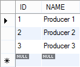

Code generation technologies
============================

JVM based languages
-------------------

**Summary:** <http://en.wikipedia.org/wiki/List_of_JVM_languages>

Beyond Java, many programming languages exist which are capable of producing software that can run on the Java Virtual Machine (JVM). These languages usually feature close interoperability with Java libraries: they are able to call their methods and accept their calls.

In recent years, the TIOBE index (<http://www.tiobe.com/index.php/content/paperinfo/tpci/index.html>), which shows the popularity of programming languages put Java in the top two positions, while Scala, Groovy and Clojure was in the top 100.

### Scala ###
**Home page:** <http://www.scala-lang.org/>

Like Java, Scala is strongly object-oriented and statically typed but also uses elements from functional programming. Scala natively supports building concurrent applications.


### Groovy ###
**Home page:** <http://groovy.codehaus.org/>

Groovy is a script-like language with functional elements. Most syntactically correct Java code is also a corrent Groovy code. Groovy supports both static and dynamis typing.

**Remark:** in Bonita (<http://www.bonitasoft.com/>), used on the Service Integration course, you can specify expressions in Groovy (<http://www.bonitasoft.com/resources/documentation/groovy>).


### Clojure ###
**Home page:** <http://clojure.org/>

Clojure is a dialect of the Lisp programming language. Software created in Clojure can be compiled to run on the JVM, the .NET Common Language Runtime (CLR) or a JavaScript engine. Clojure is a functional language which strongly support building concurrent applications.


Code generation with Eclipse technologies
-----------------------------------------

### Xtext ###
**Home page:** <http://www.eclipse.org/Xtext/>

Xtext is a framework creating programming languages and domain-specific languages. Xtext is capable of generating the parser the interpreter and provide Eclipse IDE support for the language. The developers task is to define language's grammar in ``.xtext`` files (<http://www.eclipse.org/Xtext/documentation.html#_1>). Xtext's components build on the Eclipse Modeling Framework (EMF), so Xtext development can be easily integrated with other EMF based technologies (e.g. GMF).


### Xbase ###
**Home page:** <http://wiki.eclipse.org/Xbase>

Xbase is partial programming language. It's purpose is to serve as a basis of the expessions in the programming languages generated by Xtext. Xbase expressions closely resemble Java expressions: the mutual elements include strings, if and foreach structures, method invocations, constructors, etc.

The target platform of Xbase expressions is the JVM. At first, Xbase generates Java code and later compiles it to byte code.

Xbase is statically typed. It's features include closures and operator overloading. It provides convenient type inference mechanism and a switch structure more advanced than Java's (see the Xbase home page above).

**Remark:** the ``check`` expression in IncQuery patterns (<http://viatra.inf.mit.bme.hu/incquery>) are written in Xbase.


### Xpand ###

**Home page:** <http://www.eclipse.org/modeling/m2t/?project=xpand>, <http://wiki.eclipse.org/Xpand>

Xpand is a highly specialised language, with the purpose of generating code from EMF models. Xpand is statically typed and support polymorphic template invocation, aspect-oriented programming (AOP), model transformation, model validation, etc.

Example code: <http://www.openarchitectureware.org/pub/documentation/4.3.1/html/contents/emf_tutorial.html#emf_tutorial_generating_code>

#### Xtend (deprecated) ####
**Home page:** <http://wiki.eclipse.org/Xpand/Galileo>

See also: <http://dslmeinte.wordpress.com/2011/09/19/using-xtexts-xtend2-language/>

Originally, Xtend was a sublanguage of Xpand (file with ``.ext`` and ``.xpt`` extension). It was capable of supporting functional programming elements.

**Remark:** Xpand and its Xtend technologies are no longer actively developed, so we don't use it in the courses.

### Xtend (previously called Xtend2) ###
**Home page:** <http://www.eclipse.org/xtend/>

Blog post: <http://blog.efftinge.de/2010/12/xtend-2-successor-to-xpand.html>

Wikipedia: <http://en.wikipedia.org/wiki/Xtend_(programming_language)>

Xtend2 was created with the intent to replace Xpand and Xtend. Later the number ,,2'' was dropped from its name. Hence, when we use the term ,,Xtend'' we refer to the new technology. In order to be distinguishable, the files created with the newer Xtend technology have the extension ``.xtend``. 

Xtend is a JVM based language. It's grammar and editor was created with Xtext. The language uses Xbase expressions. Xtend is statically typed, and uses both object-oriented and functional elements -- e.g. lambda expressions.

Xtend can cover the whole process of generating code from an EMF model, including the definition of the templates and imperative code that executes the process.


JPA
===

This tutorial shows a simple example that covers most of the JPA technology. 

1. Create a new java project with the name ``hu.bme.mit.mdsd.jpaexample``.

1. Create a new package to the **src** folder and name it to ``car.entities.handwritten``.

1. Create a class named ``Dealer``:

    ```java
    public class Dealer {
      private String name;
      private List<Producer> productRange = new ArrayList<Producer>();
    }
    ```
    
1. And a one  named ``Producer``:
    
    ```java
    public class Producer {
      private String name;
      private List<Dealer> worksWith = new ArrayList<Dealer>();
    }
    ```

1. Generate the getters and setters.

1. To persist the instances to a database some jar file is needed:
    - **javax.persistence_2.0.4.jar:** The java persistence API itself.
    - **eclipselink.jar:** The way of object-relational mapping is defined in this jar. We use Eclipse link at this lecture.
    - **mysql-connector-java-5.1.22-bin.jar:** The database driver. In this case the application is connected to a MySQL database.
    
    Those jar files can be downloaded from the site of the vendor.
    
1. Those files should be added to the project. Previously the Maven tool is used for this purpose, but at this case they will be added manually.
   Create a new folder to the project and call it to ``lib``. Put the files to this folder by drag and drop them.

1. Those files should be added to the classpath of the project.
   To do this right click to the project and choose **Build Path | Configure Build Path**.
   Add the jars to the build path with the **Add JARs** button at the Lybraries menu.

1. Some configuration is inevitable. Create a ``META-INF`` folder into the project and add a file into it named ``persistence.xml``.
   The content:
   
    ```xml
    <?xml version="1.0" encoding="UTF-8"?>
    <persistence version="2.0"
      xmlns="http://java.sun.com/xml/ns/persistence"
      xmlns:xsi="http://www.w3.org/2001/XMLSchema-instance"
      xsi:schemaLocation="http://java.sun.com/xml/ns/persistence http://java.sun.com/xml/ns/persistence/persistence_2_0.xsd">
	  <persistence-unit name="cars">
	    <exclude-unlisted-classes>false</exclude-unlisted-classes>
	    <properties>
		  <property name="javax.persistence.jdbc.password" value="root"/>
		  <property name="javax.persistence.jdbc.user" value="root"/>
		  <property name="javax.persistence.jdbc.driver" value="com.mysql.jdbc.Driver"/>
		  <property name="javax.persistence.jdbc.url" value="jdbc:mysql://localhost:3306/test"/>
		  <property name="eclipselink.ddl-generation" value="create-tables"/>
		  <property name="eclipselink.logging.level" value="INFO"/>
	    </properties>
	  </persistence-unit>
    </persistence>
    ```
    
    This configuration defines the following properties:
    - A name for the persistence-unit
    - Username / Password for the database
    - The path of the database as a URL
    - What should happen if there is an existing table with the same name (possibly from a previous version). Another possibility that resets the tables is ``drop-and-create-tables``.
    - Which class should be persisted?

1. Annote the persistent classes.
   Add ``@Entity``, the ``@Table(name="Producer_Table")`` and the ``@Table(name="Dealer_Table")`` annotation to the respective persistent classes.
   
1. An ID field is necessarry to every class:
    
    ```java
    @Id
	@GeneratedValue(strategy=GenerationType.TABLE)
	@Column(name="ID")
	private int id;
	
	public int getId() {
		return this.id;
	}
    ```
    
    The manually defined column name and the generation strategy should be inspected.
    
1. Create a new class named ``FillDatabase_1`` and add a main method:

    ```java
	public static void main(String[] args) {
		EntityManagerFactory factory = Persistence.createEntityManagerFactory("cars");
	    EntityManager em = factory.createEntityManager();
	    
	    
	    em.getTransaction().begin();
	    
		Producer
			producer1 = new Producer(),
			producer2 = new Producer(),
			producer3 = new Producer();
		producer1.setName("Producer 1");
		producer2.setName("Producer 2");
		producer3.setName("Producer 3");
		
		em.persist(producer1);
		em.persist(producer2);
		em.persist(producer3);
		
	    em.getTransaction().commit();

	    em.close();
	}
	```

1. Start the MySQL workbench and check the database named **test**.

1. Run the application, and check the console output.

1. Check the database: new tables have been created, and there is one that contains the producers.

    

1. To link the dealers with the producers a new manager class is defined:
    
    ```java
    public class CarManager {
	    public void linkDealerToProducer(Dealer dealer, Producer producer) {
	        dealer.getProductRange().add(producer);
	        producer.getWorksWith().add(dealer);
	    }
	}
    ```

1. Define the Many To Many relation in ``Producer``:
    
    ```java
    @ManyToMany
	@JoinTable(
	    name="DealerProducerJoin",
	    joinColumns={@JoinColumn(name="ProductID",referencedColumnName="ID")},
	    inverseJoinColumns={@JoinColumn(name="DealerID", referencedColumnName="ID")})
	private List<Dealer> worksWith = new ArrayList<Dealer>();
	```
	
	``And in Dealer``:
	
	```java
	@ManyToMany(mappedBy="worksWith")
	private List<Producer> productRange = new ArrayList<Producer>();
	```

1. Fill the database with dealers too:

    ```java
	//...
	producer3.setName("Producer 3");
	
	Dealer
		dealer1 = new Dealer(),
		dealer2 = new Dealer(),
		dealer3 = new Dealer();
	dealer1.setName("Even dealer");
	dealer2.setName("Odd dealer");
	dealer3.setName("Prime dealer");
	
	CarManager manager = new CarManager();
	
	manager.linkDealerToProducer(dealer1, producer2);
	manager.linkDealerToProducer(dealer2, producer1);
	manager.linkDealerToProducer(dealer2, producer3);
	manager.linkDealerToProducer(dealer3, producer2);
	manager.linkDealerToProducer(dealer3, producer3);
	
	em.persist(producer1);
	//...
    ```

1. If you run it a ``java.lang.IllegalStateException`` exception will appear:
    **During synchronization a new object was found through a relationship that was not marked cascade PERSIST.**
    The first solution is to persist the dealers too:
    
    ```java
    em.persist(dealer1);
	em.persist(dealer2);
	em.persist(dealer3);
    ```
    
1. The second is that if it is defined if the products are persisted the dealers should also be persisted:
    
    ```java
    @ManyToMany(cascade=CascadeType.ALL)
    ```
	
	We use this one.

1. If the application is executed the tables of the database will be filled.

1. Create an application that queries the database:

    ```java
    public class DataBaseQuery {

		/**
		 * @param args
		 */
		public static void main(String[] args) {
			EntityManagerFactory factory = Persistence.createEntityManagerFactory("cars");
		    EntityManager em = factory.createEntityManager();
		    
		    Query q1 = em.createQuery("select p from Producer p");
		    @SuppressWarnings("unchecked")
			List<Producer> producers = q1.getResultList();
		    
		    for (Producer producer : producers) {
				System.out.println(producer.getId() + " - " + producer.getName());
				for (Dealer dealer : producer.getWorksWith()) {
					System.out.println("    - " +dealer.getName());
				}
			}
	
		    em.close();
		}
    }
    ```
1. If you execute this the result will be empty, so set the **ddl-generation** value in the persistence.xml to **create-tables**

1. The query can be parameterised like this:
    
    ```java
    "select p from Producer p where p.id = 1"
    ```
    
Code generation laboratory
==========================

1. Open the ``hu.bme.mit.mdsd.erdiagram`` project, and generate the model, the edit and the editor as usual.

1. Check the handed out code: the ``hu.bme.mit.mdsd.generatebutton`` and the ``hu.bme.mit.mdsd.codegenerator``. This project contains an extension that puts a button to the cool bar. The button is detailed in the Technical basics lecture. Our goal is to initiate the code generation procedure with this button.

1. The event handler of the button is implemented in the ``execute`` method of the ``JPADataGenerateCommandHandler`` class. The method structured like this:
    - ``IWorkbenchWindow window``: Getting the actually edited active workbench.
	- ``ISelection selection``: Checks it if there is anything selected.
	- ``Object firstElement``: Only a single element should be selected.
	- ``EntityRelationDiagram dataModel``: This element should be an ER diagram.
	- ``System.out.println(dataModel.eResource().getURI())``: The result should be printed to the console of the host eclipse.
	
	If the method fails in those steps it will show an error message. This event handler gets a diagram that we can generate from.

1. Run the plug-ins in an eclipse application.

1. Import the **JPAExample** project to the runtime eclipse and check **My.erdiagram**.

1. Select the diagram model element and press the **ERDiagram -> Code** button. If you push the button while an ER diagram is selected the URL of the model should be printed to the output.

1. From this we work in the ``hu.bme.mit.mdsd.codegenerator`` project. There is a support class named ``GeneratorHelper`` in this project that will be used for the code generation.

    The following method creates a java file into the project that the parameter model ``nextTo`` is in. The file is placed into the source folder named **src**, which is expected to be exist. It creates the folder composition from the namespace hierarchy, so for example the namespace ``hu.bme.mit.jpadatagenerator.helper`` creates the ``src/hu/bme/mit/jpadatagenerator/helper`` folder if it isn't existed previously. The java file named ``<name>.java`` will be placed into this folder with the content defined by the ``content`` parameter, where ``<name>`` comes from the parameter ``name``. The method only replaces a derived file and creates a derived file.
	
	```java
	public static IFile createJavaFile(Resource nextTo, String namespace,
			String name, Boolean derived, CharSequence content)
	```
    
1. Create a new package named ``hu.bme.mit.jpadatagenerator.templates`` to the ``hu.bme.mit.mdsd.codegenerator``
    project and create an XTend class named ``JPAProjectGenerator`` by **Right click to the package | New | Other | Xtend | Xtend Class**.

1. Fill out with the class with an initial implementation that prints the entities of the ER diagram:

    ```java
	class JPAProjectGenerator {
		def generateDataModel(EntityRelationDiagram dataModel) {
			for(clazz : dataModel.entities) {
				System::out.println(clazz.name)
			}
		}
	}
	```
	
	Some feature of the language should be emphasized:
	- The Xtend class equivalent with the java class.
	- An Xtend class may contains some method defined by the ``def``.
	- The method has a usual java-like explicitly typed parameterlist.
	- The method doesn't have return type defined, but if you put the cursor over the definition the hover says:
		
		```java
		void generateDataModel(EntityRelationDiagram dataModel)
		```
		
		So the return value is strongly typed, but the return type is inferred from the method body.
		
	- The previous point applies to the loop variable ``clazz``, which is inferred to be an ``Entity``.
	- A static field is accessible with the scope operator ``::``.
	- The ``;`` character from the end of the lines are omittable.
	
1. If you save this a source folder named **xtend-gen** will be created. This contains the ``JPAProjectGenerator`` java class that is equivalent with the xtend one.

1. Fill the Xtend class. It calls the helper class to create the java files with the content **Hello world!**
    
	```java
	def generateDataModel(EntityRelationDiagram dataModel) {
		for(clazz : dataModel.entities) {
			GeneratorHelper::createJavaFile(
				dataModel.eResource,
				dataModel.namespace,
				clazz.name,
				true,
				'''Hello world!''')
		}
	}
	```
	
	Save it and write the ``JPADataGenerateCommandHandler`` class to call the ``generateDataModel`` method:
	
	```java
	//System.out.println(dataModel.eResource().getURI());
	JPAProjectGenerator generator = new JPAProjectGenerator();
	generator.generateDataModel(dataModel);
	```
	
	Lessons from the examples:
	- You can call the Xtend code from java (like ``generator.generateDataModel(dataModel)``).
	- You can call the java code from Xtend (like ``GeneratorHelper::createJavaFile``).
	- A field can be easily accessed like it would be an attribute (or C# property), without calling the``get``/``set`` method. Of course this is only a syntactic sugar.
	- The ``'''Hello world!'''`` expression returns a ``CharSequence`` with the content. This is similar to the expression ``"Hello world!"`` with the type``String``.
	
1. From now on only the template will be edited. At first we create some simple method. 

    A ``Relation` has two ``RelationEnding``. It is useful if the opposite of an ending is accessable:
	
	```java
	def otherEnding(RelationEnding ending) {
		// If ending is the left end of the relation return with the right ending.
		if(ending.leftEndingOf!=null) {
			return ending.leftEndingOf.rightEnding;
		}
		// Otherwise return with the right ending.
		else return ending.rightEndingOf.leftEnding;
	}
	```
	
	A feature of the Xtend language is the application of the extension methods. You can use the first parameter as the host of the extension, like:
	
	```java
	ending.otherEnding == otherEnding(ending)
	```
	
	This could be very conviniant. From now we use the ``.compile`` method to generate the code from a model element.
	
1. This example demonstrates the use of lambda expressions. Create the following method. The comments show the results of subexpressions:

    ```java
	def references(Entity entity) {
		// Lambda help:
		//   
		//     | The collection of the endings that targets this entity.
		//     |          | We want to get another collection by changing every elements
        //     |          | of the original collection.
		//     |          |   | This is a function that tells how to change every
		//     |          |   | elements. In this case this function returns the
		//     |          |   | opposing pair of the edge.
		//     |          |   |            | We need only some of the element in this 
		//     |          |   |            | collection
		//     |          |   |            |      | This functions tells which element
		//     |          |   |            |      | is needed.
		//     |          |   |            |      | In this case this getter function
		//     V          V   V            V      V returns that the ending is navigable.
		entity.referredBy.map[otherEnding].filter[navigable]
	}
	```

1. If you create big ``CharSequence`` block, you can insert code in it with the ``« »`` characters. Those characters can be summoned by the content assist. This can be used to create control commands like ``FOR`` or ``IF`` too. An example:
    
	```java
	«FOR attribute : entity.attributes SEPARATOR "\n"»
	private «attribute.type.name» «attribute.name»;
	«ENDFOR»
	```
