Introduction to the Git Version Control System
==============================================

First of all you can find a lot of useful links at the [FTSRG cheat sheets wiki](https://github.com/FTSRG/cheat-sheets/wiki/Git) from visual tutorials to available git clients with GUI. Also there is a quite extensive [e-book](http://git-scm.com/book) about Git with nice images, it is recommended to check it out.

From [Wikipedia](http://en.wikipedia.org/wiki/Git_(software)):

"Git is a distributed revision control system with an emphasis on speed, data integrity, and support for distributed, non-linear workflows. As with most other distributed revision control systems, and unlike most client–server systems, every Git working directory is a full-fledged repository with complete history and full version-tracking capabilities, independent of network access or a central server. Git was initially designed and developed by Linus Torvalds for Linux kernel development in 2005, and has since become the most widely adopted version control system for software development."

EGit tutorial
-------------

### Basics

[EGit](https://www.eclipse.org/egit/) is an Eclipse built-in git client. It comes with most of the standard Eclipse distributions and probably you won't need to install it.

The easiest way to use EGit is to open the Git perspective. To do so press ctrl+3 and type git.

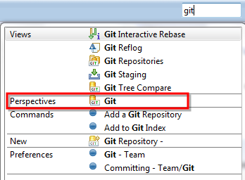

It has all the important views for using git, namely: Git Repositories, History, Git Staging, Git Reflog. Let's focus on the Git Repositories view. You may browse your existing repositories, _create_ new one locally, _add_ an existing one, and _clone_ a remote git repository. Let's clone a simple repository created only for this tutorial.

The repository and the URI for the clone command can be found [here](https://github.com/n-a-sz/mdsd-git-demo).

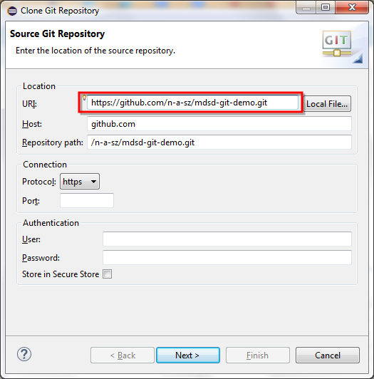

Also note, that you may connect to a repository with different protocols: https, ssh, git. You may read more about their pros and cons [here](http://git-scm.com/book/it/v2/Git-on-the-Server-The-Protocols).

The destination folder should be also given, the default folder in Windows is the User/<user-name>/git/<repo-name>. Let's leave it there now. In this wizard you may also import the projects to the eclipse workspace with a help of a checkbox.

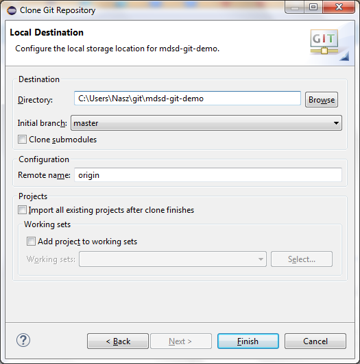

You may also import the projects by right clicking on the Project (or Package) Explorer and clicking import and either by "Existing Projects into workplace" from the repository folder or by "Projects from Git" and choosing the repository.

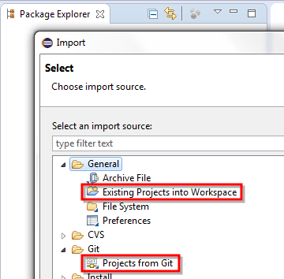

Let's look at the Git Repositories view:

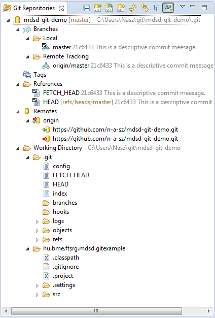

Here, you may found all of the repositories added to EGit and their details. For example, the local and remote branches, remotes and the working directory, which represents the folder of the repository. The working directory has a .git folder which contains the repository itself including the commits, branches and a configuration file.
Apart from the .git folder the actual version of the project(s) can be found here too. Note that the project is not in the eclipse workspace physically.

The other useful view is the History view. It has to bee initialized on a specific repository:

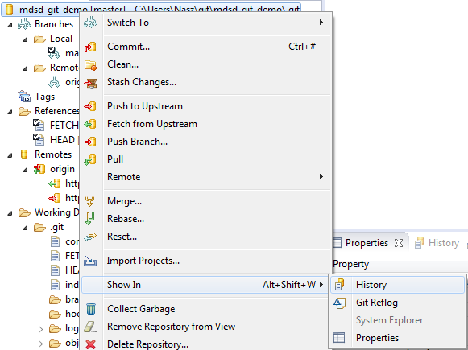

Here you may see the commits (versions), their dependency and other metadatas about them such as Id, Message, Committer, etc. The files modified in the selected commit can be found at the lower right corner of the view.

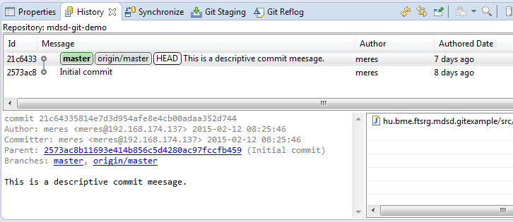

The Git Reflog view shows the local history of your executed git commands.

Before discussing the Staging view, let's configure git with our name and email address. This is required as this data will be added to every commit. It is stored in the .gitconfig file under the home folder (Users/<user-name>/.gitconfig). EGit provides a GUI for this configuration in Window/Preferences//Team/Git/Configuration, as seen in the following screenshot:

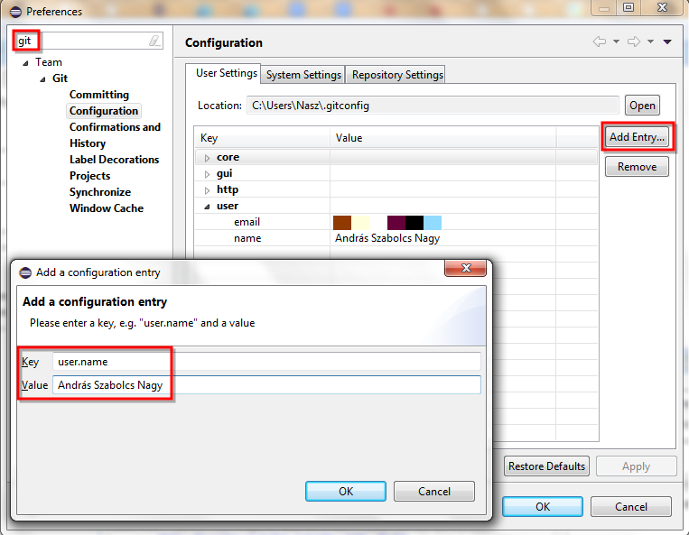

Let's change something in the Java project, for example by modifying the only class: Main.java, and commit it with the help of the Staging view. As in git it is unnecessary to commit every change, you can select the files to commit by staging them. It can be done in the Staging view by drag and drop. Write a commit message and commit. Note that the commit command is also available in the context menu of the repository and the project files.

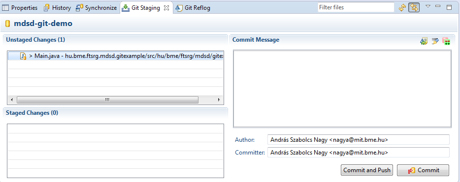

Take a look at the History view. The new commit has appeared, the master branch has moved with the commit along with HEAD (as it is pointing to the branch itself). The origin/master branch is stayed as there were no synchronization with the "origin" remote git repository.

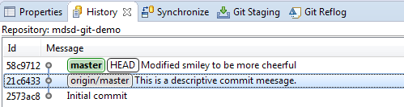

### Branching, resolving conflicts

In the following we will learn how to resolve conflicts, with the _merge_ and _rebase_ commands by imitating others work with local branches. Let's create a new branch named "feature" pointing to our previous commit - right click on commit, Create Branch.

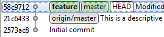

Create a commit (on the feature branch) by modifying the Main.java class as you like. Then checkout the master branch (which is stayed on the previous commit) to set the working directory to the previous version..

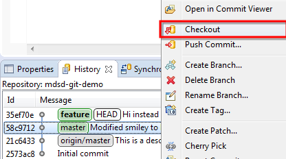

The feature branch has disappeared, as the default configuration of the view is to show only the 'active' branch. Press the button shown on the screenshot to see the entire commit tree.

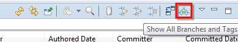

Create an other commit (on the master branch), which modifies a same line modified in the feature branch and check the History view. Then use the merge command on the context menu. The merge command creates a new commit from two other commits: 1) the one, which is checked out and 2) the one which you bring up the context menu. Executing the command, it will alert us if there was a conflict or it was successful without problem.

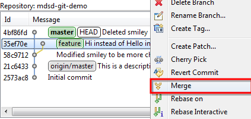
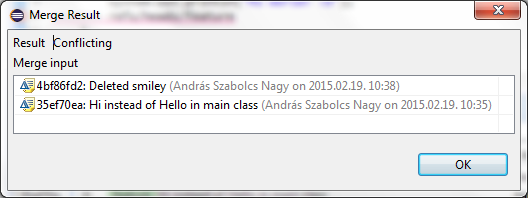

If there is a conflict, git will mark the problematic files and also modifies them in such a way, that the two version of the conflicting hunk (part of the file) will be there.

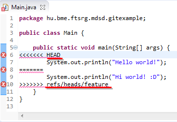

To solve the conflict, modify the file to the desired final version (also deleting the helper lines) and stage it. The commit message will automatically fill out with basic information.

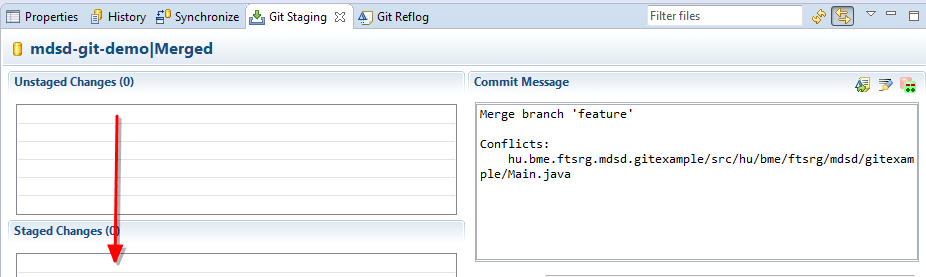

Now, the history should look something like this:

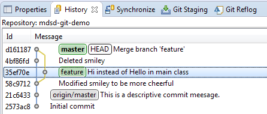

Note, that the feature branch stayed where it was, but the master branch (HEAD) is moved to the new commit.

Let's try out the rebase command by creating a new commit on the feature branch. Then rebase it on the master branch:

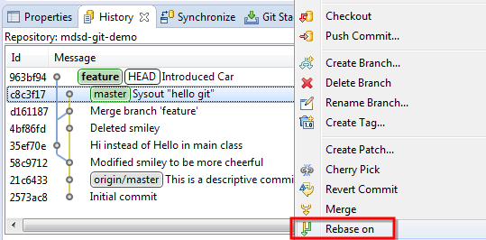

The result should be something like this:

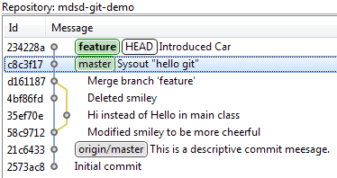

As you can see, the new commit with the same message has a different Id, hence the original commit has disappeared. Actually it is still there as git never deletes any data unless explicitly commanded to do so, but there's nothing pointing on it (branch or HEAD), hence the history view doesn't show it.

There is a third outcome of merging (beside of successful and conflicting) which is the fast-forward. Let's checkout the master branch and merge it with the feature branch. It will be moved (fast-forwarded) to the last commit.

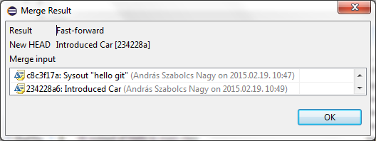

### Other concepts

**Stash** is a very useful feature in git, basically it makes a commit with all pending changes and makes a reference to it. It's function is to save your work and restore your working directory to its initial state. Later on you can apply it anywhere (rebase without a commit).

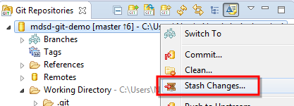
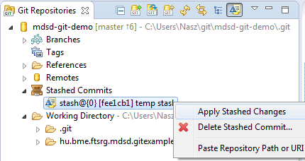

To put a new project to the repository, you can use the Team/Share Project command on the project'c context menu, then choose the a repository.

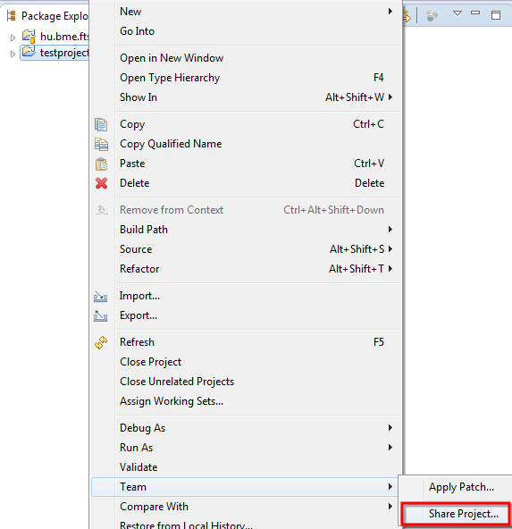
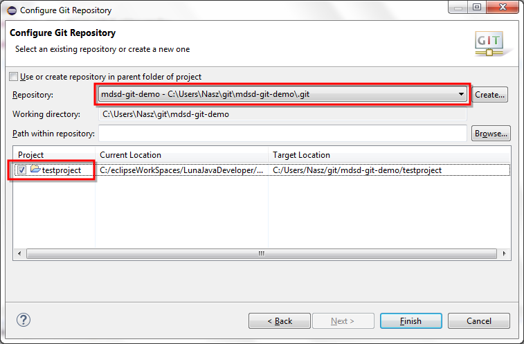