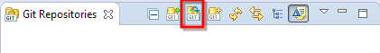

Introduction to the Git Version Control System
==============================================

First of all you can find a lot of useful links at the [FTSRG cheat sheets wiki](https://github.com/FTSRG/cheat-sheets/wiki/Git) from visual tutorials to available git clients with GUI. Also there is a quite extensive [e-book](http://git-scm.com/book) about Git with nice images, it is recommended to check it out.

From [Wikipedia](http://en.wikipedia.org/wiki/Git_(software)):

"Git is a distributed revision control system with an emphasis on speed, data integrity, and support for distributed, non-linear workflows. As with most other distributed revision control systems, and unlike most client–server systems, every Git working directory is a full-fledged repository with complete history and full version-tracking capabilities, independent of network access or a central server. Git was initially designed and developed by Linus Torvalds for Linux kernel development in 2005, and has since become the most widely adopted version control system for software development."

EGit tutorial
-------------

[EGit](https://www.eclipse.org/egit/) is an Eclipse built-in git client. It comes with most of the standard Eclipse distributions and probably you won't need to install it.

The easiest way to use EGit is to open the Git perspective. To do so press ctrl+3 and type git.

It has all the important views for using git, namely: Git Repositories, History, Git Staging, Git Reflog. Let's focus on the Git Repositories view. You may browse your existing repositories, _create_ new one locally, _add_ an existing one, and _clone_ a remote git repository. Let's clone a simple repository created only for this tutorial.

The repository and the URI for clone command can be found [here](https://github.com/n-a-sz/mdsd-git-demo).

Also note, that you may connect to a repository with different protocols: https, ssh, git. You may read more about their pros and cons [here](http://git-scm.com/book/it/v2/Git-on-the-Server-The-Protocols).

The destination folder should be also given, the default folder is the User/<username>/git/<repo-name>. Let's leave it there now. In this wizard you may also import the projects to the eclipse workspace with a help of a checkbox.

You may also import the projects by right clicking on the Project (or Package) Explorer and clicking import and either by "Existing Projects into workplace" from the repository folder or by "Projects from Git" and choosing the repository.

Let's look at the Git Repositories view:

