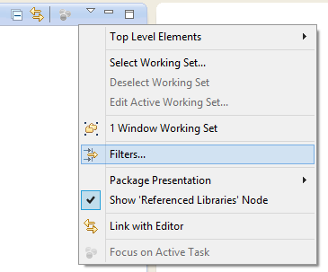
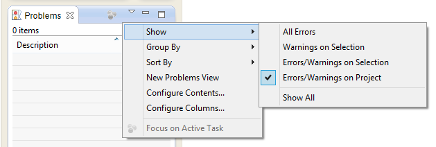
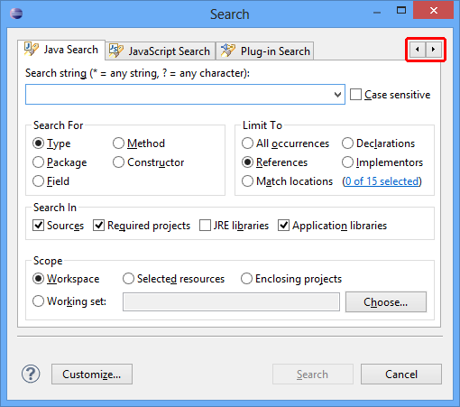
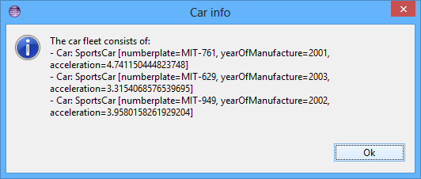
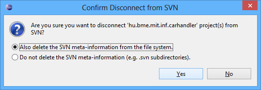
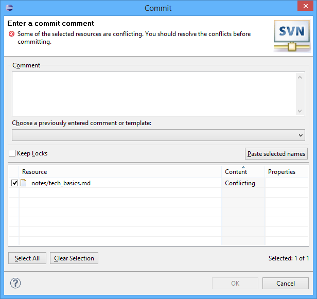
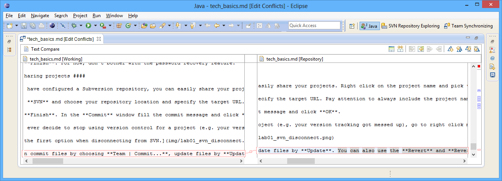

An overview of the Eclipse development environment
==================================================

Introduction
------------

The following chapter serves as an introduction to the Eclipse Development Environment. Eclipse is used in  both the Model Driven Software Development and Service Integration courses.


Eclipse is a free, open-source software development environment and a platform for plug-in development. Members of the Eclipse Foundation include Cisco, IBM, Intel, Google, SAP, Siemens, etc. A list of Eclipse Foundation Members is available here: <http://www.eclipse.org/membership/showAllMembers.php>.

In this section we will cover the basic concepts in Eclipse.

Eclipse comes in different editions, e.g. Eclipse IDE for Java Developers, Eclipse IDE for C/C++ Developers, Eclipse Modeling Tools, each containing a different set of plug-ins.

The Eclipse SDK includes JDT (Java Development Tools) which features a full-blown Java development environment with an advanced editor and debugger. It supports unit testing (JUnit) and different source code analysis techniques. The JDT has its own Java compiler which can compile Java code incrementally.

Project homepage: <http://www.eclipse.org/jdt/>

Project management
------------------

### Workspace ###

Eclipse organises the work in _workspaces_. A workspaces can contain multiple _projects_. Projects can be organised in _working sets_.

Upon launching, Eclipse prompts you the location of the workspace. You may switch workspace later in the **File | Switch Workspace** menu.

Further reading:

* <http://help.eclipse.org/kepler/topic/org.eclipse.platform.doc.isv/guide/resInt_workspace.htm>
* <http://help.eclipse.org/kepler/index.jsp?topic=/org.eclipse.platform.doc.user/concepts/cworkset.htm>

### Project ###

Eclipse organises the work in _projects_. Projects can have multiple natures, e.g. Java, C++, Plug-in project, etc. You can create a new project in the **File | New** menu.

The project settings are stored in the ``.project`` file. 

**Warning:** upon creation, the _project directory_ will be the same as the _project name_. However, if you rename the project, it only edits the ``.project`` file and the project directory will not change. To rename the project directory you have to rename it in the file system and import the project. Of course, this is not trivial if you use version control. Thus, when creating projects it's worthy to think on good project names.

Projects can be exported in the **File | Export** menu. A common way of distributing sample projects is to create a zip file by choosing *General | Archive file*. You can import an archive file in the **File | Import** menu by choosing **General | Existing Projects into Workspace** and using the **Select archive file** option.

Further reading: <http://help.eclipse.org/kepler/index.jsp?topic=/org.eclipse.platform.doc.isv/guide/resAdv_natures.htm>

### Package Explorer and Project Explorer ###


You may want to show the ``.project`` file in the **Package Explorer**. In order to do so, click the downward pointing triangle in the upper right corner, pick **Filters...** and untick the **.* resources** checkbox.



To show the ``.project`` file in the **Project Explorer**, click the downward pointing triangle in the upper right corner, pick **Customize View...** and untick the **.* resources** checkbox.

### Build in Eclipse ###

Eclipse's build philosophy is to always keep the source code and the binary code in synch. In order to do so, Eclipse builds the project automatically upon every save operation.

You may turn of the automatic build process by unchecking the **Project | Build Automatically** menu. However, as a general rule you should not turn the automatic build off.

### Copying and linking ###

Naturally it is possible to add another file to an existing project. It can be done by dragging and dropping it to your project. As a result a dialog window will appear that ask if the file should be copied to the workspace or just referenced (and left it in its original place).

In addition to the basic file management this operation is useful for the version control of documents that are edited outside Eclipse. Manual refresh is required if a file changes out of the IDE.

### Pictograms ###

The **Package Explorer** and **Project Explorer** uses a lot of different icons and pictograms. You can find the description if these here: 
<http://help.eclipse.org/kepler/index.jsp?topic=/org.eclipse.jdt.doc.user/reference/ref-icons.htm>

### Subversion ###

**Apache Subversion** (<http://subversion.apache.org/>), often abbreviated SVN is a widely used open-source version control system.

Eclipse does not include an SVN client by default. You can install the **Subversive** plug-in from your Eclipse distribution's (e.g. Kepler's) update site by following the instructions provided here: <http://www.eclipse.org/subversive/>.

For basic usage you only need the **Subversive SVN Team Provider** package. Complete the installation and restart Eclipse. Eclise will ask you to install a Subversive Connector. Choose one which is compatible with your SVN server's version, install and restart Eclipse again.

The pictograms of **Subversive** are similar to the one of **Subclipse**: <http://stackoverflow.com/questions/3917925/what-do-the-arrow-icons-in-subclipse-mean>

User interface
--------------

### Workbench ###

Upon launching, after you choose the workspace location, the workbench window is shown. A workbench window offers _perspectives_. A perspective contains editors, such as the Java Editor and views, such as the Project Explorer.

### Editors ###

Editors contribute buttons to the _global toolbar_. You can have several instances of the same editor, e.g. you can have a dozen Java source files open and edited. You may run different editors at the same time, e.g. you can edit Java and XML files in the same workbench. Editors can be associated with a file name or an extension, and this association can be changed by users.

### Views ###

The primary use of views is to provide navigation of the information in the workbench. You can think of a  view as a representation of the data in the workbench. Views have a _local toolbar_. Editors can appear in only one region of the page, whereas views can be moved to any part of the page and minimized as fast views.

The default JDT views include the **Package Explorer**, the **Problems**, the **Console** view and others. You can open new views in the **Window | Show View** menu.

#### The Problems view and the Error Log view ####

The **Problems view** shows the warnings and errors in the workspace's projects. In the **Problems** view click on the Downward pointing triangle icon and pick **Show | Errors/warnings on selection**.

The **Error Log** shows the errors occured in Eclipse. It shows the error message, the date and the plug-in that produced the error.



Further reading:

* <http://wiki.eclipse.org/FAQ_What_is_a_view%3F>
* <http://wiki.eclipse.org/FAQ_What_is_the_difference_between_a_view_and_an_editor%3F>

### Perspective ###

A perspective is a collection and a predefined layout for editors and views created for a special development purpose: Java, Debug, Plug-in Development, SVN Repository Exploring, etc.

### SWT ###

Java applications typically use AWT (Abstract Window Toolkit) or the Swing toolkit to implement graphical user interfaces. While these are proven solutions, both have serious shortcomings:

* AWT uses native widgets, but only provides the ones which are available on all supported platforms. Also, AWT's architecture implies that the developer has to work on a low level. Hence, AWT is not suitable for modern application development.
* Swing provides its own custom widgets and is easily extensible. Swing provides the option of using either a system ,,look and feel'' which uses the native platform's look and feel, or a cross-platform look and feel that looks the same on all windowing-system. The old Swing implementation suffered from memory consumption and performance problems.

SWT (Standard Widget Toolkit) is a GUI framework that was developed for the Eclipse project by IBM. It uses native components and offers good performance. Today, SWT is maintained by the Eclipse Foundation. Since the SWT implementation is different for each platform, a platform-specific SWT library (JAR file) must be distributed with each application. A number of SWT widgets are available at <http://eclipse.org/swt/widgets/>.


### Search ###

* Search in files: press ``Ctrl``+``H`` to display the **Search** window and choose the **File Search** tab. If the window has many tabs, the **File Search** tab may be hidden. The solution is to resize the **Search** window or use the arrows in the upper right corner to show the rest of the tabs.



Configuration
-------------

### Bundle ###

OSGi components are named _bundles_. It's important to note that Eclipse plug-ins are also OSGi bundles.

### Build path ###

If a Java project depends on libraries in JAR files, you have to specify the JAR files containing those. In order to do so, you have to add the JAR file to the build path by right clicking on it and picking **Build Path | Add to Build Path**.

By convention, JAR files are typically stored in a directory called ``lib``. You cannot add a directory to the build path: you have to specify the files. If you want to remove a JAR from the build path, you have to find it under **Referenced Libraries**, right click and choose **Build Path | Remove from Build Path**.

If you right click anywhere under the project and choose **Build Path | Configure Build Path...**, you can specify the source folders and the requires libaries.

### Execution environment ###

In the **Window | Preferences** dialog click **Java | Installed JREs**. You can add new execution environments and pick the default one.

### Run configuration ###

Eclipse stores the launch settings in _run configurations_. By default, run configurations are only saved in the workspace. If you want to save or share your run configurations, go to the **Run Configurations...** (under the **Run** button or right click on the project and under **Run As**). On the **Common** tab choose **Shared file** in **Save as** group.

If you run multiple programs, you can switch between them by clicking the terminal-shaped icon (called **Display selected console**).

### The ``.project`` file ###

There is a configuration file in every Eclipse project named ``.project``. To make the ``.project`` file visible from Eclipse, refer to the _Package Explorer and Project Explorer_ section.
At first this defines the tool set that works with the project by naming the
natures applied to them. For example the plug-in projects have the following natures:

```xml
<natures>
    <nature>org.eclipse.jdt.core.javanature</nature>
    <nature>org.eclipse.pde.PluginNature</nature>
</natures>
```
    
Secondly it defines the builders that run after every save. In plug-in projects Eclipse builds the Java code, the ``MANIFEST.MF`` and the ``plugin.xml`` with the following configuration:
   
```xml
<buildSpec>
  <buildCommand>
    <name>org.eclipse.jdt.core.javabuilder</name>
    <arguments>
    </arguments>
  </buildCommand>
  <buildCommand>
    <name>org.eclipse.pde.ManifestBuilder</name>
    <arguments>
    </arguments>
  </buildCommand>
  <buildCommand>
    <name>org.eclipse.pde.SchemaBuilder</name>
    <arguments>
    </arguments>
  </buildCommand>
</buildSpec>
```

The Java source code editor
---------------------------

Right click the left bar in the source code editor and pick **Show Line Numbers**.

### Formatting the source code ###

In a modern IDE you rarely have to format the code by hand. In Eclipse, right click in the editor and pick **Source | Format**. Hotkey: ``Ctrl``+``Shift``+``F``.

### Refactoring ###

You often need to rename classes, methods and variables. Doing this by hand is an error-prone method: you may forget to rename some occurences of the renamed item. The _rename refactoring_ technique takes care of all occurences of the renamed item. To use it, right click on the renamed item and pick **Refactor | Rename...**. Type the desired name and press ``Enter``. Hotkey: ``Alt``+``Shift``+``R``.

### Fixing problems ###

JDT has a very useful feature called _Quick fix_: if there is an error or warning in the source code, it suggests common ways of fixing it (e.g. if you forgot assign a value to an undefined variable, it will define it). Hotkey: ``Ctrl``+``1``.

### Zooming ###

By default, Eclipse does not provide zooming in the editor. You can change the font size by going to **Window | Preferences**. Pick **General | Appearance | Colors and Fonts**, and edit **Basic | Text Font**.

### Content assist and imports ###

You can access the content assist by pressing ``Ctrl``+``Space``. Press ``Enter`` to pick you choice. If you pick an item that has to import a package, the appropriate ``import`` instructinon will appear between the imports. Sometimes you may end up with lots of unused imports: right click and pick **Source | Organize Imports** or press ``Ctrl``+``Shift``+``O``. 

Pay attention to the package names. For example, the ``List`` class is available both in ``java.awt`` and ``java.util``.


You can use the content assist by only typing the abbreviation of the desired item. For example, if you have ``java.io.InputStreamReader`` imported, you can type ``ISR`` and the content assist will propose ``InputStreamReader``.

If you want to overwrite an item (class name, method name) with the content assist, hold the ``Ctrl`` button when you press ``Enter`` to pick your choice.

There is a lot of predefined template available in the **Window | Preferences** dialog under **Java | Editor | Templates**. For example, you can type ``sysout`` to get ``system.out.println();``.

You can use templates for control structures, you can define cycles with ``for``, ``while``, ``do``, ``foreach`` and so on. Similarly, you can define conditional statement with ``if``, ``ifelse`` and ``switch``.

Tip: **Organize Imports** can also be used to add missing imports. If the class is available in multiple packages, Eclipse will prompt you to choose between them.

### Automatic generation of getter and setter methods ###

Since the Java language lacks properties, you often have to write getter and setter method for the fields you want to access. Fortunately, you can generate them: right click in the source file and pick **Source | Generate Getters and Setters...**. Similarly, you can generate the constructor, the ``toString`` method and so on.

If you have only a few properties, there is a quicker way. While typing ``getVariableName`` or ``setVariableName``, use the Content Assist (``Ctrl``+``Space``), pick the desired method and press ``Enter``. The appropriate method is generated.

Plug-in development
-------------------

Multiple pre-compiled editions are available at the home page of Eclipse (<http://www.eclipse.org/downloads/>). One support C/C++ development, an other aids the testing of software. This IDE is not limited to support those popular field of use; it is designed to be as customisable as possible. It can be used for example as a LaTeX editor, as a host of custom enterprise software (e.g. accounting) or even as a note sheet editor (<http://mit.bme.hu/~rath/pub/theses/diploma_harmathd.pdf>).

So feel free to look for the tools that support your goals.

If you're interested in the topic, the FTSRG has two related courses to offer:

* Eclipse Technologies: <http://www.inf.mit.bme.hu/edu/courses/eat>
* Eclipse Based Development and Integration: <http://www.inf.mit.bme.hu/edu/courses/eafi>

### Plug-in ###

Eclipse's main strength is the possibility of creating and installing custom Eclipse plug-ins. Some useful ones are:

* TeXlipse (<http://texlipse.sourceforge.net/>): ,,a plugin that adds Latex support to the Eclipse IDE.'' TeXlipse provides incremental compiling and easy navigation between the TeX source and the generated PDF.
* FindBugs (<http://findbugs.sourceforge.net/>): ,,a program which uses static analysis to look for bugs in Java code''.
* PMD (<http://pmd.sourceforge.net/>): ,,PMD is a source code analyzer. It finds unused variables, empty catch blocks, unnecessary object creation, and so forth.''

FindBugs and PMD are widely used tools. They're also part of the _Software Verification Techniques_ course (<http://www.inf.mit.bme.hu/edu/courses/szet/>) of the ,,Dependable System Design'' master's programme held in the autumn semester.

### Runtime Eclipse ###

The Eclipse plug-ins run in an Eclipse instance. If new plug-ins are developed (as Plug-in projects) in an Eclipse instance (called **host Eclipse**), there should be an Eclipse instance that can run them as a part of it in a new empty workspace. This so called **runtime Eclipse** contains the plug-ins installed to the host Eclipse _and_ the ones developed in the host Eclipse.

A runtime can be started with the **Run** button. The range of the applied plug-ins can be reduced in the run configuration.

It is possible to install developed plug-in projects (see: Install as a plug-in).

### RCP ###

Eclipse RCP (Rich Client Platform) ,,is a platform for building and deploying rich client applications. It includes Equinox, a component framework based on the OSGi standard, the ability to deploy native GUI applications to a variety of desktop operating systems, such as Windows, Linux and Mac OSX and an integrated update mechanism for deploying desktop applications from a central server.''

Along successful open-source projects, RCP is often used for making highly specialised software for organisations.

Popular RCP applications include the following:

* Java Mission Control (<http://docs.oracle.com/javase/7/docs/technotes/guides/jmc/jmc.html>): Java Mission Control is a Java profiler provided with the Java Development Kit (JDK) since the release of JDK 7 Update 40.
* ECUTE (<http://sourceforge.net/apps/mediawiki/sblim/index.php?title=Ecute>): ,,ECUTE stands for Extensible CIM UML Tooling Environment. It is a family of tools that support all phases of the development of CIM models, CIM providers, and CIM client applications.'' ECUTE is used in the BSc specialisation programme ,,Information Technologies'' on the Intelligent Systems Surveillance (<https://www.inf.mit.bme.hu/edu/bsc/irf>) course.
* XMind (<http://www.xmind.net/>): a mind mapping software.
* Vuze, formerly known as Azureus (<http://www.vuze.com/>): a BitTorrent client.

In the Model Driven Software Development and Service Integration courses we use the following RCP applications:

* Bonita Open Solution: <http://bonitasoft.com/>
* Yakindu: <http://statecharts.org/>

For more RCP applications, visit the following links:

* <http://www.eclipse.org/community/rcpos.php>
* <http://www.eclipse.org/community/rcpcp.php>

The popular UML and BPMN modelling tool, Visual Paradigm can also be integrated to Eclipse: <http://www.visual-paradigm.com/product/vpuml/provides/ideintegration.jsp>.

Further reading: <http://www.eclipse.org/home/categories/rcp.php>.

### Update site ###

Update sites are used to install new features to the Eclipse application. You can install new applications in the **Help | Install New Software...** menu by selecting the update site and the installed components.

After the installation completes, it prompts you to restart Eclipse. If you don't want to restart yet, you can restart Eclipse later by clicking **File | Restart**.

### Install as a plug-in ###

Tutorial: <http://www.vogella.com/articles/EclipsePlugIn/article.html#deployplugin_direct>

### The ``Manifest.MF`` file ###

The plug-in project contains a folder named ``META-INF``. This folder has a file
named ``MANIFEST.MF`` that describes the relations of the packages of this
project with the other packages. In simple words, it defines which (Java)
package is visible as you edit the source files in this project, and which
package you want to make visible to other projects. The content this file looks like
the following:

* Version numbers of the ``MANIFEST.MF``:

    ```
    Manifest-Version: 1.0
    Bundle-ManifestVersion: 2
    ```

* Names and versions. This can be edited at the **Overview** page of the in the
**Plug-in Editor**. An example content:

    ```
    Bundle-ManifestVersion: 2
    Bundle-Name: JPADataCompileButton
    Bundle-SymbolicName: hu.bme.mit.mdsd.generatebutton;singleton:=true
    Bundle-Version: 1.0.0.qualifier
    ```

* Required target platform that can run this bundle:

    ```
    Bundle-RequiredExecutionEnvironment: JavaSE-1.6
    ```

* After this, the configuration file enumerates the required bundles with optional
minimal version requirement. This can be edited in the **Dependencies**
page of the **Plug-in Editor**. An example:

    ```
    Require-Bundle: org.eclipse.ui,
     hu.bme.mit.mdsd.erdiagram;bundle-version="1.0.0",
     hu.bme.mit.mdsd.codegenerator;bundle-version="1.0.0",
     org.eclipse.core.runtime;bundle-version="3.8.0"
    ```

* The following section declares the exported packages. This can be edited at
the **Runtime** page of the Plug-in editor.

    ```
    Export-Package: ERDiagram,
     ERDiagram.impl,
     ERDiagram.util
    ```

### The ``plugin.xml`` file ###
An eclipse plug-in is an OSGi bundle that (usually) connects to other bundles
through an extension point mechanism. An **extension point** defines the
interface and an **extension** defines a subscription to that arbitrary
interface. The ``plugin.xml`` configuration file contains those information.
This configuration can be edited in the **Extension** page of the plug-in
editor.

An example subscription that handles a GUI event:

```xml
<!-- This is an extension of "org.eclipse.ui.handlers". -->
<extension
   point="org.eclipse.ui.handlers">
   <!-- If a command named "hu.bme.mit.JPADataCompileButton.GenerateCommand"
      fires then call the execute method of the class named
      "hu.bme.mit.JPADataCompileButton.GenerateCommand".-->
   <handler
      class="hu.bme.mit.compilecommandhandler.JPADataGenerateCommandHandler"
      commandId="hu.bme.mit.JPADataCompileButton.GenerateCommand">
   </handler>
</extension>
```

Hotkeys
----------

As every modern IDE, Eclipse defines a great number of hotkeys. We gathered some useful ones here:

* List the available hotkeys: ``Ctrl``+``Shift``+``L``.
* Quick fix: ``Ctrl``+``1``
* Content assist: ``Ctrl``+``Space``
* Organize imports: ``Ctrl``+``Shift``+``O``
* Autoformatting of source code: ``Ctrl``+``Shift``+``F``
* Run: ``Ctrl``+``F11``
* Navigate between tabs: ``Ctrl``+``Page Up``, ``Ctrl``+``Page Down``
* Rename refactoring: ``Alt``+``Shift``+``R``
* Find/Replace: ``Ctrl``+``F``, use ``Ctrl``+``K`` to iterate through the results.
* Seach: ``Ctrl``+``H``

You can edit the hotkeys in the **Window | Preferences** menu, in **General | Keys**. For some plug-ins (e.g. TeXlipse), the hotkeys don't appear at first: click the **Filters...** button and untick the **Filter uncategorized commands** checkbox.

Sources
-------

* Our own experience from Project Laboratories, etc.
* University courses: Eclipse Technologies (<http://www.inf.mit.bme.hu/edu/courses/eat>), Eclipse Based Development and Integration (<http://www.inf.mit.bme.hu/edu/courses/eafi>), Model Driven Software Development (<http://www.inf.mit.bme.hu/edu/courses/mdsd>), Service Integration (<http://www.inf.mit.bme.hu/edu/courses/szolgint>)
* <http://www.eclipse.org/documentation/>
* <http://theshyam.com/2009/07/eclipse-productivity-shortcuts/>
* <http://www.openlogic.com/wazi/bid/221090/Eclipse-productivity-tips>
* <http://rithus.com/eclipse-productivity-tips>


Eclipse laboratory: step-by-step instructions
=============================================

Introduction
------------

We will demonstrate Eclipse on a simple task. We create a Java project and then extend it to a plug-in project. After that, we import a plug-in project which puts a button on the Eclipse toolbar and configure it to print the output of our own plug-in project.

Java project
------------

Go to **File | New | Other...**. Here you can choose any type of projects your Eclipse supports. For now, create **Java Project**.

1. Name to project to ``hu.bme.mit.inf.carhandler`` and click **Finish**.
1. Right click on the project name and choose **New | Package**. Name the package to ``hu.bme.mit.inf.cars``.
1. Right click the package and choose **New | Class**. Name the class to ``Car``.

    ```java
    public class Car {
         private String numberPlate;
         private int yearOfManufacture;
         private double acceleration;
    }
    ```

    Right click and go to the **Source** menu. You can access formatting, refactoring and generation tools here. Use the following:
    
    * **Generate Constructor using Fields...**
    * **Generate Getters and Setters...**
    * **Generate toString...**
    * **Format**

1. Create a new class named ``CarFleetPrinter``. This time, tick ``public static void main(String[] args)`` checkbox so the main function is generated automatically. You can create the main method later as well, using the ``main`` template and content assist (``Ctrl``+``Space``).

    Write the following code. Hints:
    
       * Type ``/**`` and press ``Enter`` to Javadoc.
       * Use ``Ctrl``+``Space`` (content assist) or ``Ctrl``+``1`` (quick fix) to use the appropriate package to import.
       * Type ``LL`` and use the content assist to find the ``LinkedList`` class.
       * Use ``Ctrl``+``1`` or ``Ctrl``+``2``, ``L`` to create a local variable (``random``) for the new ``Random`` instance.
       * Use the ``foreach`` and the ``sysout`` templates.
       * In the **Window | Preferences** dialog, go to **Java | Editor | Typing**. In the **Automatically insert at correct position** group, check the **Semicolons** checkbox.

    ```java
    /**
    * Car dealer program. 
    * @param args Arguments
    */
    public static void main(String[] args) {
      String manifest = "The car fleet consists of:\n";
      
      List<Car> cars = new LinkedList<>();
      Random random = new Random();
      for (int i = 0; i < 10; i++)
        cars.add(
          new Car("MIT-" + 
            (String.format("%03d", random.nextInt(1000))),
             2000 + random.nextInt(14),
             3.0 + random.nextDouble() * 4)
          );
        );
      
      for (Car car : cars) {
        if (car.getAcceleration() < 5) {
          manifest += "- Car: " + car + "\n";
        }
      }
      
      System.out.println(manifest);
    }
    ```

1. Run the application. Right click the project and choose **Run As | Java Application**. Hotkey: ``Alt``+``Shift``+``X``, ``J``.

1. If you would like to read a JRE method's source code, hold ``Ctrl`` and click on the class' name. Click the **Attach Source...** button and set the ``C:/Program Files/Java/jdk1.7.0_51/src.zip``.
    
1. Use the **Rename** refactoring technique to rename the class from ``Car`` to ``SportsCar``.
    
1. Select the following part: 

    ```java
    return new Car("MIT-" + 
        (String.format("%03d", random.nextInt(1000))),
        2000 + random.nextInt(14),
        3.0 + random.nextDouble() * 4);
    ```
    
    Use the **Extract method** refactoring technique to extract it to a method named ``generateCar``.
    
1. Select the whole ``main`` method except the last line (``System.out.println(manifest)``). Use the **Extract method** technique again to extract it to a method named ``getCarManifest``.

1. The result looks like this:

    ```java
    public static void main(String[] args) {
      String manifest = getCarManifest();
      
      System.out.println(manifest);
    }

    public static String getCarManifest() {
      String manifest = "The car fleet consists of:\n";
      
      List<Car> cars = new LinkedList<Car>();
      Random random = new Random();
      for (int i = 0; i < 10; i++)
        cars.add(generateCar(random));
      
      for (Car car : cars) {
        manifest += "- " + car + "\n";
      }
      return manifest;
    }

    private static Car generateCar(Random random) {
      return new Car("MIT-" + 
        (String.format("%03d", random.nextInt(1000))),
        2000 + random.nextInt(14),
        3.0 + random.nextDouble() * 4);
      }
    }
    ```

1. Run the application.

Jetty
-----


1. Create a new Java project ``hu.bme.mit.inf.carserver``.

1. Search for "Jetty" and go to <http://download.eclipse.org/jetty/stable-9/dist/>. Download ``jetty-distribution-9.1.2.v20140210.zip``.

1. Search for "Jetty tutorial" and go to <http://wiki.eclipse.org/Jetty/Tutorial/Jetty_HelloWorld>.
  
1. Create a ``HelloWorld`` class and copy the code (with the imports) to it:

    ```java
    import javax.servlet.http.HttpServletRequest;
    import javax.servlet.http.HttpServletResponse;
    import javax.servlet.ServletException;
     
    import java.io.IOException;
     
    import org.eclipse.jetty.server.Server;
    import org.eclipse.jetty.server.Request;
    import org.eclipse.jetty.server.handler.AbstractHandler;
     
    public class HelloWorld extends AbstractHandler
    {
        public void handle(String target,
                           Request baseRequest,
                           HttpServletRequest request,
                           HttpServletResponse response) 
            throws IOException, ServletException
        {
            response.setContentType("text/html;charset=utf-8");
            response.setStatus(HttpServletResponse.SC_OK);
            baseRequest.setHandled(true);
            response.getWriter().println("<h1>Hello World</h1>");
        }
     
        public static void main(String[] args) throws Exception
        {
            Server server = new Server(8080);
            server.setHandler(new HelloWorld());
     
            server.start();
            server.join();
        }
    }
    ```

1. Change the response to the following:
    
    ```java
    response.getWriter().println(CarHandler.getCarManifest());
    ```

1. Run in **Debug mode**. Visit <http://localhost:8080/> in the browser.

1. The output is a bit messy. Add preformatted text tags to the command:

    ```java
    response.getWriter().println("<pre>" + CarHandler.getCarManifest() + "</pre>");
    ```

1. Refresh the page in the browser.

1. Remove ``jetty-http-9.1.2.v20140210.jar`` from the build path. The application will remaing free of compile errors. Re-run the application.

1. It will throw ``java.lang.NoClassDefFoundError`` caused by a ``java.lang.ClassNotFoundException``.

    ```
    Exception in thread "main" java.lang.NoClassDefFoundError: org/eclipse/jetty/http/HttpField
      at hu.bme.mit.inf.carserver.HelloWorld.main(HelloWorld.java:31)
    Caused by: java.lang.ClassNotFoundException: org.eclipse.jetty.http.HttpField
      at java.net.URLClassLoader$1.run(Unknown Source)
      at java.net.URLClassLoader$1.run(Unknown Source)
      at java.security.AccessController.doPrivileged(Native Method)
      at java.net.URLClassLoader.findClass(Unknown Source)
      at java.lang.ClassLoader.loadClass(Unknown Source)
      at sun.misc.Launcher$AppClassLoader.loadClass(Unknown Source)
      at java.lang.ClassLoader.loadClass(Unknown Source)
      ... 1 more
    ```

1. The reason is that the ``jetty-http`` file is accessedd _transitively_.

Maven
-----


1. Use **Maven** instead.

    

1. Right click the ``carserver`` project, choose **Configure | Convert to Maven Project..**. Click **Finish**.

1. Go to the **Maven Central Repository** (<http://search.maven.org/>). Search for ``jetty-servlet``. Choose the ``org.eclipse.jetty`` group's latest ``jetty-servlet`` artifact. Copy the following Maven dependency to the ``pom.xml`` file. Do not forget to add the surrounding ``<dependencies>`` tag.

    ```xml
    <dependency>
        <groupId>org.eclipse.jetty</groupId>
        <artifactId>jetty-servlet</artifactId>
        <version>9.1.2.v20140210</version>
    </dependency>
    ```

1. If you have the command-line version of Maven installed, you can go to the command line in ``hu.bme.mit.inf.carserver`` and run:

    ```
    mvn exec:java -Dexec.mainClass=hu.bme.mit.inf.carserver.HelloWorld
    ```

Plug-in project
---------------

1. Import the ``hu.bme.mit.inf.car.carbutton`` project from the ``CarButton.zip`` file. Use the **File | Import** menu and choose **General | Existing Projects into Workspace** and use the **Select archive file** option.

1. Inspect the ``plugin.xml`` and ``META-INF/MANIFEST.MF`` file. The most interesting for now are the **Extensions** tab.

1. Run the project by right clicking the project and picking **Run As | Eclipse Application**. A new Eclipse instance called ,,Runtime Eclipse'' will start with the plug-in. Close the welcome Window. Observe the **Print!** button on the toolbar.

1. Close the Runtime Eclipse.

1. We would like to extend our Java project to a plug-in project. Right click the ``hu.bme.mit.inf.carhandler`` project and choose **Configure | Convert to Plug-in Projects...**. Click **Finish**.

1. Go to the ``carhandler`` project's newly created ``MANIFEST.MF`` file. Pick the **Runtime** tab. Observe the **Exported Packages**. Later, you can add additional packages if necessary.

1. Go to the ``carbutton`` project's ``MANIFEST.MF`` file. Pick the **Dependencies** tab.

1. Click **Add**. An empty list will show. However, as soon as you start typing ``car``, the ``hu.bme.mit.inf.carhandle (1.0.0.qualifier)`` package will show. Click **OK**.

1. Go to the ``hu.bme.mit.inf.car.carbutton`` package's ``PrintTheCarHandler`` file. Inspect the ``showMessage`` method which shows a message in a dialog window.

1. In the ``execute`` method use ``showMessage`` to show the car fleet's data. 

    ```java
    showMessage(CarFleetPrinter.getCarManifest());
    ```
    
    Use **Quick Fix** take care of the missing ``CarFleetPrinter`` import and change the visibility of the method.
    
1. Run the plug-in project. This time, the **Print!** button will show the cars in the fleet.



Version control
---------------

From the **Window | Open Perspective | Other...** pick the **SVN Repository Exploring** perspective. Use the green plus icon (**New Repository Location**) to add a new repository. (You can also import from the **File | Import** menu with the **SVN | Project from SVN** option.)
&
Specify the URL and fill the authentication data appropriately. If you're working on a private computer, it's recommended to save the authentication data.

Click **Finish**. For now, don't bother with the password recovery feature. 

### Sharing projects ###

If you have configured a Subversion repository, you can easily share your projects. Right click on the project name and pick **Team | Share Project...**.

Choose **SVN** and choose your repository location and specify the target URL. Pay attention to always include the project name as the last directory in the path. (Warning: if you use the **Browse...** button, it will not be added automatically).

Click **Finish**. In the **Commit** window fill the commit message and click **OK**.

If you ever decide to stop using version control for a project (e.g. your version tracking got messed up), go to right click menu and choose **Team | Disconnect**. When Eclipse prompts you to confirm the question, choose the **Also delete the SVN meta-information from the file system.** which deletes the hidden ``.svn`` directories.



You can commit files by choosing **Team | Commit...**, update files by **Update**. You can also make good use of the **Revert** and **Revert to commit** options.

If more than one person works on a file, a conflict can emerge. 



To resolve the conflict, use the **Team Synchonizing** perspective or right click on the file and choose **Team | Edit Conflicts**.



Further reading: <http://help.eclipse.org/kepler/index.jsp?topic=/org.eclipse.platform.doc.user/tasks/tasks-115.htm>

References
----------

Great tutorial about the configuration of the Eclipse IDE: <http://www.vogella.com/tutorials/Eclipse/article.html>