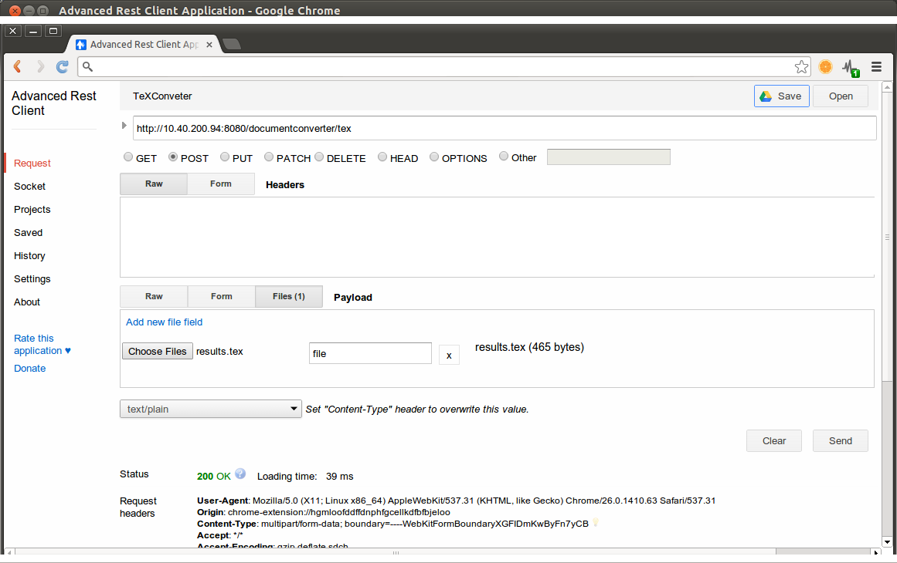

LaTeX compiler REST API
=======================

If you encounter any errors, send a bug report to <szarnyasg@gmail.com>.

To use the servic, you need to be connected to the FTSRG Student VPN (<http://www.inf.mit.bme.hu/wiki/it/vpn>).

* Ping
    * ```GET``` <http://10.40.200.94:8080/documentconverter/ping>: says "pong".

* TeX
    * ```POST``` <http://10.40.200.94:8080/documentconverter/tex>: saves the TeX file and returns a unique id for the session.
    * ```GET``` <http://10.40.200.94:8080/documentconverter/pdf/ID>: returns the compiled PDF file for the session identified ```ID```.
    * ```GET``` <http://10.40.200.94:8080/documentconverter/log/ID>: returns the compiled PDFLaTeX log for the session identified ```ID```.

* HTML
    * ```POST``` <http://10.40.200.94:8080/documentconverter/html>: saves the HTML file and returns a unique id.
    * ```GET``` <http://10.40.200.94:8080/documentconverter/html/ID>: returns the HTML file identified by ```ID```.

Note: the ```POST``` methods consume two type of inputs:

* Plain text messages with the MIME type set to ```text/plain```.
* Multipart messages (<http://en.wikipedia.org/wiki/MIME#Multipart_messages>). This is useful if you test the service with a REST client (e.g. Google Chrome's Advanced REST client). If you use it this way, don't forget to set the field name to ```file```. See the figure below for reference. 


