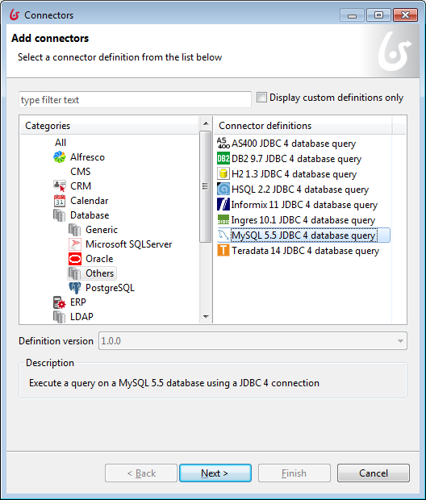
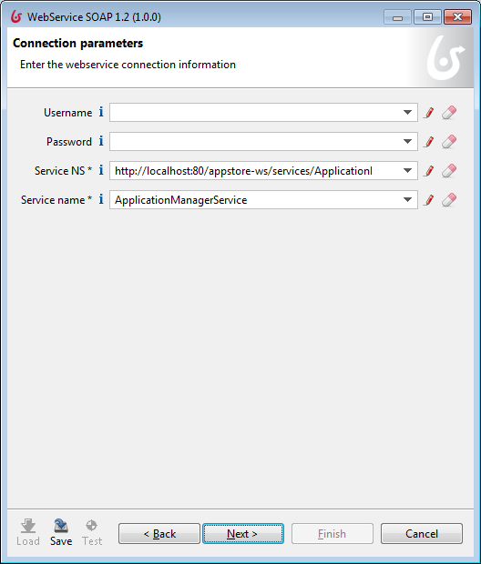
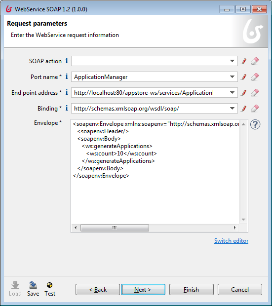
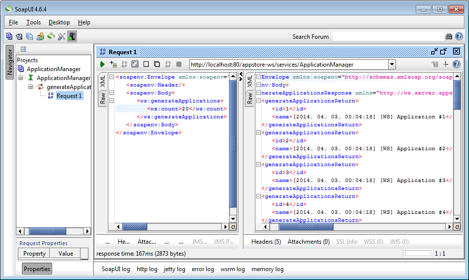
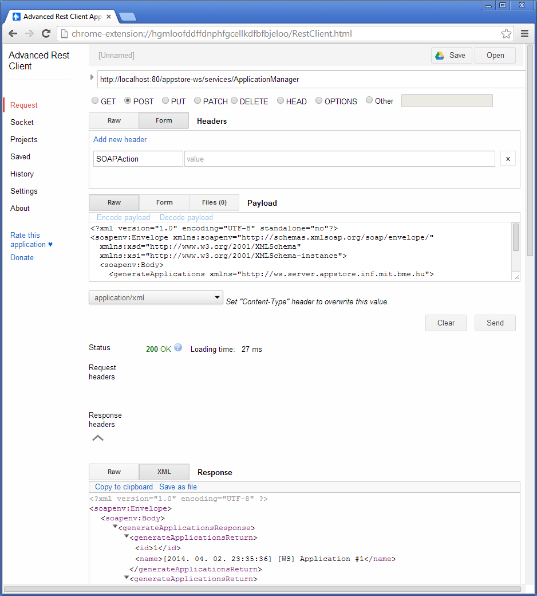

Integrating Bonita
==================

Source code snippets and URLs are available in <https://svn.inf.mit.bme.hu/edu/trunk/mdsd/handout/public/2014/>.

A detailed guide in Hungarian is available in <https://njszt.hu/sites/default/files/Informatikai-Navigator-10.pdf>.

Introduction
------------  

1. Start the **Bonita BPM Community** application and choose the **ApplicationStore (1.0)** process.

1. Start the workflow and inspect it. The **Show the application names** step shows the applications available in our application store. Currently this list is generated by the Groovy connector of the **Download the application names** task.

1. Go to the **Connectors** of the **Download the application names** task and delete the Groovy connector.

Creating a Connector
--------------------

1. A connector consist of a **definition** (interface) and an implementation.

1. First, define the **definition**. Go to **Development | Connectors | New Definition...**. Set the **Definition id** to ``ApplicationConnector`` and the **Category** to **Script**. Click **Next**, **Next**. On the the **Output** page, click **Add...*** and set the **Name** to ``applications`` and the **Type** to ``java.util.List``. Click **Finish**.

1. Go to **Development | Connectors | New Implementation**. Pick the **ApplicationConnector** and set the package to ``hu.bme.mit.inf.sysint``.

1. An Eclipse JDT-based Java editor will show up with the ``ApplicationConnectorImpl`` file. Edit the ``executeBusinessLogic`` method to get the following. 

    ```java
    @Override
    protected void executeBusinessLogic() throws ConnectorException {
      //Get access to the connector input parameters

      //WARNING : Set the output of the connector execution. 
      //If outputs are not set, connector fails
      List<String> applications = new ArrayList<String>();
      applications.add("App1");
      applications.add("App2");
      setApplications(applications);  
    }
    ```

1. The connector can be tested in **Development | Connectors | Test connector**. Choose the **ApplicationConnector** and click **Test** and **OK**.

1. Add this connector to the **Download the application names** task. On the **Output operations** page, set that the **applications** variable takes the value of the **applications** output of the connector.

1. Delete the connector from the **Download the application names** task.

1. Test the workflow.

Database Integration
--------------------



1. In this section, we integrate our workflow with a MySQL database. Start the **MySQL Workbench 6.0 CE** application.

1. Choose the **SQL development** section and select the **applications** database.

1. The username and password are both ``root``.

1. An SQL development environment will appear. We have created a database table for the workflow: select the **application** table in the **applications** database, **right click** and select **Select Rows - Limit 1000**.

1. The query and the results will appear with the applications ``Flashlight``, ``News`` and ``Weather``.

1. Go back to **Bonita**. Select the **Download the application names** task and add a **MySQL 5.5 JDBC4 database query** connector. Name it ``MySQLConnector`` and click **Next**.

1. On the **Database access information** page, set the following and click **Next**:

    * Driver: ``com.mysql.jdbc.Driver``
    * URL: ``jdbc:mysql://localhost:3306/applications``
    * Username: ``root``
    * Password: ``root``

1. On the **Enter query** page, use the **Switch editor** button to switch to a single line editor (defining a **Constant** expression). Else you would get an error message (_Unsupported expression type for testing: ..._).

    Set the **Query or Batch Script** field in the next page:

    ```sql
    SELECT * FROM application;
    ```

1. Click **Test configuration**. It will throw the following error: __java.lang.reflect.InvocationTargetException
org.bonitasoft.engine.exception.BonitaRuntimeException: java.lang.ClassCastException: com.mysql.jdbc.JDBC4ResultSet cannot be cast to java.io.Serializable__. The reason for this is that we first have to process the **JDBC4ResultSet** object to a serializable representation.

1. On the **Output operations definition page** set that the **applications** variable takes the value of a Groovy script. The content of the script is the following:

    ```java
    def res = []
    while (resultset.next()) {
      res.add(resultset.getString("name"))
    }
    res
    ```
    
    Set the return type to ``java.util.List``

1. Use the **Back** button and press **Test**. The connector should work now and list the applications available in the database.

Web Services
------------

1. You can start the Tomcat server with the ``Start Tomcat`` shortcut on the Desktop. The WAR files in the ``C:\tomcat\webapps`` directory are deployed.

1. You may wish to set the port configuration of the server in the ``server.xml``. In the laboratory, we used the following configuration: ``Connector port="80" protocol="HTTP/1.1"``, ``Connector port="89" protocol="AJP/1.3"``.)

1. On the Tomcat server, you have two web applications available: a JAX-WS SOA web service and a JAX-RS REST web service. Both offer the same functionality: they generate an arbitrary number of ``Application`` objects.

### SOA Web Service ###

To test the SOA web service, open the **Google Chrome** browser and start the **Advanced REST Client** plug-in. Set the **URL** to 
<http://localhost:80/appstore-ws/services/ApplicationManager> and the **HTTP method** to **POST**. Add a header field ``SOAPAction`` (with an empty value) to the **Headers**. Paste the following code to the **Payload** field.

```xml
<?xml version="1.0" encoding="UTF-8" standalone="no"?>
<soapenv:Envelope xmlns:soapenv="http://schemas.xmlsoap.org/soap/envelope/" 
  xmlns:xsd="http://www.w3.org/2001/XMLSchema" 
  xmlns:xsi="http://www.w3.org/2001/XMLSchema-instance">
  <soapenv:Body>
    <generateApplications xmlns="http://ws.server.appstore.inf.mit.bme.hu">
      <count>20</count>
    </generateApplications>
  </soapenv:Body>
</soapenv:Envelope>
```

_Notes:_ we can generate the SOA envelope with the **Eclipse WTP platform**. If you generate the client (as seen in the _web service laboratory_), you can observe the SOA envelope in the **TCP/IP monitor**.






#### SoapUI ####

SoapUI (<http://www.soapui.org/>) is a tool capable of generating SOA envelopes from the WSDL file.

Just create a **New SOAP Project**, add the ``ApplicationManager.wsdl`` WSDL file as **Initial WSDL**. Tick **Create Requests** and click **OK**. The SOA envelope will be generated.



### REST Web Service ###

To observe the REST web service, simply visit <http://localhost:80/appstore-rest/rest/applicationmanager/generate/20>.



Creating a SOAP Connector
-------------------------

1. Go to **Connectors**, **Add...** and add a **SOAP Web Services | WebService SOAP 1.2** and name it ``ApplicationRestConnector``.

    * Service NS: ``http://localhost:80/appstore-ws/services/ApplicationManager``
    * Service name: ``ApplicationManagerService``
    * Port name: ``ApplicationManager``
    * End point address: as above, ``http://localhost:80/appstore-ws/services/ApplicationManager``
    * Binding: ``http://www.w3.org/2003/05/soap/bindings/HTTP/``
    * Envelope: same XML as above.

1. If you encounter the following exception, change the envelope accordingly: _Caused by: com.sun.xml.internal.ws.protocol.soap.VersionMismatchException.: Couldn't create SOAP message. Expecting Envelope in namespace http://www.w3.org/2003/05/soap-envelope, but got http://schemas.xmlsoap.org/soap/envelope/ ( )_.

1. The exception indicates that the error is in the ``SecureWSConnector`` class. A quick web search will guide you to the source code of the class: <https://github.com/bonitasoft/bonita-connector-webservice/blob/master/bonita-connector-webservice-impl/src/main/java/org/bonitasoft/connectors/ws/cxf/SecureWSConnector.java>.

1. As of now, the error is unresolved. Please drop an email to the author if you have found the solution.

Creating a REST Connector
-------------------------

1. Create a new implementation for the **ApplicationConnector** definition.

1. Edit the Java code to get the following:

    ```java
    @Override
    protected void executeBusinessLogic() throws ConnectorException {
      ArrayList<String> results;
      URL url;
      try {
        url = new URL("http://localhost:80/appstore-rest/rest/applicationmanager/generate/3");
      } catch (MalformedURLException e1) {
        throw new ConnectorException(e1);
      }
      URLConnection connection;
      try {
        connection = url.openConnection();
        Document document = parseXmlDom(connection.getInputStream());
        results = new ArrayList<String>();
        NodeList apps = document.getElementsByTagName("applications").item(0)
            .getChildNodes();
        for (int i = 0; i < apps.getLength(); i++) {
          results.add(apps.item(i).getTextContent());
        }
      } catch (IOException e) {
        throw new ConnectorException(e);
      }

      setResults(results);
    }

    public static Document parseXmlDom(InputStream is) {
      Document document = null;
      try {
        // getting the default implementation of DOM builder
        DocumentBuilderFactory dbf = DocumentBuilderFactory.newInstance();
        dbf.setValidating(false);
        dbf.setIgnoringComments(true);
        dbf.setIgnoringElementContentWhitespace(true);
        dbf.setNamespaceAware(true);
        DocumentBuilder builder = dbf.newDocumentBuilder();
        // parsing the XML file
        document = builder.parse(is);
      } catch (Exception e) {
        // catching all exceptions
        System.out.println(e.toString());
      }
      return document;
    }
    ```

Working with Bonita from Java
-----------------------------

You can work with a Bonita workflow from java using by using the following dependency. The corresponding dependency is:

```xml
<dependency>
    <groupId>org.bonitasoft.engine</groupId>
    <artifactId>bonita-client</artifactId>
    <version>6.2.6</version>
</dependency>
```

Do not forget to set the version to the actual version number of your Bonita installation.

The ``BonitaAPI.zip`` file in <https://svn.inf.mit.bme.hu/edu/trunk/mdsd/handout/public/2014/bonita_connector_materials/> contains an example Java code.
