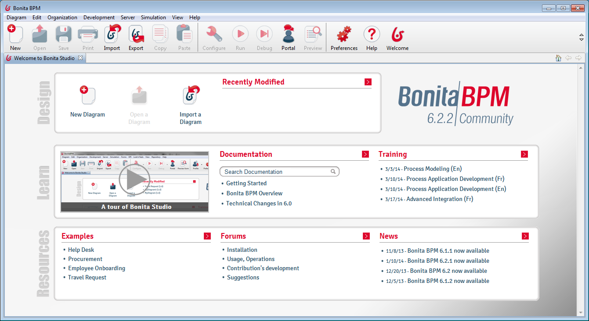
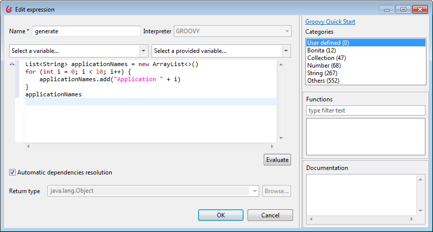
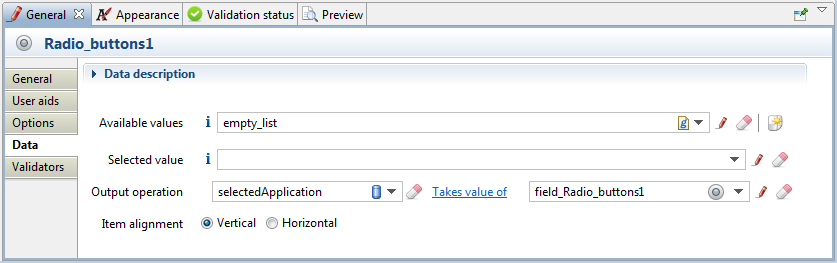
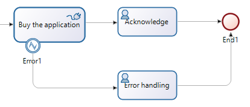
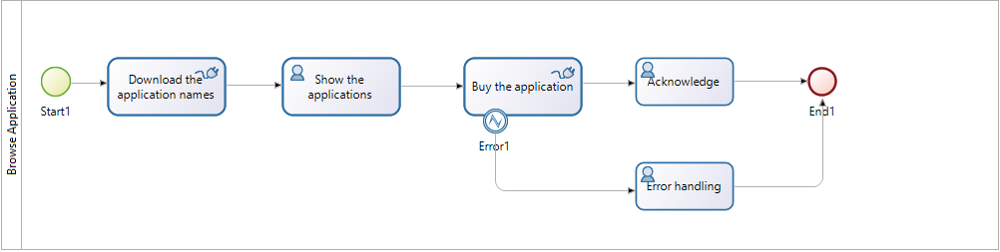
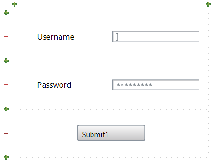
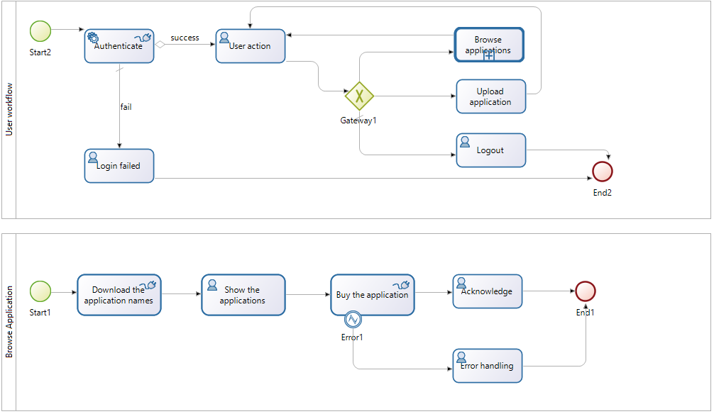

BPMN
====

Introduction
------------

BPMN (Business Process Model and Notation) is a widely used graphical representation for specifying business processes in a business process modell.

On the Service Integration course, we will use Bonita as our BPMN editor and workflow framework. Bonita is an Eclipse RCP application. 


Sources
-------
* <http://www.bonitasoft.com/>
* <http://www.bpmn.org/>


BPMN laboratory -- step-by-step instructions
============================================

In this laboratory, we will create the workflow of an application store. In the application store the users can browse and upload applications. On the Model Driven Software Development and Service Integration Courses in 2012, the teams had to design and implement the workflow of an application store.

Simple workflow
---------------

1. Start **Bonita Studio**. Bonita will prompt you to register. You can choose to skip it but it's highly recommended to register because registration provides access to well-made official tutorials and thorough documentation.

    

1. Create a new process from **Diagram | New**.

1. A simple process will show with only a _start event_ and a _human task_. Click on the process, choose the **Pool** page and click the **Edit...** button. Rename the process to ``BrowseApplication``.

1. Rename the lane to ``Lane``. 

1. Click the ``Step1`` task and look at its properties on the **General** tab. On this tab, you can set the execution-specific properties of the process, e.g. it's **Name** and **Task type**. Rename the task to ``Acknowledge``.

1. Add an _end event_ to the workflow. Connect the ``Acknowledge`` task to the end event.

    

1. Let's create a graphical user interface for this task.  Choose the **Application** tab. On the **Forms** page click **Add...**. Click **Finish**.

1. A graphical editor will appear. Add a **message** to the top of the form. Edit the properties of the message element on the **Data** page. You can edit plain text or HTML code. Type ``Hello world!``.

1. Click the **Run** button or choose your process in the **Server | Run** menu. The generated web page will show in a browser.

    

1. On the web interface, you can control the workflow by the buttons provided. In this example, if you click the **Submit1** button, the workflow finishes.

1. Click the **Bonita BPM Portal** link and browse this interface. Try to start a new workflow from this.

1. Create the following tasks:
    
    1. ``Download the application names``: _script task_.
    1. ``Show the applications``: _human task_.
    1. ``Buy the application``: _abstract task_.
    
1. Note that the ``Show the applications`` human task uses the actor defined in the lane.

    

1. Let's add some workflow variables to the process. Click the process and choose the **Data** page. Create the following variables:

    1. ``applications``: is the collection of names of the downloadable applications. The type of this variable is ``Text`` and the multiplicity is **multiple**.
    1. ``selectedApplication``: The user will select one of the available application. This ``Text`` variable with single multiplicity contains its name.

    
    
1. Let's create a script that substitutes the calling of other services. Select the **Download the application names** task and go to the **Connectors** page. Add a new script by selecting **Script | Groovy 1.8 -- Execute a Groovy 1.8 script**.

1. Name the script instance to **Get the applications**, time it to the **enter** phase of the activity and hit **Next**. Select the **Edit...** button. A Groovy editor will appear. This allows us to edit a Java-like expression or a method body where every flow variable is available.

    

1. Create this script that returns a collection of application name:

    ```java
    List<String> applicationNames = new ArrayList<>()
    for (int i = 0; i < 10; i++) {
      applicationNames.add("Application " + i)
    }
    applicationNames
    ```
    
    Click next and set that the ``applications`` takes the value of the ``result``.
        
1. Add a form to the **Show the applications** task. In the **All widget based on...** groupbox you can select the variables shown in the form. In this case we want to specify every element by hand so unselect all.

    Drag a **Radio buttons** widget to the top of the view and go to the **Data** page of the property view.
    We would like to show the application names in this list, so go to the **Available values** and select the ``applications`` variable.
    
    We also want to put the name of the selected value to a variable, so edit that the ``selectedApplication`` variable takes value of ``field_Radio_buttons1``.
    
    

1. The message of the **Acknowledge** action should refer to the selected variable, so let's set it. If you closed the editor page go to the properties of the action select the **Application** page and edit the **Hello task** pageflow.

    At the **Data** edit the ``Hello world!``. Add a script the following Groovy script:
    
    ```java
    "Thank you for downloading " + selectedApplication + "."
    ```

1. Try to run the application. Don't be afraid of the presettable variable at the begining. If you want to get rid of this form, go to the process' **Application** tab and set the **Forms** tab to **Skip**.

1. Sometimes an action may fail and the error should be handled. Change the ``Buy the application`` task's type to **Script**. Select the **Throw error event** at the **If connector fails...** options and name the error to ``failed``. The script should looks like this:

    ```java
    if (selectedApplication == applications.get(0)) {
      throw new UnsupportedOperationException()
    }
    ```
    
    This script will fail with an exception if the user downloads the first application. The output should be neglected.

1. Add a **Catch error** item to the **Buy the application** action from the palette. Create a human task for the initiator and edit the control flow:
    
    
    
    Create a webpage for the task where there is a message that shows **Error in the web services!**.

1. Run the workflow and select the first application. It looks like that the workflow stops but eventually the next action arrives to the inbox.



Complex workflow
----------------

We will implement a workflow for the actions of the user. 

1. Create a new _pool_ and name it to ``UserWorkflow``.

1. Create a _start event_, an _end event_ and create the following tasks:

    1. ``Authenticate``: _service task_
    1. ``User action``: _human task_
    1. ``Login failed``: _human task_
    1. ``Browse applications``: _call activity_
    1. ``Upload application``: _abstract task_
    1. ``Logout``: _human task_

    For the _human tasks_, set the actor to **Initiator**.
   
1. Create a **XOR gateway**.

1. Time to create some variables:

    1. ``userID``: **Integer**
    1. ``username``: **Text**
    1. ``password``: **Text**
    
1. Also create a new variable named ``action``. To create an enumeration, click **List of options...**. Set the **Name** to ``UserActionType`` and add the following options:

    1. ``Browse``
    1. ``Upload``
    1. ``Logout``

    Click **OK** and **Finish**.
    
    

1. To create the login screen, click on the ``UserWorkflow`` _pool_. On the **Application tab**'s **Entry Pageflow** page add a new form named ``Login``. 

1. In the **Add widgets based on...** groupbox only select the ``username`` and ``password`` widgets.

1. Set the password field's **Field type** to **Password**.

    

1. Connect the _start event_ to the ``Authenticate`` task. This is a service task which simulates the authentication of the user. Add a new **Groovy** connector named ``Simulation of Authentication``.

    ```java
    if (username.equals(password)) {
      return username.hashCode()
    } else { 
      return -1
    }
    ```

    The ``result`` from connector's output goes to the ``userID`` variable. Click **Finish**.
 
1. Depending on the authentication's result, the user can proceed or fail the login. Create transitions from the ``Authenticate`` task to the ``User action`` task named ``success`` and the ``Login failed`` task name ``fail``.

1. On the ``success`` transition choose **Edit expression...** in the **Condition** combobox and type ``userID != -1``. If this condition is not satisfied, the login fails. To implement this, tick the **Default flow** checkbox for the ``fail`` transition.

1. Add a form to the ``User action`` task. Only select the ``action`` widget, which will be mapped to radio buttons.

1. Now we have to create the conditions to the transitions from the XOR gateway. To do this, click on the transition and from the **Condition** combobox choose **Edit expression...**.

    1. For the transition to the ``Browse applications`` task, set the expression to ``action == "Browse"``.
    1. For the transition to the ``Upload application`` task, set the expression to ``action == "Upload"``.
    1. For the transition to the ``Logout`` task, tick the **Default flow** checkbox.
    
1. The user can browse and upload applications multiple times. To implement this in the process, we have to create loops. Add the necessary transitions from the ``Browse applications`` and the ``Upload applications`` task.

1. For the ``Browse applications`` task change the **Task type** to **Call Activity** and set the **Subprocess Name** to ``BrowseApplication``.

1. Create a form for the ``Logout`` task. Add the following script: ``"User " + username + " logged out"``.

1. Create a form for the ``Login failed`` task. Add the following message: ``Login failed``.

    

1. From the ``Login failed`` and the ``Logout`` tasks draw a transition to the _end event_.

    

Tips
----

* If you close some windows by mistakes, you can make them reappear by choosing **View | Reset view**. 
* If you name a transition and then delete the name, Bonita will mark it as faulty with the following message: ``Empty name detected for a SequenceFlow``. The solution is to name the transition.
* Sometimes, the error markings don't disappear until you manually validate the workflow by clicking **Validation status | Refresh**.
* Do not use ``LinkedList`` in the Groovy connector as it does not work, use ``ArrayList`` instead.
* To use version control, you have to export the Bonita workflows. The workflows are stored in binary ``.bos`` files -- beware that version control systems cannot diff or merge such files.