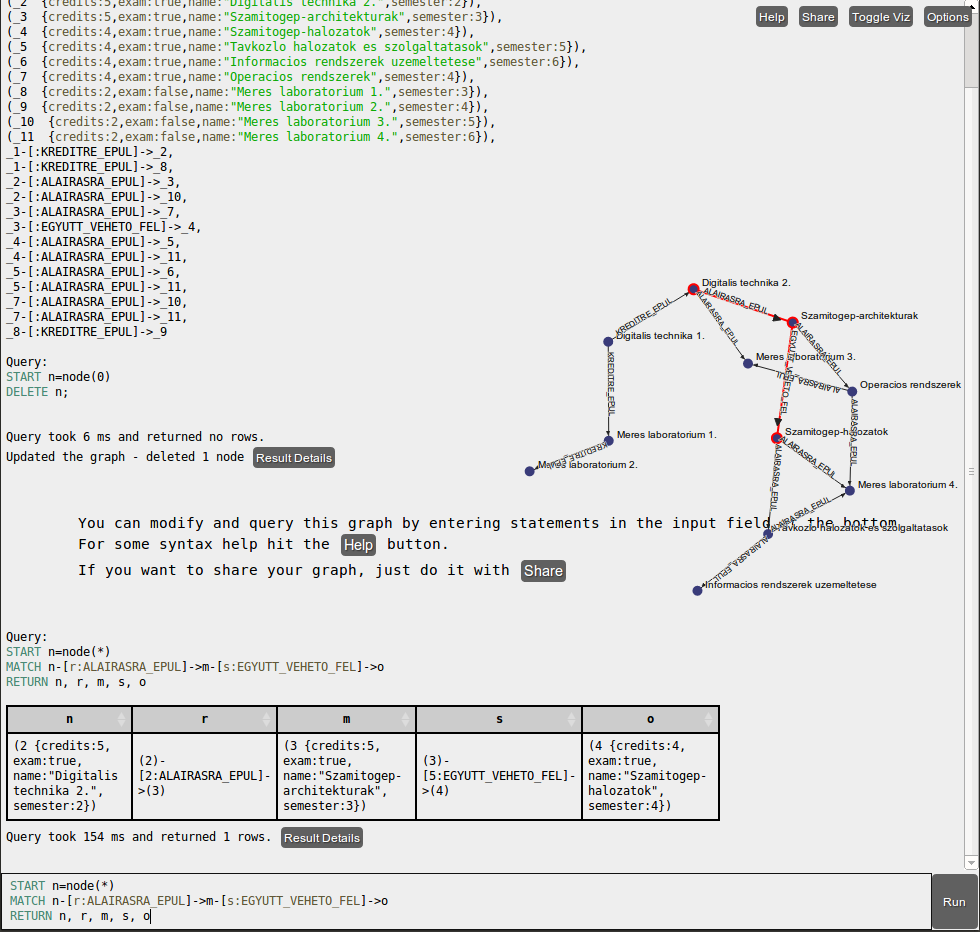
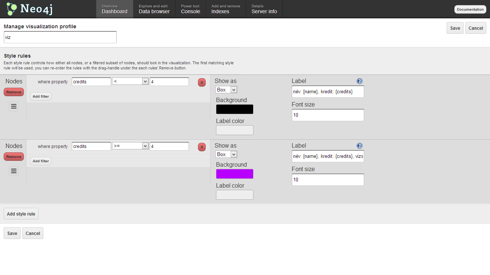
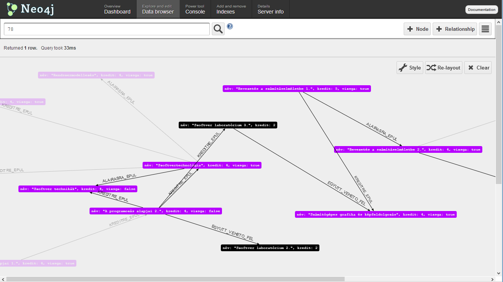

NoSQL
=====


Neo4j console
-------------

Neo4j provides an online REPL (read--evaluate--print loop) console at <http://console.neo4j.org/> to experiment with Cypher. A preloaded graph database is available at <http://console.neo4j.org/r/39s1je>.

* Delete root node if necessary.

    ```
    START n=node(0) 
    DELETE n
    ```

* Get all subjects.

    ```
    START n=node(*) 
    RETURN n
    ```

* Subjects with at least 4 credits that have an exam.

    ```
    START n=node(*) 
    WHERE n.credits >= 4 AND n.exam = true 
    RETURN n
    ```

* Subjects that are required to complete before some other subject.

    ```
    START n=node(*) 
    MATCH n-[r:ALAIRASRA_EPUL]->() 
    WHERE n.credits >= 4 AND n.exam = true 
    RETURN DISTINCT n
    ```

    **Warning:** don't forget the colon.

* Subjects that are not required to complete before any other subject.

    ```
    START n=node(*) 
    MATCH n-[r?:ALAIRASRA_EPUL]->() 
    WHERE n.credits >= 4 AND n.exam = true AND r IS NULL 
    RETURN DISTINCT n, r
    ```

* Subjects that are required to complete before an other subject, which can be taken simultaneously with some a third one.

    ```
    START n=nodes*) 
    MATCH n-[r:ALAIRASRA_EPUL]->m-[s:EGYUTT_VEHETO_FEL]s>o 
    RETURN n, r, m, s, o
    ```

* The query is equivalent to:

    ```
    START n=node(*) 
    MATCH n-[r:ALAIRASRA_EPUL]->m, m-[s:EGYUTT_VEHETO_FEL]->o 
    RETURN n, r, m, s, o
    ```



Embedded mode
-------------

Create a new **Maven Project** in Eclipse. Select **Simple project (no archetype)**.

* **Group Id:** ```etr.neo4j```
* **Artifact Id:** ```etr.neo4j.embedded```

### Dependencies ###

Go to Neo4j's homepage (<http://www.neo4j.org/>) and naviagte to Download | Maven dependency. Add the following dependency to the ```pom.xml``` with the version set to 1.8.2.

```xml
<dependency>
 <groupId>org.neo4j</groupId>
 <artifactId>neo4j</artifactId>
 <version>1.8.2</version>
</dependency>
```

### Java code ###

Tips:

* **Preferences | Java | Editor | Typing | Automatically insert at correct position | Semicolons**.
* Use **Extract to local variable** refactor.

Create two classes in a package called ```embedded```.

The ```Main``` class:

```java
package embedded;

public class Main {
	public static void main(String[] args) {
		Neo4jHandler neo4jHandler = new Neo4jHandler();
		neo4jHandler.run();
	}
}
```

The ```Neo4jHandler``` class:

```java
package embedded;

import java.io.File;
import java.io.IOException;
import java.util.Map;

import org.neo4j.cypher.javacompat.ExecutionEngine;
import org.neo4j.cypher.javacompat.ExecutionResult;
import org.neo4j.graphdb.GraphDatabaseService;
import org.neo4j.graphdb.Node;
import org.neo4j.graphdb.RelationshipType;
import org.neo4j.graphdb.Transaction;
import org.neo4j.graphdb.factory.GraphDatabaseFactory;
import org.neo4j.graphdb.index.Index;
import org.neo4j.graphdb.index.IndexManager;
import org.neo4j.kernel.impl.util.FileUtils;

public class Neo4jHandler {

	public void run() {
		String path = "neo4j-db";

		File file = new File(path);
		if (file.exists()) {
			try {
				FileUtils.deleteRecursively(file);
			} catch (IOException e) {
				e.printStackTrace();
			}
		}

		GraphDatabaseService graphDb = new GraphDatabaseFactory()
				.newEmbeddedDatabase(path);
		IndexManager index = graphDb.index();
		Index<Node> index_names = index.forNodes("__names__");

		Transaction tx = graphDb.beginTx();
		try {
			Node fiz1 = graphDb.createNode();
			fiz1.setProperty("name", "Fizika 1.");
			fiz1.setProperty("credits", 4);
			index_names.add(fiz1, "name", "Fizika 1.");

			Node fiz2 = graphDb.createNode();
			fiz2.setProperty("name", "Fizika 2.");
			fiz2.setProperty("credits", 4);
			index_names.add(fiz2, "name", "Fizika 2.");

			fiz1.createRelationshipTo(fiz2, EtrRelationship.VIZSGARA_EPUL);

			tx.success();
		} finally {
			tx.finish();
		}
	}

	enum EtrRelationship implements RelationshipType {
		VIZSGARA_EPUL, KREDITRE_EPUL, EGYUTT_VEHETO_FEL
	}

}
```

### Neoclipse ###

Run Neoclipse (<https://github.com/neo4j/neoclipse>), create a new database connection to the ```neo4j-db``` directory. To test the application, run the following Cypher query in Neoclipse:

```
START n=node:__names__(name='Fizika 1.')
RETURN n.name, n.credits
```

### Cypher query from Java ###

Add the Cypher query to the Java code. Warning: use the ```javacompat``` execution engine/result.

```java
		ExecutionEngine engine = new ExecutionEngine(graphDb);
		String query = "START n=node:__names__(name='Fizika 1.')\r\n"
				+ "RETURN n.name, n.credits";
		ExecutionResult result = engine.execute(query);
		
		for (Map<String, Object> row : result) {
			System.out.println(row);
		}
```

Tip for inserting Cypher queries to Java: go to **Preferences | Java | Editor | Typing** and tick **Escape text when pasting into a string literal**.

To create the whole database, run the Cypher query from <https://svn.inf.mit.bme.hu/edu/trunk/mdsd/handout/public/nosql_materials/elotanulmanyi_rend_cypher_ekezetes.txt>

Eclipse will prompt to change the encoding of the file: choose **UTF-8**.

Tip: autocomment with ```Ctrl + 7``` or ```Ctrl + Shift + C```.

Server mode
-----------

Run the server with ```C:\neo4j-community-1.8.2\bin\Neo4j.bat```.

If you get the error ```Unable to access jarfile C:\NEO4J-~1.2\bin\windows-service-wrapper-*.jar```, you ran into the issue mentioned at <https://github.com/neo4j/neo4j/issues/391>. To solve it, edit ```base.bat```: change 

```set wrapperJarFilename=windows-service-wrapper-*.jar```

to 

```set wrapperJarFilename=windows-service-wrapper-4.jar```

### Using the REST API manually ###

Use the **Advanced Rest Client** to access the Neo4j server.

* URL: <http://localhost:7474/db/data/cypher>
* HTTP Method: **POST**
* Headers: ```Accept: application/json```

The payload to the creation query is in the <https://svn.inf.mit.bme.hu/edu/trunk/mdsd/handout/public/nosql_materials/rest_create_query.txt> file.

Query all nodes with:

```json
{
  "query" : "START n=node(*) RETURN n",
  "params" : {
  }
}
```
Observe how verbose the output is. Try the following query:

```json
{
  "query" : "START n=node(*) RETURN n.name, n.credits",
  "params" : {
  }
}
```

Warning: this is not going to work if the root node still exists. Delete it with:

```json
{
  "query": "START n=node(0) DELETE n",
  "params": {}
}
```

Run the previous Cypher query and observe how compact it's output is.

### Web administration interface ###

You can access the web administration interface: <http://localhost:7474/webadmin/>. Observe the dashboard and play with the data browser.





### REST API in Java ###

Create a **Maven project** in Eclipse. 

* **Group Id:** ```etr.neo4j```
* **Artifact Id:** ```etr.neo4j.embedded```

Luckily, we have a great wrapper to use (<https://github.com/neo4j/java-rest-binding>), but it is not available in the Maven Central Repository.  

#### Installing Maven ####

To install Maven, download from it <http://maven.apache.org/download.cgi> and follow the **Installation Instructions**.

In Windows, go to the **System** window (```Windows``` + ```Break```), click **Advanced system settings | Environment variables... | System variables**. Set the following variables:

* M2_HOME = ```c:\apache-maven-3.0.5```
* M2 = ```%M2_HOME%\bin```
* Path = ```<previous value of Path>;%M2%```

Use ```mvn --version``` to test if it works.

In Debian-based Linux distributions, simply install with:

```
sudo apt-get install maven
```

Note that the ```maven``` package contains Maven 3 and the ```maven2``` package contains Maven 2. You need the former.

#### Compiling the Neo4j ```java-rest-binding``` project with Maven ####

Retrieve the ```java-rest-binding``` project for Neo4j 1.8.

* _The simple way:_ download <https://svn.inf.mit.bme.hu/edu/trunk/mdsd/handout/public/nosql_materials/java-rest-binding-1.8.1.zip> and unzip.

* _The more adventurous way:_ clone the repository from GitHub:
    
    ```
    git clone git://github.com/neo4j/java-rest-binding.git
    ```
    
    Open a command line, navigate to the ```java-rest-binding``` directory. Switch to the 1.8.1 branch (note that the semantics of the ```git checkout``` command are different of the ```svn checkout``` command).
    
    ```
    git checkout 1.8.1 
    ```

Compile and install the project with the following command:

```
mvn clean install
```

If this fails, you may try the following:

```
mvn clean install -DskipTests
```

Use the dependency provided in the GitHub project's ```README.md``` file, but correct the version number to ```1.8.2```:

```xml
<dependency>
    <groupId>org.neo4j</groupId>
    <artifactId>neo4j-rest-graphdb</artifactId>
    <version>1.8.2</version>
</dependency>
```

#### Creating the Java application ####

Create a package called ```client``` and create the following classes:

The ```Main``` class:

```java
package client;

public class Main {

	public static void main(String[] args) {
		Neo4jClient neo4jClient = new Neo4jClient();
		neo4jClient.run();
	}
	
}
```

The ```Neo4jClient``` class:

```java
package client;

import java.util.Collection;
import java.util.Map;

import org.neo4j.helpers.collection.IteratorUtil;
import org.neo4j.helpers.collection.MapUtil;
import org.neo4j.rest.graphdb.RestAPI;
import org.neo4j.rest.graphdb.RestAPIFacade;
import org.neo4j.rest.graphdb.query.RestCypherQueryEngine;
import org.neo4j.rest.graphdb.util.QueryResult;

public class Neo4jClient {

	String serverUrl = "http://localhost:7474/db/data";
	RestAPI restApi = new RestAPIFacade(serverUrl);
	
	public void run() {
		RestCypherQueryEngine queryEngine = new RestCypherQueryEngine(restApi);
		String query = "START n=node(*) RETURN n.name AS name, n.credits AS credits";
		QueryResult<Map<String, Object>> queryResult = queryEngine.query(query, MapUtil.map());
		Collection<Map<String, Object>> result = IteratorUtil.asCollection(queryResult);
		
		for (Map<String, Object> map : result) {
			String name = (String) map.get("name");
			Integer credits = (Integer) map.get("credits");
			System.out.println(String.format(
					"%s (%d credits)", name, credits));
		}
		
		restApi.close();
	}

}
```

This will run the Cypher query through the REST API, and list the names and credit numbers of the subjects.
