Web services
============

Introduction
------------

In this laboratory, we will create web applications. First, we will define the data types. We will create a JAX-WS and a JAX-RS web application and deploy them on a Tomcat server.

Remarks
-------

For this laboratory, we relied heavily on the Vogella site's (<http://www.vogella.com/>) tutorials. If you're further interested in the topics, we recommend to study them -- they are thorough and well-written.

* Servlet and JSP development with Eclipse WTP, <http://www.vogella.com/articles/EclipseWTP/article.html>
* REST with Java (JAX-RS) using Jersey, <http://www.vogella.com/articles/REST/article.html>
* Apache Tomcat, <http://www.vogella.com/articles/ApacheTomcat/article.html>
* JAXB, <http://www.vogella.com/articles/JAXB/article.html>

Apache Tomcat
-------------

From Wikipedia (<http://en.wikipedia.org/wiki/Apache_Tomcat>): ,,Apache Tomcat is an open source web server and servlet container developed by the Apache Software Foundation. Tomcat implements the Java Servlet and the JavaServer Pages (JSP) specifications from Sun Microsystems, and provides a ,pure Java' HTTP web server environment for Java code to run.''

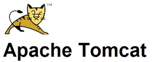

WSDL
----

WSDL (Web Services Description Language)

* A developer using a bottom up method writes implementing classes first, and then uses a WSDL generating tool to expose methods from these classes as a Web service. This is simpler to develop but may be harder to maintain if the original classes are subject to frequent change.
* A developer using a top down method writes the WSDL document first and then uses a code generating tool to produce the class skeleton, to be completed as necessary. This way is generally considered more difficult but can produce cleaner designs and is generally more resistant to change. As long as the message formats between sender and receiver do not change, changes in the sender and receiver themselves do not affect the web-service. The technique is also referred to as "contract first".

JAX-RS
------

From Wikipedia (<http://en.wikipedia.org/wiki/Java_API_for_RESTful_Web_Services>): ,,JAX-RS: Java API for RESTful Web Services is a Java programming language API that provides support in creating web services according to the Representational State Transfer (REST) architectural style.''

### Jersey ###

To use JAX-RS, we need to use Jersey (<http://jersey.java.net/>). ,,Jersey is Sun's production quality reference implementation for JSR 311: JAX-RS: The Java API for RESTful Web Services. Jersey implements support for the annotations defined in JSR-311, making it easy for developers to build RESTful web services with Java and the Java JVM.''

JAXB
----

From Wikipedia (<http://en.wikipedia.org/wiki/Java_Architecture_for_XML_Binding>): 
,,Java Architecture for XML Binding (JAXB) allows Java developers to map Java classes to XML representations. JAXB provides two main features: the ability to marshal Java objects into XML and the inverse, i.e. to unmarshal XML back into Java objects.''

Maven
-----

From Wikipedia (<http://en.wikipedia.org/wiki/Apache_Maven>): ,,Maven is a build automation tool used primarily for Java projects. Maven uses an XML file to describe the software project being built, its dependencies on other external modules and components, the build order, directories, and required plug-ins. Maven dynamically downloads Java libraries and Maven plug-ins from one or more repositories such as the Maven 2 Central Repository, and stores them in a local cache. This local cache of downloaded artifacts can also be updated with artifacts created by local projects. Public repositories can also be updated.''


Web services laboratory -- step-by-step instructions
====================================================

Prerequisites
-------------

To create a basic web service in Eclipse, you need to install some plug-ins.

### Eclipse WTP ###

Eclipse provides a bunch of plug-ins called _Web Tools Platform_ (WTP) to aid the development of web services.

1. Click **Help | Install New Software**. From the **Work with** combobox pick **Kepler**. From the category "Web, XML, Java EE Development and OSGi Enterprise Development" install the following packages:

    * Eclipse XML Editors and Tools
        * XML editor, highligher, etc.
    * JST Server Adapters Extensions
        * This is needed to connect to Apache Tomcat.
    * Eclipse Java EE Developer Tools
    * Eclipse Java Web Developer Tools
        * These two are needed to create Dynamic Web Projects.

1. Restart Eclipse.

1. Click **Window | Preferences**. Pick **Server | Runtime Environtment** and click the **Add...** button.
  
  1. Choose **Apache | Apache Tomcat v7.0**.
    
    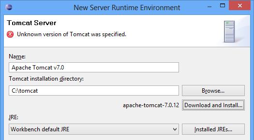
  
  1. Click **Next**. Change the name to ``FTSRG Tomcat``. Click **Download and install...** and choose the installation location. Wait for the installation to complete: the _Unknown version of Tomcat was specified._ error message will disappear.

    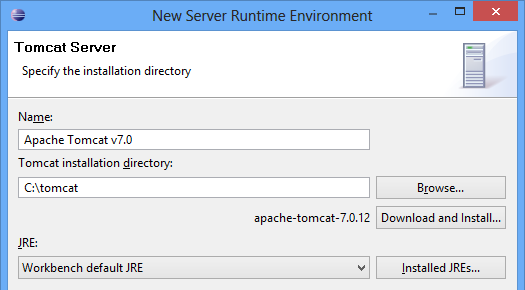 
  
  1. Click **Finish**.
  
1. Click **OK**.

### Maven ###

We will use Maven to resolve the Java dependencies of our software. To install Maven, install the **m2e - Maven integration for Eclipse** package from the **Kepler** update site.


Datatypes
---------

1. Create a Java project named ``hu.bme.mit.inf.appstore.data``.

1. Create a package named ``hu.bme.mit.inf.appstore.data.model`` and add a class named ``Application``.

    ```java
    public class Application {
      private int id;
      private String name;
    }
    ```
    
1. Add getter/setter methods to the class and generate a constructor that uses the ``name`` attribute as a parameter.

1. We will create a data provider for the model. Create a package named ``hu.bme.mit.inf.appstore.data.provider`` and add a class named ``ApplicationProvider``.

    ```java
    package hu.bme.mit.inf.appstore.data.provider;

    import hu.bme.mit.inf.appstore.data.model.Application;

    import java.util.ArrayList;
    import java.util.HashMap;
    import java.util.List;
    import java.util.Map;

    public enum ApplicationProvider {
      instance;
      
      private Map<Integer, Application> map = new HashMap<>();
      private int lastId = 0;
      
      public Application getApplication(int id) {
        return map.get(id);		
      }
      
      public List<Application> getApplications() {
        return new ArrayList<>(map.values());
      }
      
      public void insertApplication(Application application) {
          lastId++;
          application.setId(lastId);
          map.put(lastId, application);
      }

      
      ApplicationProvider() {
        insertApplication(new Application("Flashlight"));
        insertApplication(new Application("Weather"));
      }
    }
    ```
    
    We implemented the Singleton pattern with an enumeration. See <http://www.vogella.com/articles/DesignPatternSingleton/article.html> or Joshua Bloch's book _Effective Java_ for more details.

If you want to add use the ``Application`` class from an other project, go to the project **Properties**, **Java Build Path**. On the **Projects** tab click **Add...** and tick **hu.bme.mit.inf.appstore.data**.

JAX-WS
------

Further reading: <http://wiki.eclipse.org/Creating_a_Bottom-Up_Java_Web_Service>

,,The Java API for XML Web Services (JAX-WS) is a Java programming language API for creating web services.''

1. Create a new **Dynamic Web Project** called ``hu.bme.mit.inf.appstore.server.ws``. When using the **New Dynamic Web Project** wizard, tick the **Generate web.xml deployment descriptor** checkbox. The ``web.xml`` file will be generated in the ``WebContent/WEB-INF`` directory.

    Remarks:
    
    * If you forgot to generate the ``web.xml`` file, go to the **Project Explorer**, right click the project name and choose **Java EE Tools | Generate deployment descriptor stub**.
    * Unlike other natures (like the Plug-in Project and the Maven Project), the Dynamic Web Project nature cannot be added to the project from the **Configure** menu -- you have to start from a Dynamic Web Project and add other natures later.
    
1. Eclipse prompts if it should switch to the **Java EE perspective**: choose **No**.
    
1. Add a dependency to the ``hu.bme.mit.inf.appstore.data`` project (see the _Datatypes_ section for more information).    

1. Create a new package called ``hu.bme.mit.inf.appstore.server.ws`` and a new class called ``ApplicationManager``:

    ```java
    package hu.bme.mit.inf.appstore.server.ws;
    
    import java.util.List;

    import hu.bme.mit.inf.appstore.data.model.Application;
    import hu.bme.mit.inf.appstore.data.provider.ApplicationProvider;

    public class ApplicationManager {
      
      public Application getApplication(int id) {
        return ApplicationProvider.instance.getApplication(id);
      }
      
      public Application[] getApplications() {
        List<Application> list = ApplicationProvider.instance.getApplications();
        Application[] array = list.toArray(new Application[list.size()]); 
        return array;
      }

      public void insertApplication(Application application) {
        ApplicationProvider.instance.insertApplication(application);
      }
    }
    ```
1. Right click the ``ApplicationManager`` class and choose **Web Services | Create Web Service**. This will generate the description files and the client application, then deploy the application on the server.
   
    * **Web service type**: **Bottom up Java Bean Service**
    * **Service implementation**: ``hu.bme.mit.inf.appstore.server.ws.ApplicationManager``
    * Server level: **Start service**
    * **Client type**: **Java proxy**
    * Client level: **Test client**

    Tick the **Monitor the Web service** checkbox.
      
    Go through the pages with the **Next** button and click **Finish**.
        
    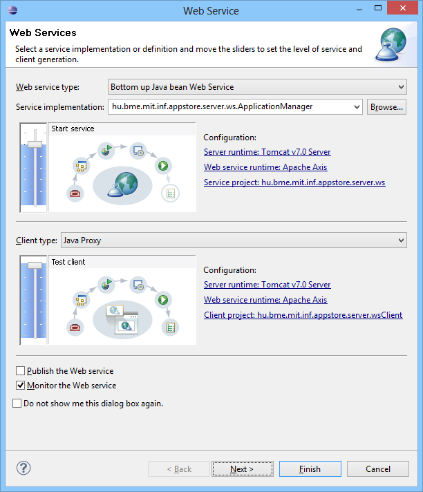     

1. While deploying, you will get a warning that the ``Application`` class does not have a default no-arg contructor.

    Create a default constructor (a constructor with no arguments, hence often referred as _no-arg constructor_) to the ``Application`` class.
    
1. While deploying, Tomcat will throw the following exception: 
    
    ```org.apache.axis.deployment.wsdd.WSDDNonFatalException: java.lang.ClassNotFoundException```
    
    The reason is that the dependencies (i.e. the ``hu.bme.mit.inf.appstore.data`` project) are only available at compile time, but not avaiable at runtime. To correct this, go to the project's **Properties** window, choose **Deployment Assembly** page. Click **Add...**, **Project**, ``hu.bme.mit.inf.appstore.data``.
    
1. Use **Create Web Service** again and deploy the server.
    
1. Insert a new application with the ``insertApplication()`` method. The following XML envelope is generated:

    ```xml
    <?xml version="1.0" encoding="UTF-8" standalone="no"?>
    <soapenv:Envelope 
      xmlns:soapenv="http://schemas.xmlsoap.org/soap/envelope/" 
      xmlns:xsd="http://www.w3.org/2001/XMLSchema" 
      xmlns:xsi="http://www.w3.org/2001/XMLSchema-instance">
      <soapenv:Body>
        <insertApplication xmlns="http://ws.server.appstore.inf.mit.bme.hu">
          <application>
            <ns1:id xmlns:ns1="http://model.data.appstore.inf.mit.bme.hu">3</ns1:id>
            <ns2:name xmlns:ns2="http://model.data.appstore.inf.mit.bme.hu">News</ns2:name>
          </application>
        </insertApplication>
      </soapenv:Body>
    </soapenv:Envelope>
    ```


2. List the application with the ``getApplications()`` method.
    
1. You can observe the traffic in the **TCP/IP Monitor**. To make the XML messages more readable, change **Byte** to **Web Browser** for both the **Request** and the **Response** messages.
    
    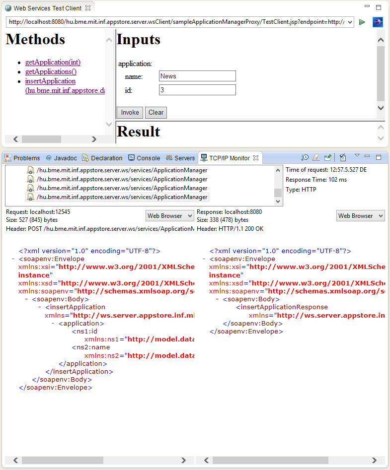
    
    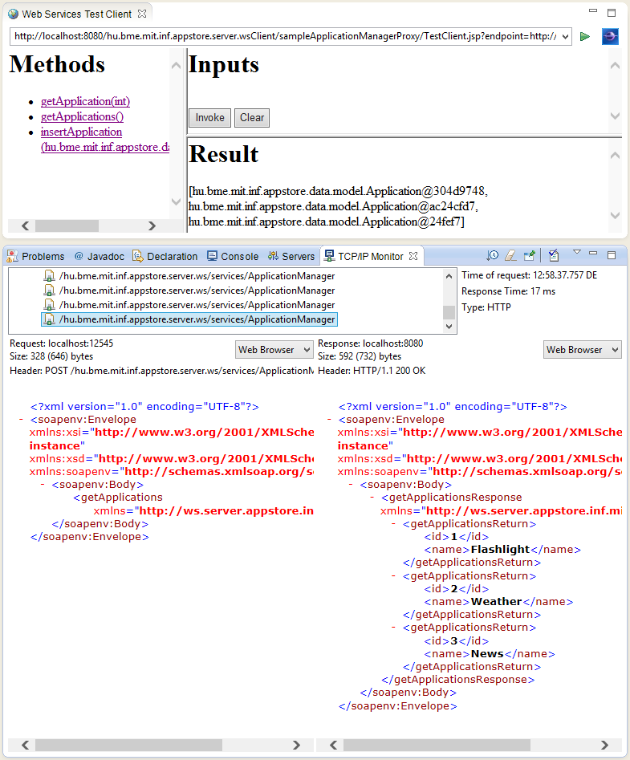

JAX-RS
------

### Creating the project ###

1. Create a new **Dynamic Web Project** called ``hu.bme.mit.inf.appstore.server.rest``. When using the **New Dynamic Web Project** wizard, tick the **Generate web.xml deployment descriptor** checkbox. The ``web.xml`` file will be generated in the ``WebContent/WEB-INF`` directory.

    Set the **Context root** to ``appstore``.

1. Eclipse prompts if it should switch to the **Java EE perspective**: choose **No**.

### Dependencies ###

To use create REST services, we have to use Jersey. Jersey is the reference implementation for the JAX-RS specification.

1. We use Maven to resolve the dependencies. In order to use Maven, we need to add the Maven nature to the project. Right click the project and pick **Configure | Convert to Maven Project**. The default artifact settings are fine, click **Finish**.

1. Click the ``pom.xml`` file and choose the last tab, named **pom.xml**.

    To specify the dependencies, add the following code under the ``<project>`` element:

    ```xml
    <dependencies>
      <dependency>
        <groupId>com.sun.jersey</groupId>
        <artifactId>jersey-server</artifactId>
        <version>1.17</version>
      </dependency>
      <dependency>
        <groupId>com.sun.jersey</groupId>
        <artifactId>jersey-bundle</artifactId>
        <version>1.17</version>
      </dependency>
    </dependencies>
    ```
    
### Java code ###

1. Create a package named ``hu.bme.mit.inf.appstore.server.rest`` and a class named ``Hello``.
    
    ```java
    package hu.bme.mit.inf.appstore.server.rest;

    import javax.ws.rs.GET;
    import javax.ws.rs.Path;

    @Path("hello")
    public class Hello {
      
      @GET
      public String sayHello() {
        return "Hello";
      }
      
    }
    ```

### Deployment ###

1. Edit the ``web.xml`` file in the ``WebContent/WEB-INF`` directory. Delete the content of the ``<web-app>`` element and paste the following:

    ```xml    
    <display-name></display-name>
    <servlet>
      <servlet-name></servlet-name>
      <servlet-class>com.sun.jersey.spi.container.servlet.ServletContainer</servlet-class>
      <init-param>
        <param-name>com.sun.jersey.config.property.packages</param-name>
        <param-value></param-value>
      </init-param>
      <load-on-startup>1</load-on-startup>
    </servlet>
    <servlet-mapping>
      <servlet-name></servlet-name>
      <url-pattern></url-pattern>
    </servlet-mapping>
    ```

    Fill the elements according to the following table:
    
    ------------------------ ---------------------------------------
    ``display-name``         ``Application Store``
    ``servlet-name`` (2×)    ``Application Store REST Service``
    ``param-value``          ``hu.bme.mit.inf.appstore.server.rest``
    ``url-pattern``          ``/rest/*``
    ------------------------ ---------------------------------------
    
1. Start the server. Tomcat will throw the following exception:

    ```
    SEVERE: Servlet /hu.bme.mit.inf.appstore.server.rest threw load() exception
    java.lang.ClassNotFoundException: com.sun.jersey.spi.container.servlet.ServletContainer
    ```
    
    The reason for this is that Eclipse not deploy dependencies (JAR files) resolved by Maven to the web application. To correct this, go to the project's **Properties** window, choose **Deployment Assembly** page. Click **Add...**, **Java Build Path Entries**, **Maven Dependencies**.
    
    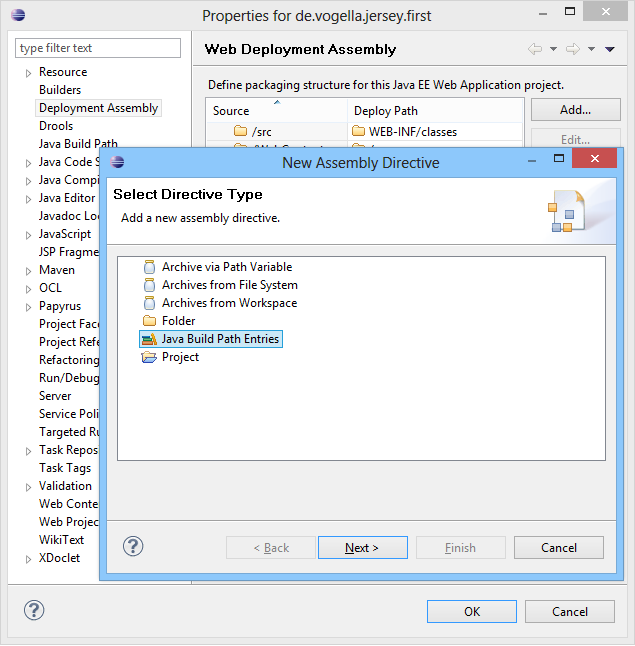
    
    If you don't use Maven, you have to put the JAR files to the ``WebContent/WEB-INF/lib`` directory and add them to the project's build path.

1. Start the server. It will start but the browser in Eclipse will show a page with a 404 error. Let's examine ho the URL of the REST service is built:

    ```
    http://domain:port/context-root/url-pattern/path-from-REST-class
    ```
    
    The ``context-root`` is defined in the ``org.eclipse.wst.common.component`` file, the ``url-pattern`` is defined in the ``web.xml`` file and the ``path-from-REST-class`` is defined in the Java source file.
    
    Remark: the Vogella JAX-RS tutorial is wrong on this point. The ``display-name`` in the ``web.xml`` file only sets the name of the application (which is shown in the Web Application Manager). It has nothing to do with the URL of the application.

1. If you want to change the ``context-root``, go to the project **Properties**. On the **Web Project Settings** set the **Context root**.

    To check if it worked, go to the ``.settings`` directory and edit the ``org.eclipse.wst.common.component`` file.
    
    ```xml
    <?xml version="1.0" encoding="UTF-8"?>
    <project-modules id="moduleCoreId" project-version="1.5.0">
      <wb-module deploy-name="[deploy-name]">
        <wb-resource deploy-path="/" source-path="/WebContent" tag="defaultRootSource" />
        <wb-resource deploy-path="/WEB-INF/classes" source-path="/src" />
        <property name="context-root" value="[context-root]" />
        <property name="java-output-path" value="/[java-output-path]/build/classes" />
      </wb-module>
    </project-modules>
    ```
    
    For now, leave the ``[deploy-name]`` and the ``[java-output-path]`` fields as they are.
    
1. If the server is running, stop it. Remove the application (right click, **Remove**) and restart the application. The URL's ``context-root`` will be set to the new one.

    Remark: if this does not work as expected (e.g. the path in the Tomcat Web Application Manager is still the same), stop the server, run a clean operation (right click, **Clean...**) and start again.

JAXB
----

We will continue to work with the ``hu.bme.mit.inf.appstore.server.rest`` project and add JAXB support to it. This way, we send and receive Java objects serialized to XML.

1. Add a dependency to the ``hu.bme.mit.inf.appstore.data`` project (see the _Datatypes_ section for more information).

1. Add the ``@XmlRootElement`` annotation to the ``Application`` class.

    ```java
    @XmlRootElement
    public class Application {
      // ...
    }
    ```
    
1. If you didn't do so already, add a default constructor to the ``Application`` class.
    
1. Create a new class named ``ApplicationManager``:
    
    ```java
    package hu.bme.mit.inf.appstore.server.rest;

    import hu.bme.mit.inf.appstore.data.model.Application;
    import hu.bme.mit.inf.appstore.data.provider.ApplicationProvider;

    import java.util.List;

    import javax.ws.rs.Consumes;
    import javax.ws.rs.GET;
    import javax.ws.rs.POST;
    import javax.ws.rs.Path;
    import javax.ws.rs.PathParam;
    import javax.ws.rs.Produces;
    import javax.ws.rs.core.Context;
    import javax.ws.rs.core.MediaType;
    import javax.ws.rs.core.Response;
    import javax.ws.rs.core.UriInfo;

    @Path("applicationmanager")
    public class ApplicationManager {
      
      @Context
      private UriInfo uriInfo;
      
      @GET
      @Path("list")
      @Produces({ MediaType.APPLICATION_XML, MediaType.APPLICATION_JSON })
      public List<Application> getApplications() {
        return ApplicationProvider.instance.getApplications();
      }
      
      @GET
      @Path("get/{id}")
      @Produces({ MediaType.APPLICATION_XML, MediaType.APPLICATION_JSON })
      public Application getApplication(@PathParam("id") int id) {
        Application application = ApplicationProvider.instance.getApplication(id);
        return application;
      }

      @POST
      @Path("insert")
      @Consumes(MediaType.APPLICATION_XML)
      public Response insertApplication(Application application) {
        ApplicationProvider.instance.insertApplication(application);
        return Response.created(uriInfo.getAbsolutePath()).build();
      }
      
    }
    ```
    
Tomcat Web Application Manager
------------------------------

Tomcat has an administration page called **Tomcat Web Application Manager**. However, it will not work if Tomcat is launched with Eclipse's default settings. To make it work, click the server in the **Servers** view. 

You have to change the **Server Location** from **Use workspace metadata** to **Use Tomcat installation**. If you have already started an application on the server, the radiobuttons will be disabled. To enable them stop the server (right click, **Stop**) and do a clean operation (right click, **Clean...**). After that, the radiobuttons should be enabled again.

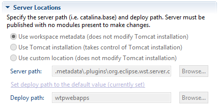

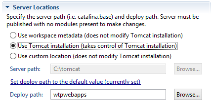

Start the server. Now you can access the Tomcat Web Application Manager on <http://localhost:8080/manager/html>. However, you can't log in yet: you have to define a user. To do so, go to the Tomcat installation directory and add the following to the ``conf/tomcat-users.xml`` file's ``<tomcat-users>`` element:

```xml
<role rolename="manager-gui"/>
<user name="admin" password="admin" roles="admin-gui,manager-gui"/>
```

You should be able to login with the user ``admin`` and the password ``admin``.


### Performance monitoring ###

If you want to monitor the performance of Tomcat, you can use JConsole (<http://docs.oracle.com/javase/7/docs/technotes/guides/management/jconsole.html>). JConsole can monitor applications that are compatible with Java Management Extensions (JMX) specification. You can find JConsole in your JDK's ``bin`` directory.

If you want to measure the performance of a web server, e.g. Apache Tomcat, you should use a performance testing tool like Apache JMeter (<http://jmeter.apache.org/>). JMeter is used in the _Design for Dependability Laboratory Exercises_ (<http://www.inf.mit.bme.hu/edu/courses/szbtlab>) course of the ,,Dependable System Design'' programme held in the autumn semester.

Further reading:

* <http://stackoverflow.com/questions/787070/how-to-properly-manage-tomcat-web-apps-inside-eclipse>
* <http://stackoverflow.com/questions/6776421/display-the-tomcat-manager-application>
* <http://stackoverflow.com/questions/2280064/tomcat-started-in-eclipse-but-unable-to-connect-to-link-to-http-localhost8085>
* <http://tomcat.apache.org/tomcat-7.0-doc/html-manager-howto.html>

Testing a REST application
--------------------------

The simplicity of the REST style enables us to test REST applications without writing our own test client. Advanced Rest Client (<http://chromerestclient.appspot.com/>) is an extension for Google Chrome. Advanced Rest Client is capable of sending requests to REST applications with a specific HTTP method (e.g. GET, POST, etc.) and a header. This way, you can emulate the behaviour of a client application.

* <http://localhost:8080/appstore/rest/applicationmanager/get/2>, HTTP method: GET
* <http://localhost:8080/appstore/rest/applicationmanager/insert>, HTTP method: POST.

    Use the following payload:

    ```xml
    <application>
      <name>News</name>
    </application>
    ```
    
    Create a ``Content-Type`` field in the header and set it to ``application/xml``.
     
* <http://localhost:8080/appstore/rest/applicationmanager/list>, HTTP method: GET. 

    Create an ``Accept`` field in the header and set it to ``application/json``.
    
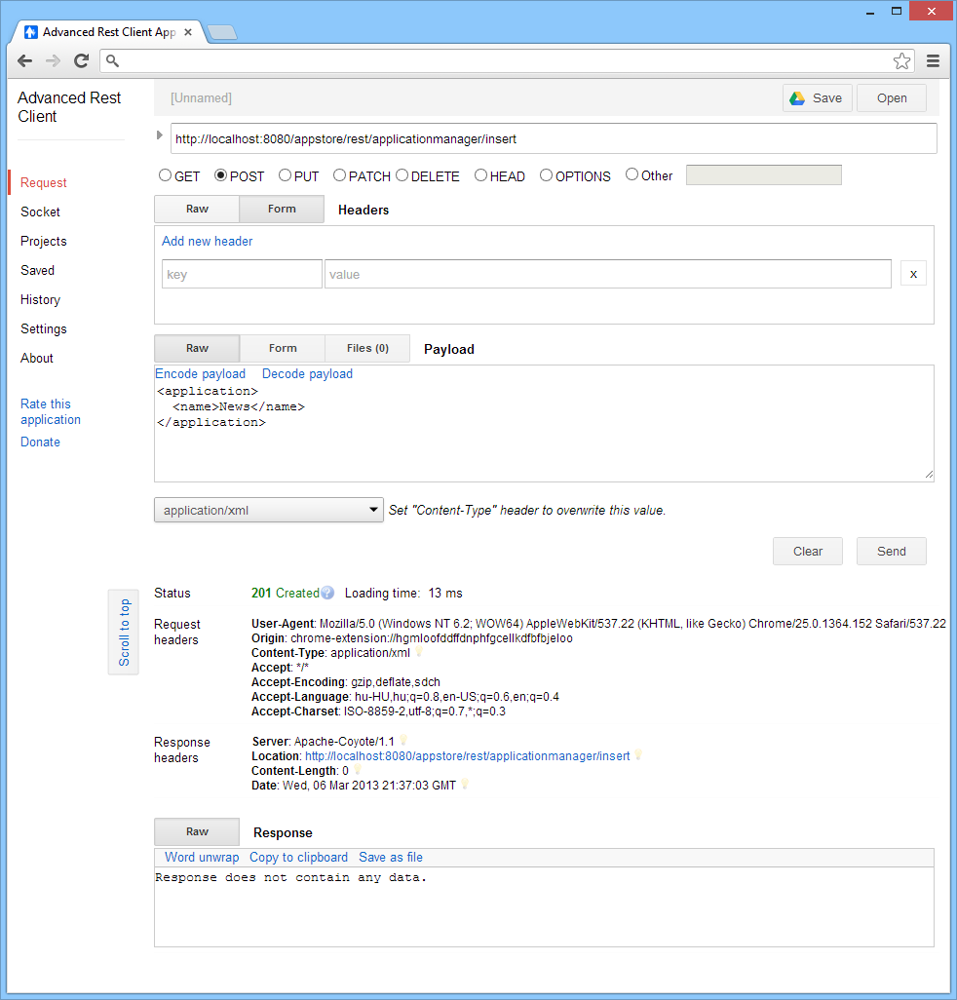

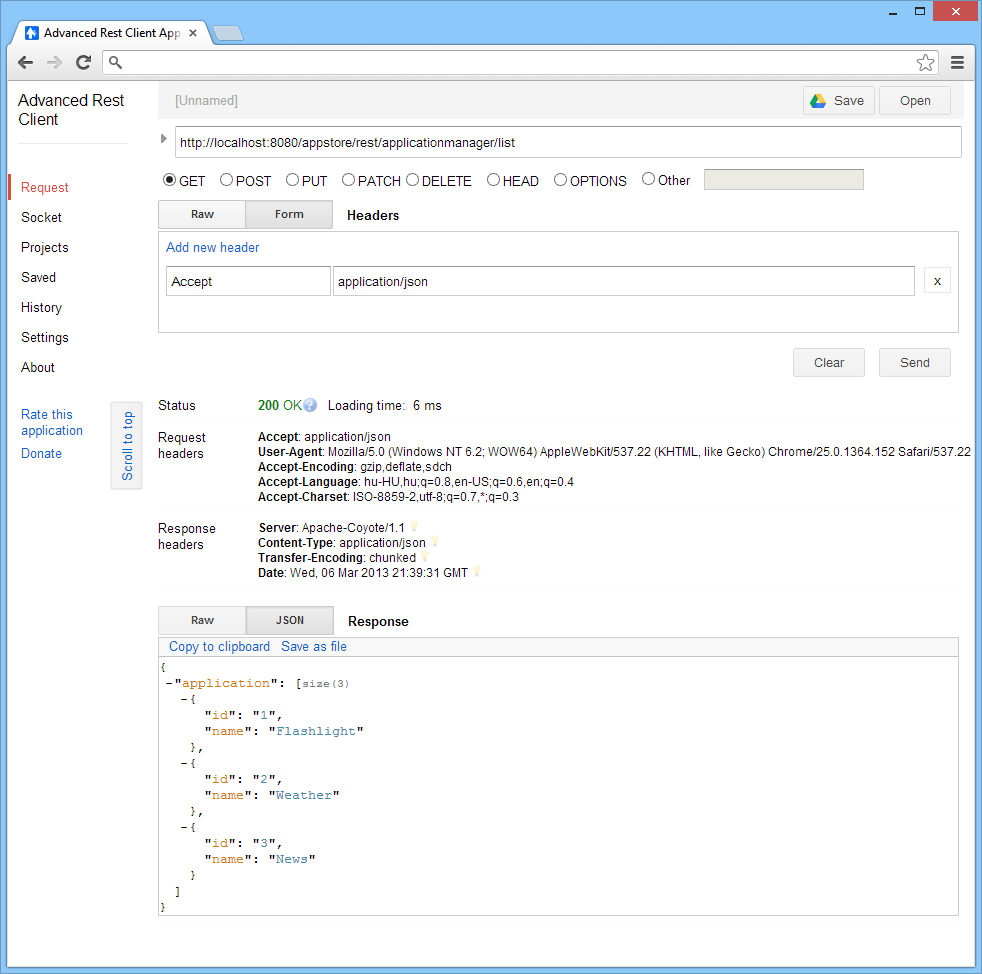

Google App Engine
-----------------

From Wikipedia (<http://en.wikipedia.org/wiki/Google_App_Engine>): ,,Google App Engine is a platform as a service (PaaS) cloud computing platform for developing and hosting web applications in Google-managed data centers. Applications are sandboxed and run across multiple servers. App Engine offers automatic scaling for web applications—as the number of requests increases for an application, App Engine automatically allocates more resources for the web application to handle the additional demand. Google App Engine is free up to a certain level of consumed resources.''


Tips and troubleshooting
------------------------

* You can show the **Show Servers** view by clicking **Window | Show View | Other...** and choosing **Server | Servers**.
* You can display the internal web browser by clicking **Window | Show View | Other...** and choosing **General | Internal Web Browser**.
* If error are displayed because the ```javax``` packages cannot be found, right click on the project name, click **Properties** and look into **Targeted Runtimes**. It's also worth trying to clean the project.
* Sometime Maven does not download the dependencies and the project's **Maven Dependencies** node is empty. Right click the project and choose **Run As | Maven install**. Because Maven depends on the accessibility of it's main repository, this might not work for the first time: try again, it might does.


Additional materials
--------------------

### Creating a JSP Servlet ###

<http://www.vogella.com/articles/EclipseWTP/article.html>

1. Start Eclipse.

1. Click **File | New | Other**. Pick **Web | Dynamic Web Project**. Set the project name to ``hu.bme.mit.inf.helloworld``.

1. Right click on the ``hu.bme.mit.inf.mdsd.helloworld`` project's name: pick **New | Other...** and choose **Web | Servlet**. Set the Java package to ``hu.bme.mit.inf.helloworld`` and the Class name to ``HelloWorld``.

1. While observing the possible settings, click **Next**, **Next**, **Finish**.

1. Add the following code to the ``doGet`` method in the ``HelloWorld`` class:

    ```java
    protected void doGet(HttpServletRequest request, HttpServletResponse response) 
      throws ServletException, IOException {
      response.setContentType("text/plain");
      PrintWriter out = response.getWriter();
      out.println("Hello world.");
    }
    ```

    Choose **Manually define a new server** and set the **Server runtime environment** to the previously created ``MDSD Tomcat``. Click **Next** and **Finish**.

    A browser tab will appear with the address <http://localhost:8080/hu.bme.mit.inf.helloworld/HelloWorld> and will display the following content (formatted as plain text):

    ```
    Hello world.
    ```
    
1. Modify the code, e.g. change ``Hello world`` to ``Hello worlds``. Eclipse will build the project automatically and deploy it on the Tomcat server. The **Console** view shows the following log:

    ```
    INFO: Reloading Context with name [/hu.bme.mit.inf.helloworld] is completed
    ```

1. Refresh the browser's page to see if it worked.

Sources
-------

* Creating Bottom-Up Web Service, <http://wiki.eclipse.org/Creating_a_Bottom-Up_Java_Web_Service>
* JSON and REST, The New Kids on the Data Block, <http://www.slideshare.net/rmaclean/json-and-rest>
* Build a RESTful Web service using Jersey and Apache Tomcat: <http://www.ibm.com/developerworks/library/wa-aj-tomcat/>
