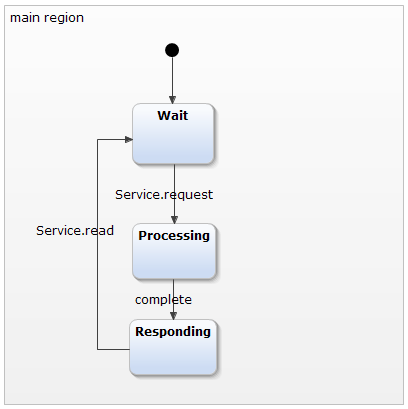
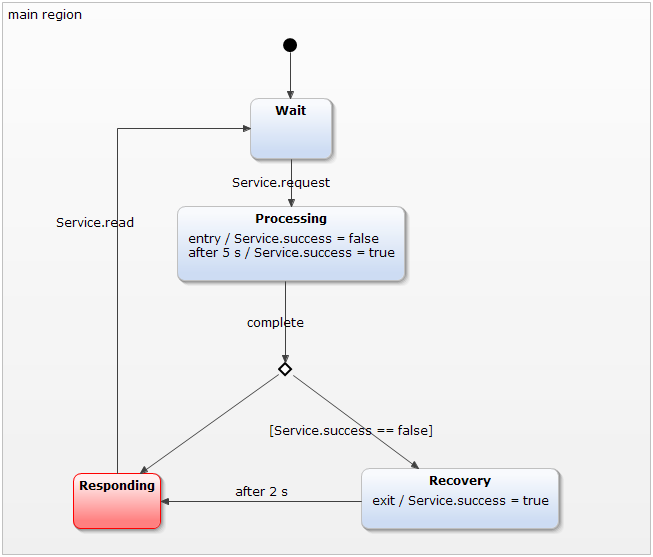
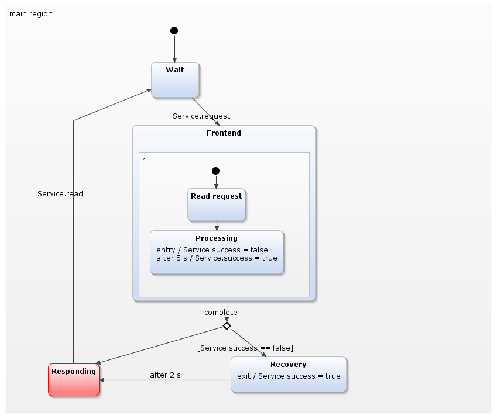
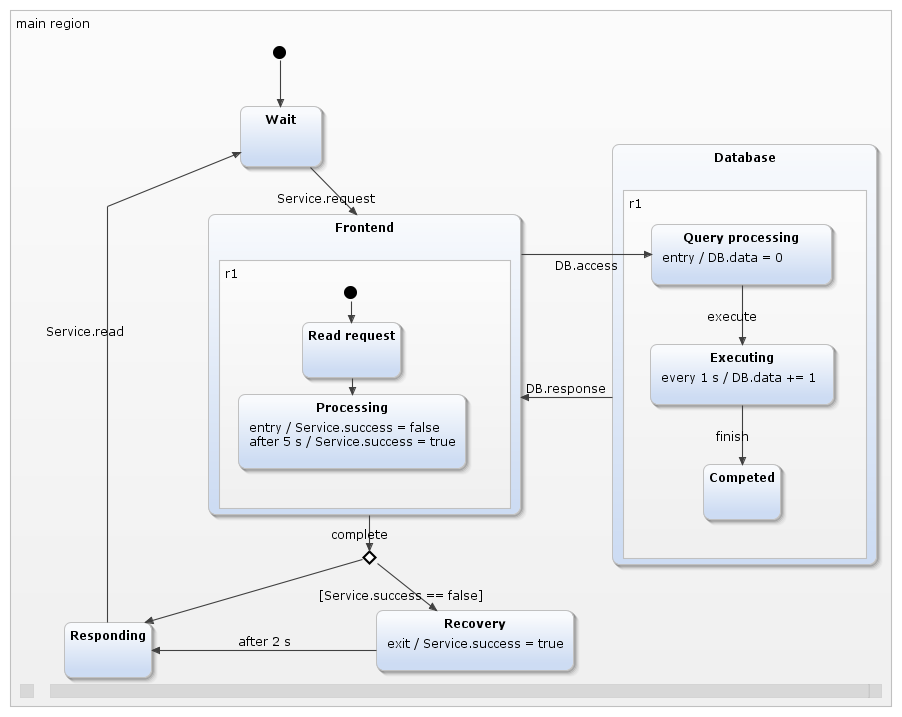
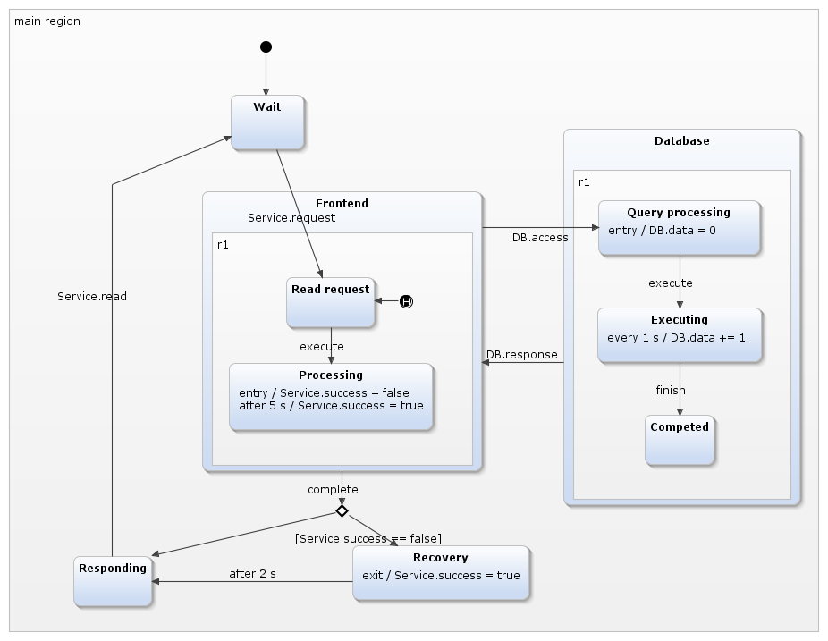
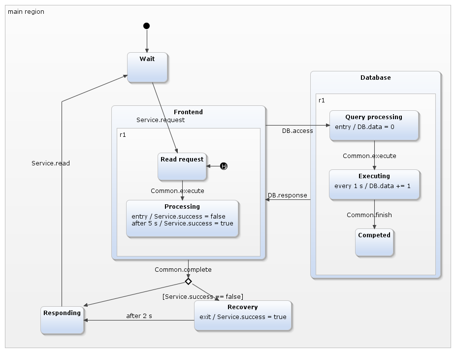

Yakindu
=======

From Wikipedia (<http://en.wikipedia.org/wiki/YAKINDU_Statechart_Tools>): Yakindu (<http://statecharts.org/>) Statechart Tools (SCT) is an open source tool for the specification and development of reactive, event-driven systems with the help of state machines. It consists of an easy-to-use tool for graphical editing and provides validation, simulation and code generators for different target platforms. The users come from both the industrial and academic sectors.''


Yakindu is developed by itemis, the same company that created Xtext.


Prerequisites
-------------

From the Yakindu update site, install the following plug-ins for Eclipse:

* Yakindu SCT 2
* Copy Paste Patch
* YAKINDU SCT Generator C
* YAKINDU SCT Generator Java
* Yakindu Statechart Tools (SCT) 2
* Yakindu Statechart Tools (SCT) 2 SDK


Modeling
--------

1. Create a new **YAKINDU Xpand Generator Project**.

1. Add a new **YAKINDU Statechart Model**.

1. Add the following code to the editor:

    ```
    interface Service:
    in event request
    in event read
    var success : boolean
    
    internal:
    event complete
    ```

1. Create the statechart #1 as shown on the figure.

    

1. Run the statechart (**Run As | YAKINDU Statechart**) and experiment with the **Simulation View**.

1. Extend your statechart to #2 by adding a new **State** and a **Choice**. Keep in mind that the transitions have priorities, which may cause them to behave differently than expected.
    
    You can edit the **Transition Priority** in the **Choice**'s **Properties** view (Right click the **Choice** on the canvas and pick **Show Properties View**).
    
    
    
1. Extend your statechart to #3 by adding a new **Composite State** called ``Frontend``.
    
    
    
1. Modify the statechart definition block to the following:

    ```
    interface Service:
    in event request
    in event read
    var success : boolean

    internal:
    event complete
    event execute
    event finish

    interface DB:
    in event access
    in event response
    var data: integer 
    ```
    
1. Using the new events, extend your statechart to #4 by adding a new **Composite State** called ``Database``.
    
    
    
1. Modify your statechart to get #5 by adding a new **Shallow History** to the ``Frontend`` state.
    
    

Code generation
---------------
    
1. Add a generator by clicking **File | New | Other...** and picking **Yakindu Statechart Generator Model**. Name it ``service.sgen``, choose **YAKINDU SCT Java Code Generator** and tick the ``service.sct`` statechart.
    
1. Modify the ``service.sgen`` file to the following:
    
    ```
    GeneratorModel for yakindu::java {

      statechart service {
        feature Outlet {
          targetProject = "yakindu.labor"
          targetFolder = "src-gen"
        }
          
        feature GeneralFeatures {
          TimerService = true
        }
      }
      
    }
    ```    
    
1. Add the ``src-gen`` folder to the **Build Path**.
    
1. Create a class named ``ServiceClient`` in the ``src`` folder in a package named ``service``:
    
    ```java
    package service;

    import org.yakindu.scr.TimerService;
    import org.yakindu.scr.service.ServiceStatemachine;
    import org.yakindu.scr.service.ServiceStatemachine.State;

    public class ServiceClient {

      public static void main(String[] args) throws InterruptedException {
        ServiceStatemachine sm = new ServiceStatemachine();
        sm.setTimerService(new TimerService());
        
        sm.enter();
        
        sm.getSCIService().raiseRequest();
        sm.runCycle();
        
        if (sm.isStateActive(State.main_region_Frontend_r1_Read_request)) {
          System.out.println("Reading request.");
        }
      }

    }
    ```
    
1. Run the program. It will produce the following output:

    ```
    Reading request.
    ```
    
    
1. Create a method that runs a number of cycles, each of which sleeps for 0.2 seconds and then notifies the statechart.

    ```java
    private static void sleep(ServiceStatemachine sm, int limit)
        throws InterruptedException {
      for (int i = 0; i < limit; i++) {
        Thread.sleep(200);
        sm.runCycle();
      }
    }
    ```
    
1. Add the following call to the ``main`` method:

    ```java
    sm.getSCICommon().raiseExecute();
    ```

1. This will cause a compile-time error. The problem is that the ``execute`` event is internal, therefore the ``raiseExecute()`` method is private and cannot be accessed from the ``main`` method. To address this, create a new interfaced called ``Common`` for the the internal events.
    
    ```
    interface Common:
    in event complete
    in event execute
    in event finish
    ```
    
1. Modify your statechart's transitions accodingly to get statechart #6.

            
    
1. After this, the ``raiseExecute()`` will be visible. Continue expanding the ``main`` method with the following:
    
    ```java
    sm.getSCICommon().raiseExecute(); // we added this previously
    
    sm.getSCIDB().raiseAccess();
    sm.runCycle();
    
    sm.getSCICommon().raiseExecute();
    sm.runCycle();
    
    sleep(sm, 30);
    
    sm.getSCIDB().raiseResponse();
    sm.runCycle();

    System.out.println("Data = " + sm.getSCIDB().getData());
    
    sleep(sm, 10);
    sm.getSCICommon().raiseComplete();
    sm.runCycle();
    
    if (!sm.getSCIService().getSuccess()) {
      System.out.println("Unsuccessful call.");
      System.out.println("Recovery state active: " + 
        sm.isStateActive(State.main_region_Recovery) + ".");
      sleep(sm, 11); // more than 2 seconds
    }
    
    if (sm.isStateActive(State.main_region_Responding)) {
      System.out.println("Responding.");
    }
    
    sm.exit();
    ```
    
1. Run the application. The output is the following:
    
    ```
    Reading request.
    Data = 6
    Unsuccessful call.
    Recovery state active: true.
    Responding.
    ```

    If you run the program multiple times, you can observe that the ``Data`` value is sometimes 5 instead of 6. Think about reason behind this.
    
Tips
----

* If the Java code is not generated automatically, right click the ``service.sgen`` file and click **Generate Statechart Artifacts**.
* If you cannot find the **Simulation View**, right click the **SC Simulation** perspective's name and choose **Reset**.
